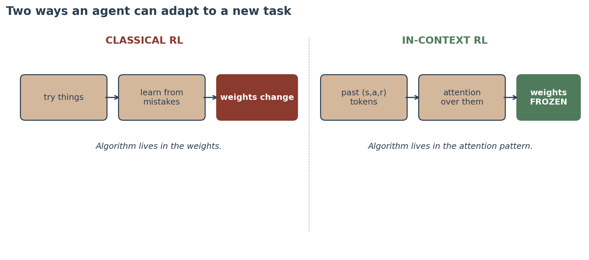
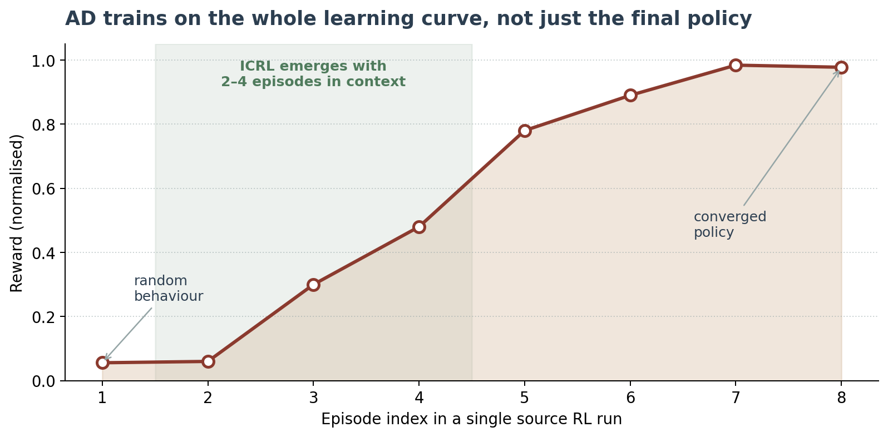
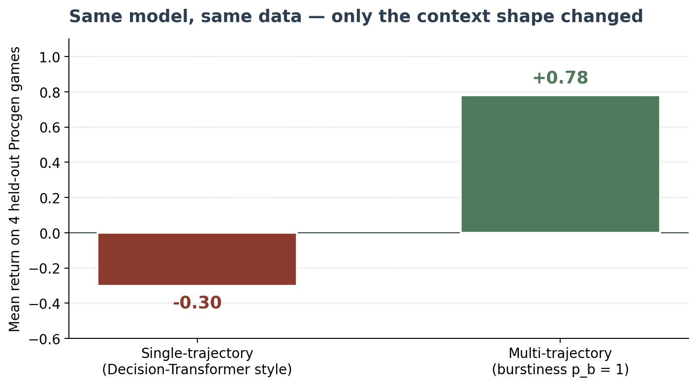
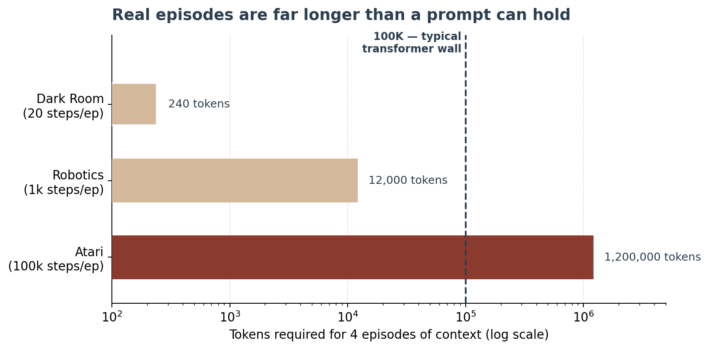

# In-Context Reinforcement Learning: A Gentle Introduction

**Author:** [Youssef Alaa](https://www.linkedin.com/in/youssef-alaa-093608308)

---

## 0. Before we start

Imagine you handed a friend who has never played a video game a controller and said: "Here's a brand new game. Figure it out." For the first minute they would press random buttons. By minute three they'd notice "ah, this button jumps." By minute five they'd be playing decently. They didn't go home, study, and come back smarter. They learned **while playing**, by reading their own attempts as evidence.

That, in a sentence, is the dream of **In-Context Reinforcement Learning** (ICRL). Take a transformer — the same family of model that powers ChatGPT — feed it the history of an agent trying a task, and ask it: *given everything you just read, what should you do next?* No gradient updates. No retraining. The model's weights never move. The "learning" happens by re-reading the past.

This chapter is a gentle tour through that idea: where it comes from, what it can already do today, what it still cannot do, and why a lot of people I respect think the open problems here are some of the most important ones in modern reinforcement learning.

By the end of this chapter, you should be able to:

- Say what in-context learning is, and how it differs from "normal" learning.
- Describe how transformers and RL stitch together into ICRL.
- Explain what the three landmark papers (**AD**, **DPT**, **GEN**) actually proved.
- List the seven open problems that stand between today's toy results and real-world deployment.
- Know where to start if you want to try this yourself.

---

## 1. What is "in-context learning," really?

My favourite definition is the one from the Dong et al. survey [1]:

> *"In-context learning is a paradigm that allows language models to learn tasks given only a few examples in the form of demonstration."*

Said more plainly: instead of fine-tuning a model on a labelled dataset, you just **show it a few examples inside the prompt** and ask it to keep the pattern going.

The classic example. You prompt a large language model with:

```
Review: Delicious food!     Sentiment: Positive
Review: The food is awful.  Sentiment: Negative
Review: Terrible dishes!    Sentiment: Negative
Review: Good meal!          Sentiment:
```

The model fills in `Positive`. Nobody told it the rules of sentiment classification — it inferred them from the four lines above. That is in-context learning. The model's weights did not change. The "learning" happened during a single forward pass through the network. (See [1], Figure 1, for the same example.)

Two things matter here, and both come back later in the chapter:

1. **No gradient updates.** Standard supervised learning would have you back-propagate through every example. Here you don't. The training was done long ago, on a much bigger corpus.
2. **The examples live in the prompt.** Whatever the model knows about the *task* right now comes entirely from the tokens it can read.

If those two facts make you a little suspicious — *"wait, how does it actually learn anything, then?"* — good. That suspicion is the seed of half the open problems in this chapter.

---

## 2. A two-minute refresher

### 2.1 Reinforcement learning, in one paragraph

An agent lives in an environment. At each step it sees a **state** `s` (what the world looks like), picks an **action** `a` (what to do), and receives a **reward** `r` (how good the result was). It then sees the next state `s'` and repeats. A **policy** is the rule that maps states to actions. Classical RL — DQN [2], PPO [3], A3C — tries to find a good policy by collecting experience and nudging the policy's weights in the direction of higher reward. Millions of steps, lots of gradient descent.

### 2.2 Transformers, in one paragraph

A transformer is a neural network that eats a sequence of tokens (think: words, or any discrete symbols) and predicts the next one. Its core trick is **attention**: every token can "look at" every other token in the sequence and decide which ones matter. Stack many attention layers, train on a huge corpus, and you get something that's eerily good at continuing patterns it has seen before. Vaswani et al. [4] introduced the architecture; Brown et al. [5] showed that, at sufficient scale, transformers learn in-context.

### 2.3 In-context learning, in one paragraph

In-context learning is what happens when a transformer is so familiar with patterns that, instead of memorising one fixed task during training, it learns to *adapt on the fly* to whatever pattern lives in its current prompt. The weights have been frozen for months. But the **attention pattern** for *this* prompt is unique, and that unique pattern is doing the work that gradient descent used to do.

Keep those three paragraphs in mind. The rest of this chapter is really just one question: *what if the "tokens" in §2.2 were the (state, action, reward) triplets from §2.1?*

---

## 3. The big idea: stitching it together

Here is the move that gave the field its name.

**Take a transformer. Pretrain it not on text, but on long histories of an RL agent trying tasks.** Each "token" is a state, action, or reward. So the input looks like:

```
prompt = [ (s1, a1, r1), (s2, a2, r2), ..., (st, at, rt) ]
                                            ^
                                            episodes stacked one after another
```

We ask the transformer the same thing language models are asked: **predict the next token.** Except the next token is the next action. We train with a plain causal cross-entropy loss across the whole sequence. After enough training, something surprising happens.

At deployment, we drop the transformer into a *new* task it has never seen, with **frozen weights**. We let it interact with the environment. Each new (s, a, r) we get just gets appended to the prompt. Over a few episodes, the agent's behaviour improves — not because we are training, but because the transformer is *re-reading its own history* and inferring "ah, this looks like the kind of task where strategy X works."

That is in-context reinforcement learning. The algorithm is no longer in the code — it's in the attention pattern.



If there's only one image from this chapter you remember, make it that one. Every open problem we hit later is some flavour of the same question: *what exactly is the algorithm hiding inside that attention pattern, and can we trust it?*

---

## 4. Where it sits among the other RL paradigms

It helps to place ICRL on the existing map. Same goal as the rest, but the *mechanism* is different — and one row is genuinely new.

| Paradigm                          | Online interaction at training? | Gradient updates at deployment? | Adapts to new tasks?       |
|-----------------------------------|---------------------------------|---------------------------------|----------------------------|
| Classical RL (DQN, PPO)           | Yes                             | n/a — one task only             | No                         |
| Offline RL (CQL, BCQ)             | No (offline data only)          | n/a — one task only             | No                         |
| Meta-RL: MAML [6]                 | Yes                             | Yes (a few inner-loop steps)    | Yes (with gradient steps)  |
| Meta-RL: RL² [7]                  | Yes                             | No (an RNN updates its state)   | Yes (within distribution)  |
| **In-Context RL**                 | **No**                          | **No**                          | **Yes (purely in context)**|

Only in-context RL answers "no" twice. That row is *genuinely new*. Every other approach either trains on the deployment task or takes a gradient step at deployment. ICRL refuses to do either. It's the only paradigm where "learning a new task" and "doing one forward pass on a longer prompt" are literally the same operation.

That's a strong claim. The next section is about what the field has actually shown to back it up.

---

## 5. The promise — why anyone cares

If ICRL actually works at scale, four old RL headaches get a lot easier:

1. **Sample efficiency.** PPO famously needs millions of environment steps for tasks a human can master in minutes. ICRL aims for adaptation in a *handful* of episodes — single digits.
2. **Cold start.** Every new task today means retraining from scratch (or at least fine-tuning). ICRL aims for zero gradient steps at deployment. You ship one model and let the context do the work.
3. **Exploration.** Smart exploration is painful to engineer per task. If the model has seen many tasks during pretraining, it can re-use exploration strategies it picked up across them.
4. **Distribution shift.** Your training data never quite matches the real deployment world. In-context conditioning gives you a knob to adjust on the fly.

The dream, in one line:

> *Pretrain once on diverse RL trajectories. Drop into any new task. Adapt in a handful of episodes.*

Whether this is reachable in five years or fifty is exactly what the open problems in §7 are about.

---

## 6. The evidence base — three papers

Three papers are doing most of the heavy lifting in this field right now. Each one makes a *different* bet about what the transformer should learn from. If a friend asked me where to start reading on ICRL, these are the three I'd send them.

### 6.1 AD — Algorithm Distillation (Laskin et al. [8], DeepMind, 2022)

**One sentence:** train a transformer on the *entire learning curve* of an RL agent, and it internalises the policy-improvement operator.

**Setup.** Take a standard RL algorithm — say, A3C — and run it on a task family for thousands of independent runs. Each run starts from a random policy and ends near-optimal. Concatenate all of that into one long sequence. Now train a transformer to predict the next action via causal cross-entropy across the whole history.

**The trick.** The training data isn't just expert behaviour — it contains the whole *progression* from terrible to expert. The transformer doesn't end up learning the optimal policy; it learns the operator that *improves a policy*. At deployment you feed it a random episode and it produces a slightly better one, then a slightly better one after that.

**Empirical headline.** AD matches RL² (a meta-RL baseline that uses 1 billion training steps) on Dark Room and Dark Key-to-Door, with **frozen weights** at deployment. The minimum context for ICRL to emerge in their experiments is about 2–4 episodes. With fewer, the phenomenon disappears.

**Where it was tested.** Adversarial bandit; Dark Room (a 9×9 grid POMDP); Dark Key-to-Door (6,561 task combinations); DMLab Watermaze (3D pixel input).



**What it did NOT solve.** Long-horizon environments. Continuous control. The question of what the implicit algorithm actually *is*. And — quietly — the cost of generating those thousands of source RL runs.

### 6.2 DPT — Decision-Pretrained Transformer (Lee et al. [9], Stanford, 2023)

**One sentence:** instead of imitating an algorithm's whole curve, just train the transformer to predict the *optimal action* given a query state and an in-context dataset, and surprising things happen.

**Setup.** Each training example looks like: *(some past (s, a, r, s') tuples about a task) + a query state → the optimal action for that state*. You need oracle labels — the *optimal* action — at pretraining time. In simulation that's usually doable. In the real world, it's harder.

**The theoretical surprise.** Under stated assumptions, Lee et al. [9] proved that DPT's forward pass is *equivalent* to posterior sampling — a known good Bayesian way of acting under uncertainty. The prior is implicitly encoded in the pretraining task distribution; the posterior update is implicit in attention. Nobody told the model to be Bayesian. It just emerges.

**The empirical surprise.** On linear bandits, DPT was trained with a teacher that *ignored* hidden structure in the task. At test time, the student exploited that hidden structure anyway. The student found patterns the teacher didn't know were there. This part genuinely surprised me the first time I read it.

**Two modes from the same network.** Sample from the output distribution → exploration. Take argmax → conservative offline behaviour. Same weights.

**Where it was tested.** 5-armed Gaussian bandits; linear bandits; Dark Room; Miniworld (3D images).

**Open.** Optimal-action labels at pretraining are often impossible to get. Assumes compliant in-context datasets. Same long-horizon wall as AD.

### 6.3 GEN — Generalization to New Tasks (Raparthy et al. [10], Meta FAIR, 2023)

**One sentence:** if you want ICRL to generalize to *new* tasks, the structure of your training data matters more than the size of your model.

**Setup.** Train on 12 Procgen games. Test on **4 entirely different** Procgen games. Same transformer in every condition.

**The pivotal finding.** Two conditions, same architecture, same model size, same compute. The only difference is the *shape* of the context:



Same model, same data, very different generalization. Single-episode context essentially does not generalize. Multi-trajectory context does, dramatically.

**Five factors that help (all eventually plateau).** Trajectory burstiness, environment stochasticity (sticky actions), dataset size (2K → 100K), model size (1M → 100M), task diversity (1 → 12).

**Four failure modes — a useful taxonomy.**

- ✅ *In-context success* — the goal.
- ◐ *In-weights success* — model memorised the answer and ignores the context.
- ❌ *Unforgiving environment* — a single bad action kills the episode; context cannot recover.
- ❌ *Distributional drift* — the test task is too far from training; the model fails silently.

**Where it was tested.** Procgen (16 games), MiniHack.

**Open.** Requires expert demos of test tasks. Distributional drift fails *silently* — no warning when generalization breaks.

### 6.4 Putting the three side by side

Three different commitments:

- **AD** imitates the *learning algorithm*.
- **DPT** predicts the *optimal action*.
- **GEN** asks *what data shape* makes ICRL generalize.

What they collectively establish:

- ✅ The phenomenon exists. A frozen transformer can do in-context RL.
- ✅ It can be analysed theoretically (≈ posterior sampling, in toy regimes).
- ✅ It can generalize across distinct tasks — within limits.
- ✅ Multi-episode context is non-negotiable. Single-episode → no ICRL.

What they collectively leave undone — that is §7.

---

## 7. The open problems

Seven problems, give or take. These are the spine of the chapter, and also the part I spent the most time on in my seminar. None of them are "we don't know this exists." All of them are "current methods produce striking results in toy tests, but they break, get expensive, or become impossible to verify in the settings we actually want to deploy in."

### Problem 1 — Long horizons (the context-length wall)

The whole signal in ICRL is cross-episode dependence. Episode 1 is random; by episode 4 the agent should be improving. For that to happen, the transformer has to *fit several episodes inside a single prompt*. Look at the cost on a log scale:



A vanilla transformer chokes well before 100K tokens. Attention is $O(L^2)$ in context length. RL data is information-sparse — most tokens are redundant. AD's own results say 2–4 episodes is the empirical minimum; below that, ICRL does not emerge.

Where progress might come from:

- **Linear-attention** variants (Performer, Linformer) — $O(L)$ instead of $O(L^2)$.
- **State-space models** (Mamba, S4) — an internal recurrent state summarises the past in $O(L)$.
- **Retrieval over context** — instead of reading every past token, retrieve the few relevant ones.
- **Hierarchical context** — compress chunks of history into short summaries.

### Problem 2 — Soundness (what algorithm is it actually running?)

Classical RL has *source code*. You can read PPO line by line and prove on paper that the clip-objective stays bounded:

```python
# file: example/ppo_loss.py
ratio = policy(a, s) / old_policy(a, s)
loss  = -min(ratio * advantage,
             clip(ratio, 1 - eps, 1 + eps) * advantage)
theta = theta - lr * grad(loss)
```

ICRL has *attention weights*. Behaviour at deployment is the result of millions of attention parameters times one specific context window. There is no place in the network you can point at and say "this is the policy update."

Open questions:

- Does the implicit algorithm converge?
- Will it explore safely?
- Will it fail on a new task type?
- Will it loop on an adversarial input?

The best result we have is DPT Theorem 1 — under stated assumptions, the implicit algorithm is posterior sampling. For AD and GEN, we have empirical evidence and not much else.

### Problem 3 — Pretraining data: sample inefficiency, moved upstream

This is the problem people most often miss when they first hear about ICRL. It *looks* sample-efficient at deployment — sometimes 2–4 episodes is enough. But the pretraining bill is enormous, and it's paid for by *somebody else's RL algorithm* doing the slow grinding for you.

| Paper | Data needed                  | What this means in practice                                 |
|-------|------------------------------|-------------------------------------------------------------|
| AD    | Full RL learning histories   | 2,000–4,000 full RL training runs per task family.          |
| DPT   | Optimal-action labels        | Need an oracle at pretraining. Trivial in toy, infeasible in Atari without an already-trained agent. |
| GEN   | Expert policies              | One pretrained expert per source task. Trivial in simulation, painful in robotics. |

The risk: ICRL stays restricted to domains where you can cheaply generate large amounts of RL data — i.e., simulated games. Real robotics, real autonomous systems, real decision-making remain out of reach.

### Problem 4 — Failure detection and safety

This is the problem I think matters most, and I'll keep saying that throughout the chapter. Confidence and competence are uncorrelated for ICRL in the worst-case region.

- **The model looks confident even when it's wrong.** No internal flag. No "value function diverged" signal.
- **Failure can be sequential.** Each action looks reasonable; the trajectory leads to an unrecoverable state. Step-level checks miss it.
- **Out-of-distribution detection is over *tasks*, not over data.** Standard OOD detectors check input similarity. Here, the relevant question is: *is the task in distribution?* That is much harder.
- **Adversarial robustness is essentially untested.** An attacker could craft a context that drives the transformer into catastrophic behaviour. No paper addresses this.

Where this hurts most: industrial robotics, autonomous vehicles, medical decision support, financial trading. None of these will adopt a method that cannot signal failure.

### Problem 5 — Generalization beyond pretraining

Some new tasks transfer beautifully. Others collapse. We can't tell which in advance.

Four levels of generalization, roughly in order of difficulty:

1. **New instance, same task.** E.g., a new Procgen level of CoinRun. Classical generalization. ✅ Mostly solved.
2. **New task, same distribution.** E.g., a new (key, door) combination in Dark Key-to-Door. AD is near-optimal on 4,000+ unseen combinations. ✅
3. **New task, distribution shift.** E.g., test on Lava-Crossing after training on 12 other Procgen games. GEN: works sometimes, fails sometimes. ◐
4. **Cross-domain.** E.g., grid-world → robotic control. ❌ No paper has tried.

Why is this hard?

- **Implicit task distribution.** There's no metric for "task distance" — the distribution exists *only* as the pretraining set.
- **Capability vs goal generalization.** The model may keep its skills but pursue the wrong objective (goal misgeneralization).
- **Combinatorial novelty.** Test tasks may combine features the model saw separately but never together.
- **Drift fails silently.** GEN identifies "distributional drift" as a failure mode but does not quantify it.

### Problem 6 — Continuous control, partial observability, stochasticity

The papers test in easy worlds. The real world is harder in three concrete ways.

| Axis                  | Today                                                | Why it's hard                                                                 | What's open                                                  |
|-----------------------|------------------------------------------------------|--------------------------------------------------------------------------------|--------------------------------------------------------------|
| Continuous actions    | Discrete buttons (≤ 8 options)                       | A robot doesn't press buttons — it picks "rotate by 23 degrees." Transformers tokenise poorly here. | No demonstrated ICRL with more than ~4 continuous controls.  |
| Partial observability | One toy test (9×9 grid, invisible goal)              | If you can't see the state, you must infer the hidden part from history.       | Can it do that in a serious POMDP, not just a toy grid?      |
| Stochasticity         | GEN: 10–20% sticky actions actually help generalization | Heavy noise (markets, real robots) destroys the "imitate from context" signal. | How much randomness is too much? Untested.                   |

### Problem 7 — Scaling laws

For language models, Kaplan et al. [11] gave us *predictable* curves: more data + more parameters = better loss, with a specific exponent. We know how much you'll pay and what you'll get.

For ICRL, we have no such curves. GEN tested five axes — task diversity (1 → 12), model size (1M → 100M), dataset size (2K → 100K), and a couple more — and **every curve plateaued**. None of them looks like a Kaplan-style power law.

What we don't know:

- A multi-axis scaling law for ICRL.
- When (or whether) emergent capabilities — e.g., temporal credit assignment — appear at a particular scale.
- How much pretraining data a target deployment domain actually needs.
- How transformers, Mamba, and RNNs compare at scale.

Every deployment is, today, a guess.

---

## 8. Engineering-hard or science-hard?

A useful split. Some of these problems are blocked by compute and engineering effort. Others are blocked by ideas we do not yet have.

| #  | Problem                  | Type                       | What "progress" looks like                                                |
|----|--------------------------|----------------------------|---------------------------------------------------------------------------|
| 01 | Long horizons            | Engineering                | Linear/state-space model demonstrating ICRL on long episodes.             |
| 02 | Soundness                | Science                    | Theorems naming what algorithm a trained ICRL transformer implements.     |
| 03 | Pretraining data         | Engineering + Science      | Cheaper data generation OR a theory of "how much do we need."             |
| 04 | Failure detection        | Science + Engineering      | A method to flag in-context drift *before* it causes harm.                |
| 05 | Generalization           | Mostly Science             | Theory predicting when ICRL will and will not transfer.                   |
| 06 | Continuous / POMDP       | Engineering                | ICRL demos on robotic control with continuous actions.                    |
| 07 | Scaling laws             | Engineering + Science      | Empirical curves like Kaplan et al. [11] — but for ICRL.                  |

**If I had to pick one:** Problem 04 — failure detection. Every other problem can be patched. A method that fails silently in deployment cannot be patched, because by the time you notice, the damage is done.

---

## 9. How ICRL touches the rest of RL

ICRL isn't really competing with classical RL or offline RL — it's a *layer on top* of them.

- **Offline RL.** ICRL is offline-pretrained. Better offline RL means cheaper ICRL pretraining (helps Problem 3 directly).
- **Meta-RL.** RL² and MAML are the closest cousins. ICRL drops both the gradient step at deployment (MAML) and the recurrent hidden state (RL²) — leaving a single Transformer forward pass to do the same job.
- **Multi-agent RL.** None of the three papers tackle it. If "task" becomes "the strategies of the other agents in the room," ICRL becomes an entirely open direction.
- **Structure exploitation.** DPT's linear-bandit result — student exploits structure the teacher missed — is the strongest evidence we have that ICRL can be more than the algorithm it imitates.

In one line: *In-context RL turns deployed agents into context-conditioned policies rather than fixed ones.*

---

## 10. Ethical, societal, and practical implications

ICRL is genuinely exciting, which is exactly why it's easy to forget the ways it can go wrong. There are four threads worth naming that go beyond the lab.

**Deployment safety.** An ICRL system has no built-in "I don't know" signal (Problem 4). It will produce confident actions in conditions where it should refuse. In domains like medical decision support, autonomous driving, or financial trading, that is not a research curiosity — it is a liability question. Any deployment of ICRL outside simulation needs an *external* safety layer (monitoring, conservative defaults, human override) until failure detection is solved.

**Who pays the data cost.** ICRL pretraining requires thousands of full RL learning histories (AD) or oracle optimal-action labels (DPT). Producing them at scale is expensive and concentrates capability in the few labs that can afford it. The same dynamic that makes large language models hard to replicate plays out here, with one extra wrinkle: in many real-world domains (healthcare, robotics, defense), the *original* RL data may be sensitive or proprietary, which raises consent, privacy, and dual-use questions that the field has barely begun to answer.

**Goal misgeneralization.** Section §7, Problem 5, mentions that a model may keep its skills but pursue the wrong objective. This is not a hypothetical — it is one of the most studied alignment failure modes for large models. ICRL inherits it directly. A system trained on diverse RL trajectories may *act* competently in a new task while optimising a goal subtly different from the one its operators intended. The failure looks like good behaviour, until it doesn't.

**Concentration of capability.** If only a handful of labs can afford the pretraining bill, the deployment story for ICRL looks less like "one model adapts to any task" and more like "a few centralised models adapt to any task, controlled by whoever paid for the data." That has economic and political consequences worth naming, even before the technical problems are solved.

**Practical recommendation.** Treat ICRL as a *capability layer*, not a deployment-ready system. Use it where the cost of a wrong action is bounded (simulation, recommendations, low-stakes scheduling). Stay clear of it in safety-critical loops until Problem 4 has a real answer.

---

## 11. Try it yourself

Below is the *shape* of a minimal Algorithm-Distillation-style training loop. It's pseudocode, not production code — the structure of the pipeline, not a reproduction of SOTA.

```python
# file: chapter/icrl_minimal.py
# Minimal Algorithm-Distillation-style training loop.
# Toy environment, single GPU, ~100 lines.

import torch
import torch.nn as nn

# 1. Generate the training data.
#    For each task in a task family, run a standard RL agent
#    (PPO, Q-learning, whatever) and SAVE THE WHOLE LEARNING HISTORY:
#    not just the final policy, but every (s, a, r) tuple from
#    random behaviour all the way to convergence.
histories = generate_rl_learning_histories(
    task_family="dark_room_3x3",
    num_runs=2000,
    rl_algorithm="q_learning",
)

# 2. Tokenise each (state, action, reward) into integer tokens.
#    Concatenate episodes back-to-back. The model sees a long stream:
#    s1 a1 r1 s2 a2 r2 ... sT aT rT
tokens = tokenise(histories)

# 3. Standard causal-LM transformer.
model = nn.Transformer(d_model=128, nhead=4, num_encoder_layers=0,
                       num_decoder_layers=6, batch_first=True)

# 4. Train with next-token prediction on the SAR stream.
optimiser = torch.optim.AdamW(model.parameters(), lr=3e-4)
for batch in dataloader(tokens, seq_len=2048):
    logits = model(batch[:, :-1])
    loss = nn.functional.cross_entropy(
        logits.transpose(1, 2), batch[:, 1:]
    )
    loss.backward()
    optimiser.step()
    optimiser.zero_grad()

# 5. Deploy: drop into a NEW task with FROZEN weights.
#    At each step, append the new (s, a, r) to the prompt and let
#    the model predict the next action. No gradient steps here.
model.eval()
prompt = []
for episode in range(4):
    state = env.reset()
    done = False
    while not done:
        action = model.predict_next_action(prompt + [state])
        next_state, reward, done, _ = env.step(action)
        prompt += [state, action, reward]
        state = next_state
```

Real code lives in:

- **AD reference implementation** (DeepMind): `https://github.com/google-deepmind/emergent_in_context_learning` and the AD paper's release.
- **DPT code** (Stanford): `https://github.com/jon--lee/decision-pretrained-transformer`.
- **GEN code** (Meta FAIR): see the paper for repo link.

If you'd rather start from a well-tested transformer-RL hybrid before going full ICRL, look at **Decision Transformer** (Chen et al. [12]): `https://github.com/kzl/decision-transformer`. It's the architectural ancestor of half of this literature, and it's much easier to actually run.

Useful libraries:

- [`transformers`](https://huggingface.co/docs/transformers) — pretrained backbones and easy tokenisers.
- [`stable-baselines3`](https://stable-baselines3.readthedocs.io/) — for generating the source RL learning histories.
- [`gymnasium`](https://gymnasium.farama.org/) — standard environments.
- [`procgen`](https://github.com/openai/procgen) — the benchmark GEN used.

---

## 12. Exercises and reflective questions

These are meant to be worked through, not just skimmed.

**Exercise 1 — Naming the algorithm.** Pick AD, DPT, or GEN. Without looking back at §6, write three sentences: what is the training objective, what is the deployment behaviour, and what is the implicit algorithm? Then re-read §6 and grade your own answer.

**Exercise 2 — Spot the failure mode.** A team trains a 100M-parameter transformer on 12 simulated robot-arm tasks. At deployment, they drop it onto a 13th task. After two episodes, it is performing at random. Which of GEN's four failure modes (§6.3) is most likely the cause, and why? List two checks the team could run to distinguish between them.

**Exercise 3 — Estimate the bill.** Look up the FLOPs needed to train a single PPO agent on Atari. Multiply by 2,000. That is roughly the pretraining bill for an AD-style system in that domain. Express the answer in GPU-days on a single H100. Were you surprised?

**Exercise 4 — Design a failure detector.** Sketch (in 5 bullet points) a method for flagging when an ICRL system is operating out of its training distribution. Your method does not need to be theoretically sound, but it must produce a signal *before* a catastrophic action. Argue why it would, or would not, catch the "distributional drift" failure mode from GEN.

**Reflective question 1.** Problem 4 (failure detection) was the author's pick for "most important." Do you agree? Make the case for a *different* problem as the single most consequential one.

**Reflective question 2.** Section §4's table claims ICRL is the only paradigm with "no" in both deployment columns. Could a hybrid system — meta-RL inner loop + transformer outer loop — actually beat pure ICRL in practice? What would the trade-off be?

**Reflective question 3.** If a perfect ICRL system existed today, what is the first real-world domain you would deploy it in, and what is the *second* thing you would build before deploying — the first being the model itself?

---

## 13. One sentence to take home

> *In-context RL is our best current bet at building one model that handles many tasks — and these seven open problems are what stand between the toy experiments of today and the real-world systems we hope to deploy by 2030.*

It's a young field, the open questions are big, and one real breakthrough in any of them — long horizons, failure detection, scaling laws — would reshape the deployment story for everyone downstream.

---

## 14. References

References are numbered in order of first citation in the text.

[1] Q. Dong, L. Li, D. Dai, C. Zheng, J. Ma, R. Li, H. Xia, J. Xu, Z. Wu, T. Liu, B. Chang, X. Sun, L. Li, and Z. Sui, "A Survey on In-context Learning," arXiv:2301.00234, 2024. Available: https://arxiv.org/abs/2301.00234

[2] V. Mnih, K. Kavukcuoglu, D. Silver, et al., "Human-level control through deep reinforcement learning," *Nature*, vol. 518, no. 7540, pp. 529–533, 2015.

[3] J. Schulman, F. Wolski, P. Dhariwal, A. Radford, and O. Klimov, "Proximal Policy Optimization Algorithms," arXiv:1707.06347, 2017. Available: https://arxiv.org/abs/1707.06347

[4] A. Vaswani, N. Shazeer, N. Parmar, J. Uszkoreit, L. Jones, A. N. Gomez, Ł. Kaiser, and I. Polosukhin, "Attention Is All You Need," in *Advances in Neural Information Processing Systems*, vol. 30, 2017.

[5] T. B. Brown, B. Mann, N. Ryder, et al., "Language Models are Few-Shot Learners," in *Advances in Neural Information Processing Systems*, vol. 33, 2020. Available: https://arxiv.org/abs/2005.14165

[6] C. Finn, P. Abbeel, and S. Levine, "Model-Agnostic Meta-Learning for Fast Adaptation of Deep Networks," in *Proc. 34th Int. Conf. Machine Learning (ICML)*, 2017. Available: https://arxiv.org/abs/1703.03400

[7] Y. Duan, J. Schulman, X. Chen, P. L. Bartlett, I. Sutskever, and P. Abbeel, "RL²: Fast Reinforcement Learning via Slow Reinforcement Learning," arXiv:1611.02779, 2016. Available: https://arxiv.org/abs/1611.02779

[8] M. Laskin, L. Wang, J. Oh, et al., "In-Context Reinforcement Learning with Algorithm Distillation," arXiv:2210.14215, DeepMind, 2022. Available: https://arxiv.org/abs/2210.14215

[9] J. N. Lee, A. Xie, A. Pacchiano, Y. Chandak, C. Finn, O. Nachum, and E. Brunskill, "Supervised Pretraining Can Learn In-Context Reinforcement Learning," arXiv:2306.14892, Stanford, 2023. Available: https://arxiv.org/abs/2306.14892

[10] S. C. Raparthy, E. Hambro, R. Kirk, M. Henaff, and R. Raileanu, "Generalization to New Sequential Decision Making Tasks with In-Context Learning," arXiv:2312.03801, Meta FAIR, 2023. Available: https://arxiv.org/abs/2312.03801

[11] J. Kaplan, S. McCandlish, T. Henighan, et al., "Scaling Laws for Neural Language Models," arXiv:2001.08361, 2020. Available: https://arxiv.org/abs/2001.08361

[12] L. Chen, K. Lu, A. Rajeswaran, K. Lee, A. Grover, M. Laskin, P. Abbeel, A. Srinivas, and I. Mordatch, "Decision Transformer: Reinforcement Learning via Sequence Modeling," in *Advances in Neural Information Processing Systems*, vol. 34, 2021. Available: https://arxiv.org/abs/2106.01345

---

## 15. A note on AI assistance

Per the seminar's AI use policy, here's a clear account of how I used language-model tools while writing this chapter.

- **Idea generation and outlining.** I used an LLM as a writing partner to brainstorm how to sequence ideas — where the comparison table should go, how to introduce the open problems before naming all seven, and so on. The structural choices are mine.
- **Draft refinement.** I drafted sections in my own words first, then used an LLM to suggest clearer phrasings and tighter transitions. Every sentence in the final draft was reviewed and edited by me; no paragraph was copy-pasted from a model.
- **Source discovery.** I used an LLM to remind me of related papers — Decision Transformer, RL², MAML — that connect to the three core ICRL papers. All citations were independently verified: arXiv IDs, author names, paper titles, and the specific claims attributed to each paper were checked against the actual papers, not assumed.
- **Summarization support.** I used an LLM to help condense the ICL survey [1] for the §1–2 background. I checked the summary against the paper before including it.

What an LLM did *not* do for me: select the three landmark papers, decide on the seven-problem split, pick failure detection as the most important problem, or write the exercises. Those choices are mine and they reflect the talk I gave in the Week 12 seminar.

---

## 16. Citation

If you found this chapter useful and want to cite it:

```bibtex
@misc{alaa_2026_ReinforcementLearning,
  author       = {Youssef Alaa},
  title        = {Reinforcement Learning: A Gentle Introduction, In-Context RL Chapter},
  year         = {2026},
  publisher    = {GitHub},
  howpublished = {\url{https://github.com/amrmsab/reinforcement_learning_book}},
  note         = {Accessed: April 30, 2026}
}
```
