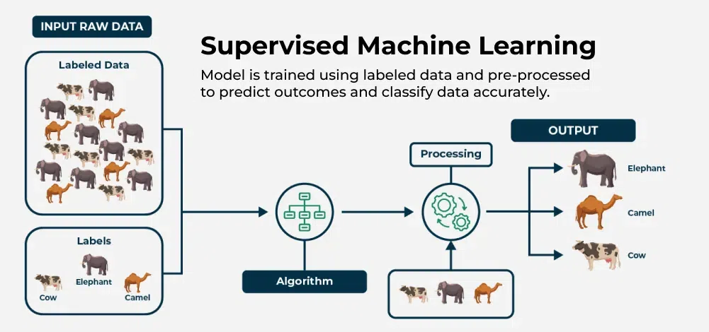
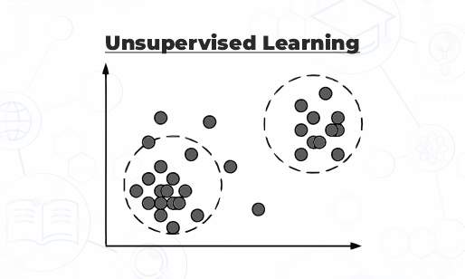

<!-- # Introduction to Reinforcement Learning

## What is Reinforcement Learning
 Reinforcement Learning (RL) is a branch of Machine Learning (ML) that focuses on how an agent should take actions in an environment to maximize the reward it receives.

 RL refers to a type of problem, a class of solution methods that work well on these problems, and a field of study that focuses on these problems and solution methods.

### Distinguishing features of an RL problem
1. RL problems are closed-loop systems. A closed-loop system means the agent's actions influence its later inputs.
2. There is no supervisor that guides the agent on which action to take.
3. The consequences of actions play out over extended time periods.

<div align="center">
  
  <p style="font-size: 0.9em;"><em>Figure 1.1: An agent-environment closed-loop diagram</em></p>
</div>

## Formulation of an RL problem
An RL agent requires an explicit goal dependent on its environment's state. Therefore, the agent must sense the state of the environment (to some extent) and possess the ability to affect the state through actions. These three aspects — sensation, action, and a goal — are the simplest form of an RL problem. Any method that is well-suited to solve problems with these aspects can be considered an RL solution method.

## Comparison with other learning paradigms

### Supervised Learning

<div align="center">
  
  <p style="font-size: 0.9em;"><em>Figure 1.2: Supervised Learning</em></p>
</div>

Supervised learning is learning from a training set of labeled examples provided by a knowledgeable external supervisor. Each example is a description of a situation or state of the environment, and its label is the correct action the agent must do in that situation. It is often used to classify the input into the category to which it belongs. The objective of supervised learning is for the agent or system to generalize its responses so that it acts correctly in situations not present in the training set. 


This type of learning is not adequate for learning from interaction. In interactive problems, it is often impractical to obtain examples of desired behavior that are both correct and representative of all situations in which the agent has to act. In uncharted territory, we would like the agent to learn from its own experience.

### Unsupervised Learning

<div align="center">
  
  <p style="font-size: 0.9em;"><em>Figure 1.3: Unsupervised Learning</em></p>
</div>

Unsupervised learning is typically about finding structure hidden in collections of unlabeled data. Even though one might be tempted to think of RL as an unsupervised learning method, they differ in their goals; unsupervised learning tries to find hidden structure, while RL does not. We, therefore, consider RL to be a third ML paradigm.

### Unique challenges in RL
There are challenges that arise in RL and not in other types of learning, such as the trade-off between exploration and exploitation. For the agent to obtain a high reward, it must prefer actions that it has tried in the past and found to be effective in producing reward. However, to discover such actions, it has to try actions that it has not selected before. The agent has to exploit what it already knows in order to obtain reward, but also has to explore in order to make better action selections in the future. The dilemma is that neither exploration nor exploitation can be pursued exclusively without failing the task. The agent must try a variety of actions and progressively favor those that appear to be best.

Another key feature of RL is that it explicitly considers the whole problem of a goal-directed agent interacting with an uncertain environment. This is different from many approaches which consider subproblems without addressing how they might fit into the larger picture, such as classifiers trained with supervised learning.

### Examples of RL problems

<div align="center">
  
  <p style="font-size: 0.9em;"><em>Figure 1.4: Gazelle calf learning to run</em></p>
</div>

RL starts with a complete interactive goal-seeking agent. The agent has an explicit goal, can sense its environment, and can choose actions that affect the state of the environment. It is usually assumed that the agent has to operate despite uncertainty about the environment. For example, when a chess player makes a move, their choice is informed both by planning and by intuitive judgment of the desirability of the new position.

A gazelle calf struggles to its feet minutes after being born, yet half an hour later it is running at two miles per hour. This example show the agent interacting with its environment to achieve a goal, despite uncertainty. Correct choices require taking into account the indirect, delayed consequences of actions and thus may require foresight or planning. Also, the effects of actions cannot be fully predicted; thus, the agent must monitor its environment frequently and react appropriately.

## Main Subelements of an RL system
There are four main subelements that make up an RL system: a policy, a reward signal, a value function, and optionally a model of the environment. The model is optional because not all RL methods require planning.

### 1. Policy
A policy defines the agent's way of behaving at a given time. It is a mapping from perceived states to actions to be taken in these states, corresponding to a set of stimulus-response rules. The policy may be a simple function or a lookup table, or it might involve extensive computation such as a search process.

The policy is the core of an RL agent in the sense that it alone is sufficient to determine its behavior.

### 2. Reward Signal
A reward signal defines the goal in an RL problem. On each time step, the environment sends to the agent a single number, the reward. The agent's sole objective is to maximize the total reward it receives over the long run. The reward signal thus defines what are the good and bad events for the agent. The reward sent to the agent depends on the agent's action and the state of the environment. The agent cannot directly alter this process, so the only way the agent can influence the reward signal is through its actions, which can have a direct effect on the reward or an indirect effect through changing the environment state. The reward signal is the primary basis for altering the policy.

### 3. Value Function
The value function specifies what is good in the long run. The value of a state is the total amount of reward an agent can expect to accumulate over the future, starting from that state. It indicates the long-term desirability of states after taking into account the rewards available in those states.

Rewards are in a sense primary, whereas values—which are predictions and aggregations of future rewards—are secondary. Without rewards, there could be no value, and the only purpose of values is to accumulate more reward. Nevertheless, it is values that we are most concerned about when making and evaluating decisions. Action choices are made based on value judgments because these metrics obtain the greatest amount of reward over the long run. Unfortunately, it is much harder to determine values than it is to determine rewards. Rewards are given directly by the environment, whereas values must be estimated and re-estimated from the sequences of observations an agent makes over its entire lifetime. In fact, the most important component of all RL algorithms is a method for effectively estimating values.

### 4. Model of the Environment
The model is something that mimics the behavior of the environment, allowing inferences to be made about how the environment will behave. Models are used for planning. RL problems that use models and planning are called model-based methods, as opposed to simpler model-free methods that are explicitly trial-and-error learners.


With these four subelements in place, we can now begin to formalize the RL framework mathematically — which we will do in the next chapter. -->

# Introduction to Reinforcement Learning

Omar Abu Shanab

---

## What is Reinforcement Learning?

**Reinforcement Learning (RL)** is a branch of Machine Learning that focuses on how an agent should take actions in an environment to maximize the reward it receives over time.

Rather than learning from labeled examples or discovering hidden patterns in data, an RL agent learns by *doing* — interacting with its world, observing the consequences, and gradually improving its behavior. RL refers simultaneously to a class of problems, a family of solution methods that work well on those problems, and the field of study that examines both.

### The Three Distinguishing Features of an RL Problem

| Feature | Description |
|---|---|
| **Closed-loop** | The agent's actions influence its future inputs — there is no separation between actor and environment |
| **No supervisor** | There is no teacher telling the agent which action to take; it must discover what works |
| **Delayed consequences** | The effects of actions play out over extended time periods, not just immediately |

<div align="center">
  
  <p><em>Figure 1.1 — The agent–environment closed-loop: the agent observes state and reward, selects an action, and the environment transitions accordingly.</em></p>
</div>

> **Example — Learning to Drive:** When you first learn to drive, no instructor controls the steering wheel for you. You observe the road (state), decide when to turn or brake (action), and feel the outcome — staying in lane or drifting off (reward signal). Over many attempts, you improve. This is the RL loop in everyday life.

---

## Formulation of an RL Problem

Every RL problem requires three ingredients:

1. **Sensation** — the agent must be able to sense the state of the environment to some extent
2. **Action** — the agent must be able to affect the state through its choices
3. **Goal** — the agent must have an explicit objective tied to the environment's state

Any method well-suited to problems with these three aspects can be considered an RL solution method.

---

## Comparison with Other Learning Paradigms

### Supervised Learning

<div align="center">
  
  <p><em>Figure 1.2 — In supervised learning, a labeled dataset guides the learner toward correct outputs.</em></p>
</div>

Supervised learning uses a training set of labeled examples provided by a knowledgeable external supervisor. Each example pairs a situation with the correct action or label. The goal is for the agent to **generalize** — to act correctly in situations not seen during training.

This approach falls short in interactive settings. In real-world interaction, it is often impossible to obtain examples that are both *correct* and *representative of every situation* the agent might face. In uncharted territory, we want the agent to learn from its own experience — not from a fixed dataset.

### Unsupervised Learning

<div align="center">
  
  <p><em>Figure 1.3 — Unsupervised learning seeks hidden structure in unlabeled data.</em></p>
</div>

Unsupervised learning finds hidden structure in collections of unlabeled data. While RL also receives no labeled examples, it is *not* unsupervised learning — its goal is to maximize a reward signal, not to uncover structure. This distinction makes RL a **third, distinct ML paradigm**.

### Summary Comparison

| | Supervised | Unsupervised | Reinforcement |
|---|---|---|---|
| **Labels / Feedback** | Labeled examples | No labels | Reward signal |
| **Goal** | Generalize to new inputs | Find hidden structure | Maximize cumulative reward |
| **Learns from** | A fixed dataset | A fixed dataset | Ongoing interaction |
| **Supervisor** | Yes — a teacher | No | No — must explore |

### Unique Challenges in RL

The most distinctive challenge in RL is the **exploration–exploitation trade-off**:

- To earn reward, the agent must *exploit* actions it already knows to be effective
- To find better actions, it must *explore* unfamiliar options
- Pursuing either exclusively leads to failure

Neither exploration nor exploitation can dominate. The agent must try a variety of actions and progressively favor those that appear best.

> **Example — A New Restaurant in Town:** Imagine you have a favorite restaurant (exploitation). A new place opens nearby — it might be better, or worse. Do you try it (exploration) or stick to what you know? The optimal diner balances both: occasionally trying new options while returning to proven favorites.

---

## Examples of RL Problems

<div align="center">
  
  <p><em>Figure 1.4 — A gazelle calf struggles to its feet minutes after birth; within half an hour it runs at speed. No instructor guided it — only the consequences of each attempt.</em></p>
</div>

RL problems share a common structure: an agent with an explicit goal interacts with an uncertain environment, where correct choices require accounting for indirect, delayed consequences. Consider these examples from Sutton & Barto:

- A **chess player** chooses moves informed by both explicit planning and intuitive judgment about position desirability
- A **petroleum refinery controller** adjusts parameters in real time to optimize yield, cost, and quality trade-offs
- A **mobile robot** decides whether to seek more trash or return to recharge, based on battery level and past experience
- A **gazelle calf** learns to run within minutes of birth, with no teacher — only the feedback of falling or staying upright

All of these involve interaction, uncertainty, explicit goals, and consequences that unfold over time.

---

## The n-Armed Bandit Problem

Before tackling the full RL problem, it helps to study a simpler version that isolates the exploration–exploitation challenge. This is the **n-armed bandit problem**.

### Setup

Imagine you face *n* slot machines (the "arms"), each paying out rewards drawn from an unknown probability distribution. At each step, you pull one lever and receive a reward. Your objective: **maximize total reward over time**.

You don't know which arm is best — you must *learn* it through repeated pulls. This is the bandit problem: pure evaluative feedback with no teacher.

> **Why "bandit"?** The name comes from "one-armed bandit" — a slot machine. With *n* levers instead of one, you face the dilemma of which to pull.

### The Core Dilemma

If you always pull the arm with the highest *estimated* value (greedy), you may never discover that another arm is actually better. If you explore constantly, you waste pulls on suboptimal arms. The tension is unavoidable.

**Action-value methods** address this by maintaining estimates of each arm's expected reward:

$$Q_t(a) = \frac{\text{sum of rewards from arm } a \text{ so far}}{\text{number of times arm } a \text{ was pulled}}$$

**ε-greedy selection** offers a simple balance:
- With probability **1 − ε**: pull the arm with the highest estimated value *(exploit)*
- With probability **ε**: pull a random arm *(explore)*

Even small ε (e.g., 0.1) dramatically outperforms pure greedy play in the long run, because exploration ensures the agent eventually identifies the true best arm.

> **Example — Clinical Trials:** A doctor testing *n* experimental treatments faces the same dilemma. Allocating all patients to the current best estimate ignores potentially superior treatments. Spreading patients randomly wastes lives. Adaptive trial designs (like Thompson Sampling) mirror RL bandit solutions.

### Why It Matters for RL

The bandit problem is the simplest instance of the broader RL challenge. It has no states, no delayed consequences — only the immediate exploration–exploitation trade-off. Mastering it builds intuition for everything that follows.

---

## The Four Main Subelements of an RL System

A complete RL system has four components beyond the agent and environment themselves.

---

### 1 — Policy

A **policy** defines the agent's way of behaving at a given time. It is a mapping from perceived states to actions:

$$\pi: \text{state} \rightarrow \text{action}$$

The policy may be a simple lookup table, a mathematical function, or a complex search process. It is the **core** of an RL agent — alone, it is sufficient to determine behavior.

> **Example — A Chess Opening Book:** A chess player's opening policy might be: *"If the opponent plays 1.d4, respond with the King's Indian Defense."* This maps board positions (states) to moves (actions) without any computation in the moment. The policy guides behavior; how good the policy *is* depends on what comes next.

---

### 2 — Reward Signal

A **reward signal** defines the goal. At each time step, the environment sends the agent a single number — the reward. The agent's sole objective is to maximize the **total reward over the long run**.

The reward signal defines what is good and bad in the *immediate* sense. The agent cannot alter the reward process directly — only through its actions, which affect the environment's state and thus future rewards.

> **Example — The Beginner Chess Player:** A beginner might feel rewarded every time they capture an opponent's piece (immediate reward). But capturing a pawn while walking into a checkmate trap is a terrible long-term decision. The reward signal (capturing material) is easy to sense; using it wisely requires understanding long-term value.

---

### 3 — Value Function

Whereas reward signals indicate what is good *right now*, the **value function** specifies what is good *in the long run*.

The **value of a state** is the total amount of reward an agent can expect to accumulate starting from that state, under a given policy:

$$V^\pi(s) = \mathbb{E}\left[ \sum_{t=0}^{\infty} \gamma^t R_t \;\middle|\; S_0 = s, \pi \right]$$

> **Example — The Queen's Gambit (Chess):** In the Queen's Gambit opening, White offers a pawn (1.d4 d5 2.c4). Black can capture it, gaining immediate material reward. But White's *value* calculation tells a different story: accepting the gambit hands White rapid development and central control, which translates into a decisive long-term advantage. The captured pawn has high *immediate reward*; the resulting position has low *value*. A strong player sacrifices the immediate reward to pursue states of higher value.

This distinction is critical:

| | Reward | Value |
|---|---|---|
| **Measures** | Immediate goodness | Long-term desirability |
| **Source** | Given directly by the environment | Must be *estimated* from experience |
| **Difficulty** | Easy to observe | Hard to compute accurately |

Rewards are foundational — without them, there could be no values. But **action choices are made based on value judgments**, not immediate rewards alone. Estimating values efficiently is arguably the most important problem in all of RL.

> **Another Example — n-Armed Bandit:** In the bandit setting, value is simply the expected reward of each arm. A greedy agent exploits the arm with highest *estimated* value. But the estimated value is only as good as the agent's exploration history — arms pulled few times have unreliable estimates. The bandit's challenge is precisely this: values are uncertain and must be refined through interaction.

---

### 4 — Model of the Environment *(optional)*

A **model** mimics the environment's behavior, allowing the agent to make inferences about what will happen next given a state and action. Models are used for **planning** — deciding on a course of action by simulating possible futures before they are experienced.

- **Model-based methods** use a model to plan ahead
- **Model-free methods** learn directly from trial-and-error, without an internal model

> **Example — Chess Engine vs. Chess Intuition:** A chess engine like Stockfish uses a model of the game (complete knowledge of rules) to search millions of positions ahead — classic model-based planning. A human grandmaster, by contrast, relies on pattern recognition and intuition to evaluate positions without exhaustive search — closer to model-free RL. Both can play at a high level, through very different mechanisms.

---

## Putting It All Together

With these four subelements — **policy, reward signal, value function, and model** — we have the vocabulary to formalize RL mathematically. The next chapter introduces Markov Decision Processes (MDPs), which provide the rigorous mathematical framework for everything that follows.

The central insight of this chapter is worth stating plainly:

> *Reinforcement learning is distinguished from other computational approaches by its emphasis on learning by an agent from direct interaction with its environment, without relying on exemplary supervision or complete models of the environment.* — Sutton & Barto

The exploration–exploitation trade-off, the distinction between reward and value, and the role of policy as the behavioral core of an agent are themes that will recur throughout this seminar.

---


## Citations
* Sutton, R. S., & Barto, A. G. (2018). Reinforcement learning: An introduction (2nd ed.). MIT Press.
* Hess, Shervin. "Speke's Gazelle Juliet Runs in the Africa Savanna Habitat." The Oregonian/OregonLive, Oregon Zoo, <https://www.oregonlive.com/living/2016/04/baby_gazelle_that_nearly_died.html>
* GeeksforGeeks. "Supervised Machine Learning" GeeksforGeeks, 14 Apr. 2026, <https://www.geeksforgeeks.org/machine-learning/supervised-machine-learning/>.
* WisdomPlexus. "Supervised Learning vs Unsupervised Learning: Key Differences To Know." WisdomPlexus, 31 May 2024, <https://www.wisdomplexus.com>.
---
To cite this, please use the following bibtex:

```bibtex
@misc{Abushanab_2026_ReinforcementLearning,
  author       = {Omar Abu Shanab},
  title        = {Reinforcement Learning: A Gentle Introduction, Chapter #},
  year         = {2026},
  publisher    = {GitHub},
  howpublished = {\url{https://github.com/amrmsab/reinforcement_learning_book}},
  note         = {Accessed: April 30, 2026}
}
