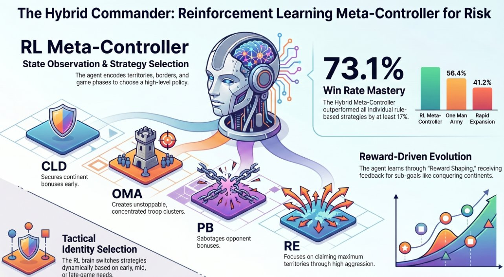
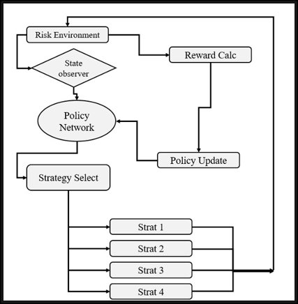
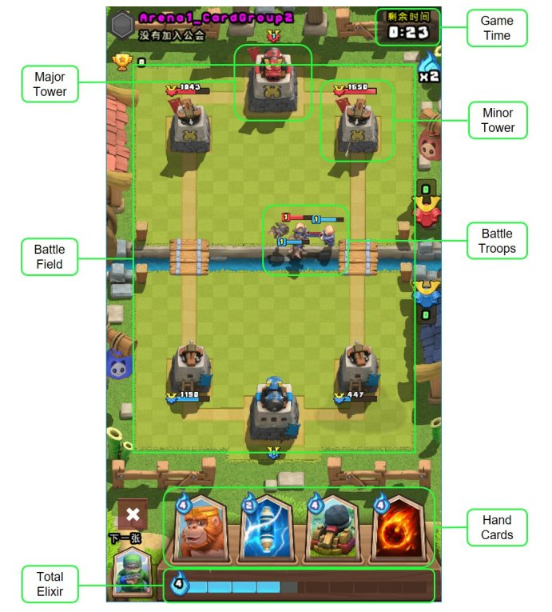
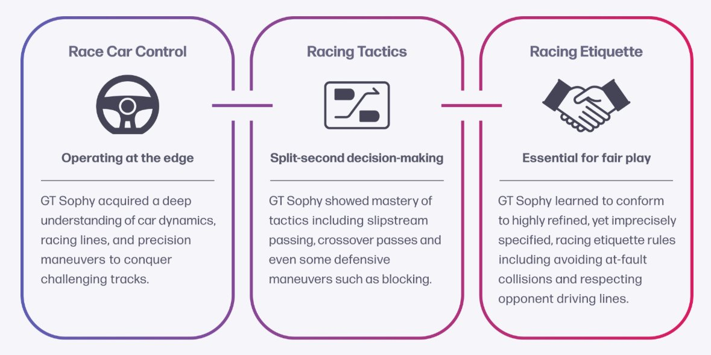

# Chapter 11 – Applications in Games

**Authors:** Omar Fouad, Ahmed Alaa Hamdy
*German University in Cairo, CSEN 1152 – Spring 2026*

---

## Introduction

Imagine teaching someone to play chess by never telling them the rules — just letting them play millions of games and rewarding them when they win. Sounds crazy, right? That is essentially what Reinforcement Learning (RL) does, and it turns out to work *remarkably* well.

Games have been the proving ground for RL since the very beginning. They offer something incredibly rare in research: a **closed, well-defined world** where an agent can act, fail, learn, and improve — all without real-world consequences. But beyond being a safe sandbox, games have pushed RL to its absolute limits. From a simple grid game of Battleship to the mind-bending complexity of StarCraft II with its near-infinite state spaces, each game has forced researchers to develop smarter, more creative algorithms.

In this chapter, we will walk through the landscape of RL in games — gradually increasing in complexity — and show you exactly how RL agents are formulated, what challenges arise, and what breakthroughs they have achieved. By the end, you will also see how lessons from games are spilling over into the real world.

---

## 11.1 Formulating a Game as an RL Problem

Before we dive into specific games, let us set up the shared vocabulary. In RL, every problem is modeled as a **Markov Decision Process (MDP)**, defined by:

- **State (S):** What the agent can observe about the world
- **Action (A):** What choices the agent can make
- **Reward (R):** The signal that tells the agent how well it is doing
- **Transition:** How the world changes after each action

Games map onto this framework naturally. Here's a quick comparison:

| Concept | Robotics | Video Game |
|---|---|---|
| **State** | Sensor readings | Board position, unit health, resources |
| **Actions** | Servo commands | Button presses, mouse clicks, ability casts |
| **Environment** | Physical world with real constraints | A customizable virtual world |
| **Agent** | Robot arm, drone | Any in-game character or player entity |

In more complex games, the raw game image (a grid of pixels) is typically fed through a **Convolutional Neural Network (CNN)** to extract a meaningful internal state vector. The agent then reasons on top of that compressed representation rather than raw pixels.

One key thing to note early: **not all video games are equal.** The complexity of the RL problem scales dramatically with the game:

- **Simple finite environments** (e.g., Battleship): Small, countable state spaces
- **Near-infinite environments** (e.g., Clash Royale, RISK): Continuous state spaces with many variables
- **Complex infinite environments** (e.g., Dota 2, StarCraft II): Astronomically large state spaces requiring multi-agent coordination

We will explore each tier in order.

---

## 11.2 Finite States: RL in Simple Environments

### 11.2.1 Case Study — Battleship

Battleship is a two-player guessing game where each player secretly arranges ships on a 10×10 grid, then takes turns guessing coordinates to "fire" at the opponent. The first to sink all enemy ships wins.

At first glance, this seems simple. But Battleship has some fascinating RL properties:

**1. Partial Observability**
The agent never sees the opponent's true board. It only knows the history of its own shots (hits and misses). This makes Battleship a **Partially Observable MDP (PO-MDP)** — the agent must act on *belief* rather than complete information.

**2. Two Learnable Policies**
An RL agent in Battleship actually needs to learn *two* things:
- **Placement policy:** Where to position its own ships to be hard to find
- **Shooting policy:** Where to fire to find and sink enemy ships most efficiently

**3. The Exploration vs. Exploitation Dilemma**
Should the agent keep firing around a known hit (exploit) or venture to an untested area (explore)? This classic RL tension is beautifully illustrated here.

The state space, despite the finite 10×10 grid, is actually enormous. Because each cell can be unknown, a hit, or a miss, and each combination represents a different belief state, the total possible configurations are on the order of **3¹⁰⁰** — huge, even for a "simple" game.

**Battleship as a PO-MDP:**

| Component | Details |
|---|---|
| **State** | Known shot history, known ship placements |
| **Hidden State** | Enemy board (partially observable) |
| **Actions** | Place a ship / Fire at a coordinate |
| **Reward** | +1 for hit, penalty for miss or wasted shot |

> 💡 **Try it yourself!** You can implement a simple Battleship RL agent using Q-learning on a belief-state representation. Libraries like `gymnasium` (formerly OpenAI Gym) make it easy to set up custom environments.

```python
# Pseudocode: Belief-state update in Battleship
def update_belief(belief_grid, shot_coord, result):
    row, col = shot_coord
    if result == "hit":
        belief_grid[row][col] = 1   # confirmed hit
    elif result == "miss":
        belief_grid[row][col] = -1  # confirmed miss
    return belief_grid
```

---

## 11.3 Infinite States: RL in Continuous Environments

### 11.3.1 The Jump from Grids to Continuous Space

Battleship's 100 possible grid coordinates feel manageable. But many real-time games involve characters that can move to *any* (x, y) coordinate — meaning the state space is, in principle, infinite. This is where tabular methods (Q-tables that store a value for every state) break down completely, and we need function approximation — typically neural networks.

### 11.3.2 Case Study — RISK: Policy Gradients in a Strategy Game

RISK is a classic board game of global domination. The game is played on a world map divided into **42 territories** grouped into **6 continents** (North America, South America, Europe, Africa, Asia, and Australia). Players control armies and take turns reinforcing, attacking, and fortifying. The endgame goal: eliminate all other players.



*Figure 11.1: Overview of the RL meta-controller for RISK, showing the four expert strategies and the 73.1% win rate achieved. (Hamdy, 2025)*


**Why is RISK hard for RL?**

- **Infinite-ish state space:** Troops can be distributed in astronomically many ways across 42 territories
- **Long time horizons:** A single game averages around **114 turns**, creating a severe **sparse reward problem** — the agent only gets a clear win/loss signal at the very end
- **Strategic depth:** Different phases of the game require fundamentally different strategies
- **Stochasticity:** Battle outcomes depend on dice rolls, introducing randomness that can override even the best-laid plans

**The Environment as an MDP**

To apply RL to RISK, the game must be formally encoded as an MDP. Here is how each component maps:

| MDP Component | RISK Encoding |
|---|---|
| **State S** | 50-dimensional vector (see below) |
| **Actions A** | Which of 4 expert strategies to deploy |
| **Reward R** | Shaped signal based on territory/continent events |
| **Transition T** | Determined by strategy execution + dice randomness |
| **Policy π** | A neural network mapping state → strategy probabilities |

**The State Vector — What the Agent Actually Sees**

Rather than processing the raw game board, the agent observes a compact **50-dimensional state vector** constructed from domain-specific features:

- Number of territories controlled by the agent and each opponent
- Current troop strength distribution across territories
- Number of border territories and their vulnerability scores (enemy-adjacent frontiers)
- Strength and proximity of enemy forces
- Control status of each of the 6 continents (binary flags)
- **One-hot encoded game phase:** Early (turns 0–30), Mid (turns 30–70), Late (turn 70+)

The game phase encoding is critical. By pre-profiling 50 games against each rule-based AI, researchers found the average game lasts roughly 114 turns, which informed where phase boundaries were drawn. The agent can then learn *different* strategies for each phase rather than a single fixed approach.

```python
def _get_game_phase(self):
    """Determine current game phase"""
    turn = getattr(self.game, 'turn', 0)
    if turn < 30:
        return 'early'
    elif turn < 70:
        return 'mid'
    else:
        return 'late'
```

**The Solution: Hybrid RL — Meta-Policy over Expert Strategies**

Rather than learning every low-level action (which territory to attack, how many troops to move), the agent operates as a **meta-controller**: it learns *which high-level strategy to use*, and delegates the actual moves to one of four hand-crafted expert modules:

| Strategy | Core Idea | Best Phase |
|---|---|---|
| **CLD** – Continent Lockdown | Secure full continents for bonus troops | Early |
| **OMA** – One Man Army | Concentrate troops into one massive attack force | Mid–Late |
| **PB** – Pressure Breaker | Disrupt enemy continent bonuses | Mid |
| **RE** – Rapid Expansion | Probability-optimized aggressive attacks | Late |

This hybrid design dramatically reduces the action space: instead of choosing among thousands of possible territory moves, the agent picks among just 4 options. The selected strategy then executes its own logic for all low-level decisions.


*Figure 11.2: The meta-controller architecture. The game state is fed into a REINFORCE-based policy selector, which picks one of four expert strategies each turn. (Hamdy, 2025)*


**The Policy Network Architecture**

The neural network that selects strategies is a **multilayer perceptron (MLP)**:

```
Input: 50-dimensional state vector
  ↓
Hidden Layer 1: 64 units, ReLU activation
  ↓
Layer Normalization
  ↓
Hidden Layer 2: 64 units, ReLU activation
  ↓
Output Layer: 4 units (one per strategy)
  ↓
Softmax → strategy probability distribution
```

Action selection uses **epsilon-greedy exploration**: with probability ε, a random strategy is chosen (to explore); otherwise, the strategy is sampled from the softmax output (to exploit learned knowledge). ε decays slowly over training to shift from exploration toward exploitation.



*Figure 11.3: Detailed RL system architecture. The state observer encodes the game state, the policy network selects a strategy via epsilon-greedy sampling, rewards are calculated from game events, and policy updates run every episode via REINFORCE. (Hamdy, 2025)*


**The Reward System — Shaped for Strategy**

Raw win/loss signals are too sparse for a 114-turn game. The reward function provides dense intermediate feedback:

| Event | Reward |
|---|---|
| Win the game | +15 |
| Lose the game | −15 |
| Conquer a territory | +3 |
| Complete a continent (early game) | +8 additional |
| Complete a continent (mid game) | +5 additional |
| Complete a continent (late game) | +2 additional |
| Lose a territory | −3 |
| Lose continent control | −5 additional |
| Complete continent during initial placement | +8 |

The phase-dependent bonuses reflect real strategic value: owning a continent early compounds across dozens of turns (extra troops every turn), while winning a continent in the late game provides much smaller returns. This phase-aware design guides the agent to prioritize continent control early and shift to aggressive finishing in the late game.

**The REINFORCE Learning Algorithm**

After each episode, the agent computes discounted returns for every decision:

$$G_t = \sum_{k=0}^{T-t} \gamma^k r_{t+k}$$

These returns weight the policy gradient loss:

$$\mathcal{L} = -\sum_t \log \pi_\theta(a_t | s_t) \cdot G_t$$

An **entropy bonus** is added to prevent the policy from collapsing to always picking one strategy too early. Gradients are clipped before the Adam optimizer step to prevent unstable updates.

**Results and Learned Behavior**

- Trained over **16,000 games** against a RandomAI baseline (first 2,000 with fixed ε to force exploration of all strategies)
- Achieved a **73.1% win rate** — a 17% advantage over the best single rule-based strategy (OMA at 56.4%)
- The agent learned **phase-specific strategy preferences**: CLD slightly preferred in early game, PB dominant in mid game, RE heavily preferred in late game — all without being told which strategy suits which phase

| Strategy | Win Rate vs Random |
|---|---|
| CLD | 29.5% |
| OMA | 56.4% |
| PB | 37.5% |
| RE | 41.2% |
| **RL Agent** | **73.1%** |

An early training challenge was reward imbalance causing the agent to over-rely on one strategy across all phases. This was corrected through careful reward function tuning and a reduced epsilon decay rate — a reminder that **reward design is often the hardest part of RL engineering**.

> 🤔 **Reflect:** Why would a fixed strategy always lose to an adaptive one in a game like RISK? Think about how an opponent could exploit any predictable pattern. Now think about why learning *when* to use each strategy is more valuable than just having the best strategy.

---

### 11.3.3 Case Study — Clash Royale: SEAT Architecture

Clash Royale is a real-time strategy (RTS) mobile game where two players simultaneously deploy troops, spells, and buildings on a shared arena (32,000 × 18,000 pixels) trying to destroy the opponent's towers within a three-minute match.



*Figure 11.4: The Clash Royale arena annotated with key game elements. The RL agent must observe all of these simultaneously to make decisions. (Chen et al., 2019)*


**Why is Clash Royale harder than RISK?**

- **Continuous real-time positioning:** The entire map is the state, updated many times per second
- **Imperfect information:** The opponent's hand cards and available elixir (the resource used to deploy units) are hidden
- **Simultaneous decisions:** Both players act at the same time; there are no clean "turns"

**The Solution: The SEAT (Selection-Attention) Model**

Researchers cleverly divided the decision into two sub-problems handled by two separate neural networks:

1. **Selection Network (What to play):** Evaluates the current board and card features to choose *which* card to deploy
2. **Attention Network (Where to play):** Generates a spatial attention map over the arena to identify *where* the card should be placed

This divide-and-conquer approach mirrors how human expert players actually think: first decide what to use, then decide where to use it.


*Figure 11.5: The SEAT (Selection-Attention) model architecture. Enemy unit maps and card features are processed by two sub-networks: the Selection Part chooses which card to play, and the Attention Part identifies where to deploy it. (Chen et al., IJCAI 2019)*


**Results:**
- **90% win rate** against aggressive and defensive rule-based bots
- **70% win rate** against decision-tree agents (which have hand-coded strategy logic)
- The agent independently learned **defensive positioning** and **unit counters** — e.g., using a cheap ranged unit to distract a slow tank — without being explicitly programmed with these tactics

---

## 11.4 Complex Infinite States: Multi-Agent RL in MOBAs and RTSs

### 11.4.1 Why Multi-Agent RL (MARL) Changes Everything

Now we enter the hardest tier. Games like Dota 2 (a MOBA — Multiplayer Online Battle Arena) and StarCraft II (a Real-Time Strategy game) are categorically more complex than anything we have seen so far. They require multiple agents working together against multiple opponents — all in real time, with incomplete information.

**The core challenges of MARL in complex games:**

| Challenge | Detail |
|---|---|
| **Partial Observability** | Large maps with "fog of war" — agents cannot see the whole map |
| **Sparse & Delayed Rewards** | Games last 30–60 minutes at high frame rates; credit assignment is difficult |
| **Team Coordination** | Agents must collaborate; pure individual reward signals are insufficient |
| **Scalability** | More agents = exponentially more states and joint actions to reason over |

To give you a sense of scale: MOBAs like Dota 2 can reach state spaces on the order of **10²⁰⁰⁰⁰** — a number so large it makes the Battleship state space look like a rounding error.

---

### 11.4.2 Case Study — League of Legends: A MOBA Agent

League of Legends (LoL) is played on a 16,000 × 16,000 unit map. Each player controls a unique champion with distinct abilities, buys items during the game, fights enemy minions, and coordinates with four teammates to destroy the enemy base.

**Architecture Highlights:**

The LoL RL agent uses an **Actor-Critic paradigm**:
- The **actor** selects actions (which ability to use, where to move)
- The **critic** estimates how good the current game state is, helping the actor improve

The state representation encodes champion positions, health, abilities, items, and nearby enemy creep positions — all compressed into a neural network input.

**Results (2024–2025 Live Tests):**
- In a 2024 live test, the agent performed **22 attacks in 3.2 seconds**, with each input taking under 0.145 seconds — reaction times that professional human players physically cannot match (pros average about double that response time)
- The agent demonstrated emergent coordination with human teammates, despite not being able to communicate through natural language

> 📌 **Key insight:** Speed alone does not make an agent win. Professional players compensate for slower reaction times with *strategic planning* that looks further ahead. RL agents often struggle with long-term planning compared to humans.

---

### 11.4.3 Case Study — Dota 2: OpenAI Five

Dota 2 features 5-vs-5 teams of heroes on a massive map with over 100 distinct hero characters, hundreds of items, and games lasting 30–60 minutes. OpenAI built **OpenAI Five** — a system of five coordinated RL agents — to tackle this.

**Scale of training:**
OpenAI Five ran **180 years of gameplay per day** using 128,000 CPU cores and 256 GPUs. This translates to roughly 50,000 games per day of self-play.

**Key design choices:**
- Each of the five agents has its own neural network but shares observations with teammates
- Agents are rewarded both individually (for kills, last-hits, gold earned) and collectively (for winning the game)
- A **team spirit** hyperparameter controls the balance between individual and collective rewards

**Results:**
- OpenAI Five defeated the **reigning Dota 2 world champions** (OG) in a public match in 2019
- The agents developed coordinated strategies like "smoke ganks" (coordinated ambushes) that are hallmarks of high-level human play

---

### 11.4.4 Case Study — StarCraft II: AlphaStar

If Dota 2 is chess in real time, StarCraft II is chess in real time *while also managing an entire economy and production chain*. Two players build bases, harvest resources, train different unit types, and attempt to destroy each other's infrastructure — all simultaneously, without turns.

Google DeepMind built **AlphaStar** to tackle StarCraft II.

**What makes StarCraft II uniquely hard:**

- **Long-horizon planning:** Strategic decisions made early in the game (which tech tree to pursue) affect the outcome 10 minutes later
- **Simultaneous macro and micro:** Players must manage their overall economy (macro) while also controlling individual units in combat (micro)
- **Race-specific strategies:** Three very different factions (Terran, Zerg, Protoss) with distinct units and mechanics

**AlphaStar's Training Pipeline:**

AlphaStar used a three-stage training approach:

1. **Supervised pre-training:** Learn from recorded human games to get a reasonable starting policy (rather than starting from random behavior)
2. **Reinforcement learning against fixed opponents:** Improve the policy using experience
3. **League training:** A pool of agents ("the League") including current agents and historical "snapshots" of past agents. New agents are trained against a diverse mixture of opponents to prevent overfitting to any single strategy

The loss function included a term that penalized the agent for diverging *too far* from human playing styles — keeping the agent grounded in strategies that are somewhat interpretable.

**Results:**
- AlphaStar achieved **Grandmaster level** — the top 0.15% of all human players — in all three StarCraft II factions
- It defeated multiple professional players in closed testing

```
AlphaStar Training Flow:
Human Replays → Supervised Learning → Base Policy
                                          ↓
                              Self-Play + League Training
                                          ↓
                            Grandmaster-Level Agent
```

---

## 11.5 RL Beyond the Screen: Sim-to-Real Transfer

One of the most exciting implications of game-based RL is **sim-to-real transfer**: using a game or simulation as a safe, cheap training environment, then deploying the learned policy in the physical world.

Games are not just entertainment — they are increasingly accurate physics simulators.

### 11.5.1 Case Study — Gran Turismo Sophy (GT Sophy)

Gran Turismo is a hyper-realistic racing simulation that models tire friction, air resistance, and suspension geometry with extraordinary fidelity. Sony AI built **GT Sophy** — an RL agent trained entirely within the game — that went on to beat world champion human drivers.


*Figure 11.6: GT Sophy's results were published on the cover of Nature (February 2022), marking the first time an RL agent surpassed world-champion human drivers in a realistic racing simulation. (Wurman et al., 2022)*


*Figure 11.7: Gran Turismo models real aerodynamics and physics (left), making it an unusually faithful simulation environment for training agents intended for real-world transfer (right).*


**The Algorithm: QR-SAC (Quantile-Regression Soft Actor-Critic)**

GT Sophy used a variant of the Soft Actor-Critic (SAC) algorithm with **distributional RL**: instead of predicting a single expected reward, the agent predicts a *distribution* of possible outcomes. This is crucial in racing, where a tiny mistake at high speed (say, clipping a wall at 200mph) can have catastrophic consequences — the agent needs to reason about worst-case scenarios, not just averages.

A unique addition was an **etiquette reward**: penalties for unsportsmanlike behavior like collisions, forcing opponents off the track, or dangerous blocking maneuvers. This ensured the agent would race aggressively but *fairly*.



*Figure 11.8: The three capabilities GT Sophy mastered: precise car control, tactical racing maneuvers, and fair-play etiquette — each enforced through careful reward design. (Sony AI / Gran Turismo Sophy)*


**Training Timeline:**


*Figure 11.9: The GT Sophy RL training loop. The agent observes speed, position, and other physical state variables from the Gran Turismo environment, and outputs continuous control actions — throttle, steering angle, and braking force. (Sony AI)*


| Duration | Milestone |
|---|---|
| 2 hours | Learns to stay on track safely |
| 2 days | Beats ~95% of all human players |
| 10–12 days | Reaches superhuman level (~45,000 driving hours equivalent) |

**Results:**
- In October 2021, GT Sophy beat the world's best drivers **104 to 52**
- The techniques are now being explored for **autonomous driving** and **high-speed robotics**

As the creator of Gran Turismo stated: game AI research will contribute to both the future of games and automobiles.

---

## 11.6 Lessons and Broader Context

Looking across all these case studies, several themes emerge:

**1. The progression of algorithms mirrors the progression of game complexity.**
Simple tabular Q-learning works for tiny state spaces. Policy gradients handle continuous states. Deep RL with CNNs handles raw image inputs. MARL adds coordination. Distributional RL handles uncertainty. Each layer of complexity required a corresponding algorithmic innovation.

**2. Reward shaping is often the real engineering challenge.**
The hardest part of applying RL to games is rarely the network architecture — it is designing a reward signal that guides the agent toward *good* strategies. RISK needed intermediate milestones. Dota 2 needed team spirit. GT Sophy needed an etiquette penalty.

**3. Self-play is incredibly powerful.**
AlphaStar, OpenAI Five, and the RISK agent all benefited from training against themselves or past versions of themselves. Self-play prevents overfitting to any fixed opponent and can generate superhuman strategies that no human ever taught the agent.

**4. Games serve as benchmarks for capabilities we care about in the real world.**
Partial observability, long-horizon planning, multi-agent coordination, and sim-to-real transfer are all relevant to robotics, autonomous vehicles, finance, and healthcare. Every breakthrough in games is a prototype for the real world.

---

## 11.7 Ethical Considerations

RL in games raises a few concerns worth thinking about:

- **Fairness in online play:** An RL agent deployed in a competitive online game gives whoever controls it an unfair advantage. Most competitive games ban bots for this reason.
- **Addictive design:** RL techniques are used by game companies not just to build AI opponents, but to *design games themselves* in ways that maximize player engagement — sometimes at the expense of player wellbeing.
- **Sim-to-real risks:** A racing agent trained in simulation may behave unexpectedly when real-world physics differ slightly from the simulation. Rigorous testing is critical before deployment in safety-critical contexts.

---

## 11.8 Reflective Questions

Test your understanding with these questions:

1. Why is Battleship a PO-MDP rather than a standard MDP? What information is hidden, and how does partial observability affect the agent's strategy?

2. The RISK agent used reward shaping to solve the sparse reward problem. Can you think of another game where sparse rewards would be a challenge, and propose an intermediate reward signal?

3. AlphaStar was penalized for diverging too far from human playing styles. Why might this be useful, and what might be lost by adding this constraint?

4. GT Sophy was trained entirely in simulation but competed against human drivers in the real game. What could go wrong in a sim-to-real transfer, and how might you test for it?

5. OpenAI Five used a "team spirit" hyperparameter. What do you think happens when team spirit = 0 (pure individual reward)? What about team spirit = 1 (pure team reward)?

---

## Summary

In this chapter, we journeyed from the humble grid of Battleship — teaching us about partial observability and exploration — all the way to the 10²⁰⁰⁰⁰-state space of Dota 2 and the real-world racing circuits of Gran Turismo.

Along the way, we saw how the core RL concepts — MDPs, policy gradients, actor-critic methods, reward shaping, and self-play — combine and evolve to tackle increasingly complex challenges. Games have proven to be not just entertainment, but the richest proving ground for AI research. And the lessons learned in virtual worlds are now driving real breakthroughs in robotics, autonomous vehicles, and beyond.

---

## References

1. Silver, D., Huang, A., Maddison, C. J., et al. (2016). Mastering the game of Go with deep neural networks and tree search. *Nature*, 529(7587), 484–489.

2. Vinyals, O., Babuschkin, I., Czarnecki, W. M., et al. (2019). Grandmaster level in StarCraft II using multi-agent reinforcement learning. *Nature*, 575, 350–354. Available at: https://www.nature.com/articles/s41586-019-1724-z

3. Li, Z., Ji, Q., Ling, X., & Liu, Q. (2025). A Comprehensive Review of Multi-Agent Reinforcement Learning in Video Games. *arXiv preprint arXiv:2509.03682*. Available at: https://arxiv.org/pdf/2509.03682

4. Berner, C., Brockman, G., Chan, B., et al. (2019). Dota 2 with Large Scale Deep Reinforcement Learning. *arXiv preprint arXiv:1912.06680*. Available at: https://arxiv.org/pdf/1912.06680

5. Hamdy, A. A. (2025). Reinforcement Learning for Risk Strategy Optimization. Bachelor thesis, Dept. Media Eng. and Tech., German University in Cairo, New Cairo, Egypt. Supervisor: Dr. Islam A. ElMaddah.

6. Wurman, P. R., Barrett, S., Kawamoto, K., et al. (2022). Outracing champion Gran Turismo drivers with deep reinforcement learning. *Nature*, 602, 223–228. Available at: https://www.gran-turismo.com/us/gran-turismo-sophy/technology/

7. Chen, J., Liu, B., & Kong, F. (2019). Reinforcement learning for Clash Royale. *Proceedings of IJCAI 2019*. Available at: https://www.ijcai.org/proceedings/2019/0631.pdf

8. Sutton, R. S., & Barto, A. G. (2018). *Reinforcement Learning: An Introduction* (2nd ed.). MIT Press. Available at: http://incompleteideas.net/book/RLbook2020.pdf

9. Mnih, V., Kavukcuoglu, K., Silver, D., et al. (2015). Human-level control through deep reinforcement learning. *Nature*, 518(7540), 529–533.

---


