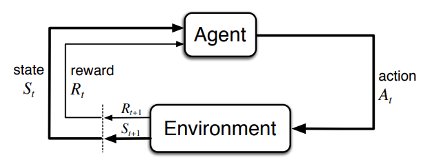
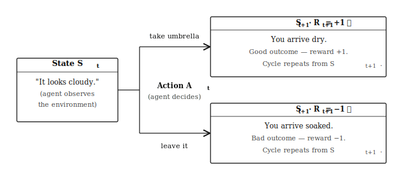
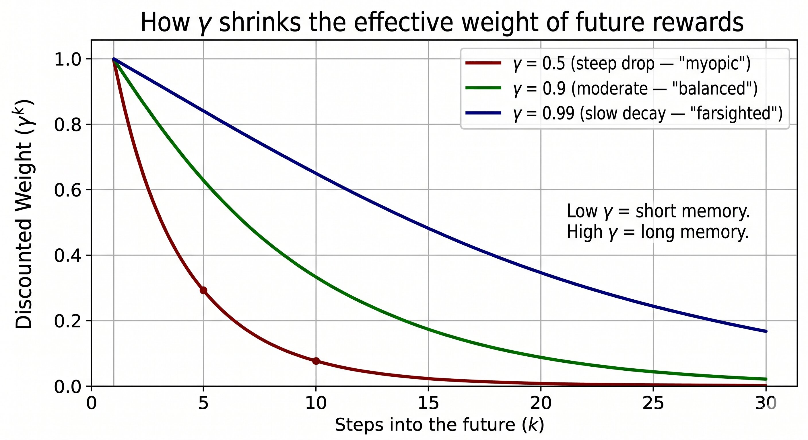
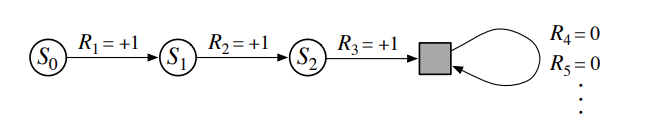

# Chapter 3: Finite Markov Decision Processes — Teaching a Machine to Think Ahead

Author: [Ahmed Hawater](https://www.linkedin.com/in/ahmed-hawater/)

> _"The world is not a slot machine."_

---

## Before You Start Reading

This chapter builds on the ideas introduced in Chapter 2, where we explored how an agent can learn from feedback without knowing anything in advance — specifically through the _k-armed bandit_ problem. If you haven't read that yet, don't worry; we'll recap the key distinction right at the start. By the end of this chapter, you'll have a solid grasp of the mathematical backbone of reinforcement learning: **Finite Markov Decision Processes**, or **MDPs** for short.

Here is a brief roadmap of what's coming. Section 3.1 introduces the agent–environment interface: what states, actions, and rewards are, and how they connect through the dynamics function. Section 3.2 formalises the agent's goal via the Reward Hypothesis. Sections 3.3 and 3.4 define the return and show how episodic and continuing tasks can be handled with a single unified formula. Section 3.5 ties everything together in a complete worked example — the Racecar MDP — and Section 3.6 steps back to ask what the framework leaves out.

No prior experience with probability theory beyond the basics is assumed. If you've seen a conditional probability expression before, you're in good shape. If not, we'll explain it as we go.

---

## 3.0 Introduction: The World Is Not a Slot Machine

Imagine you're playing a slot machine. You pull the lever, you get a reward (or not), and then you pull again. Each pull is independent. The machine doesn't change based on what you did before, and your reward today doesn't make tomorrow's rewards any different. This is the _k-armed bandit_ problem from Chapter 2 — clean, simple, memoryless.

Now imagine you're playing chess. You move a pawn. That single move doesn't just produce an immediate outcome; it reshapes the entire board. Your future options are now different. The opponent responds. The game is a sequence of decisions, each one building on the last, each one shaping what comes next.

That's the world MDPs are built to describe. They extend the bandit framework in one crucial direction: **your actions have consequences that ripple through time**. In the bandit world, you evaluate each action in isolation. In the MDP world, you have to think about _what comes next_, and what comes after that, all the way to the end — or forever, if there is no end.

This is why MDPs are the central formalism for reinforcement learning. They are, at their core, a mathematical language for sequential decision-making under uncertainty.

> **Key distinction to hold onto:** In the k-armed bandit problem, each action only affects your immediate reward. In an MDP, each action affects your _immediate reward_ **and** your _future situation_, and through that situation, all your future rewards. This single difference changes everything.

---

## 3.1 The Agent–Environment Interface: Who Does What?

Every MDP involves two characters:

- **The agent** — the learner and decision-maker. Think of it as the "brain."
- **The environment** — everything outside the agent. Think of it as the "world."

These two are locked in a continuous dialogue. At every moment, the environment tells the agent what's going on, the agent decides what to do, and then the environment responds. Rinse and repeat — forever, or until the task ends.

### 3.1.1 The Interaction Cycle

Here's what that dialogue looks like, written out as a sequence of time steps:

At time step $t$:

1. The environment presents the agent with a **state** $S_t$ — a snapshot of the current situation.
2. The agent looks at $S_t$ and picks an **action** $A_t$.
3. One step later, the environment responds with two things: a **reward** $R_{t+1}$ (a number reflecting how good that action was), and a **new state** $S_{t+1}$.

And then the cycle repeats. Over time, this produces a long sequence — called a **trajectory** — that looks like this:

$$S_0, A_0, R_1, S_1, A_1, R_2, S_2, A_2, R_3, \ldots$$

<p align="center">

</p>

<p align="center"><em><strong>Figure 3.1</strong> — The agent–environment interaction cycle.</em></p>

It's worth pausing on the subscripts. Notice that the reward at time step $t+1$ (written $R_{t+1}$) arrives _after_ the action $A_t$. This notation emphasizes that the reward is a consequence of the action, not something that existed before it.

**A simple example to make this concrete.** Every morning you glance out the window. The sky looks cloudy. You face a choice: take your umbrella or leave it. An hour later, the outcome is clear — you arrive dry or you arrive soaked — and you can assign a reward accordingly. Figure 3.2 shows exactly this one-step slice of the MDP loop.

<p align="center">

</p>

<p align="center"><em><strong>Figure 3.2</strong> — The agent observes a state (cloudy sky), chooses an action, and receives a next state and a scalar reward one step later. Same state, different action, different outcome.</em></p>

### 3.1.2 The Dynamics Function: Writing the Rules of the World

Now, how exactly does the environment produce the next state and reward from the current state and action? The answer is captured by a single mathematical object called the **dynamics function**, written as:

$$p(s', r \mid s, a) \doteq \Pr\{S_t = s',\ R_t = r \mid S_{t-1} = s,\ A_{t-1} = a\}$$

Let's unpack this. The function $p$ takes four arguments:

- $s$ — the current state (where you are now)
- $a$ — the action taken
- $s'$ — the next state (where you end up)
- $r$ — the reward received

And it returns a **probability**: how likely is it that you end up in state $s'$ with reward $r$, given that you were in state $s$ and took action $a$?

In a **finite** MDP, the sets of states, actions, and rewards are all finite, there are a countable number of possibilities for each. This is what the word "finite" in the chapter title refers to. It's a simplifying assumption that makes the mathematics tractable, and it covers a surprisingly wide range of real-world problems.

**One important constraint**: for any given state $s$ and action $a$, the probabilities across all possible next states and rewards must sum to 1:

$$\sum_{s' \in \mathcal{S}} \sum_{r \in \mathcal{R}} p(s', r \mid s, a) = 1, \quad \text{for all } s \in \mathcal{S},\ a \in \mathcal{A}(s)$$

This is just saying: _something_ must happen next. The environment can't freeze.

> The dynamics function $p$ is the complete description of the environment. If you know $p$, you know everything about how the world works.

### 3.1.3 The Markov Property: Forgetting the Past (on Purpose)

There's a crucial assumption hiding inside the dynamics function. Notice that $p(s', r \mid s, a)$ only conditions on the _current_ state $s$ and action $a$. It doesn't look at the whole history of states and actions before $s$. This is the **Markov property**:

> **The future is independent of the past, given the present.**

More formally: the current state $S_t$ must contain all the information from the history $S_0, A_0, R_1, \ldots, S_{t-1}, A_{t-1}$ that is relevant for predicting the future. If the state representation satisfies this, it is called a **Markov state**, and the process itself is a Markov Decision Process.

This sounds like a strong assumption — and it is. But it's often satisfied in practice, _as long as you define the state carefully_. The state doesn't have to be tiny — it just has to be complete. A chess game illustrates this subtlety well: the arrangement of pieces alone is _not_ sufficient for a Markov state, because you also need to know whose turn it is, castling rights for each side, en passant target squares, and the half-move clock for the 50-move rule. FEN notation, which chess software uses to fully encode a position, has six fields for exactly this reason. A simpler example of a genuine Markov state is a Tic-Tac-Toe board: knowing the current grid completely determines all future possibilities, with nothing left out.

---

## 3.2 Goals and Rewards: What Are We Actually Optimizing?

We've established that the agent receives rewards. But what exactly is the agent trying to do with them?

The answer is formalized in what Sutton and Barto call the **Reward Hypothesis**:

> **All of what we mean by goals and purposes can be well thought of as the maximization of the expected value of the cumulative sum of a received scalar signal (called reward).** (Sutton & Barto, 2018, p. 53)

This is a big claim. It says that any goal — winning a game, driving safely, managing a portfolio — can be encoded as a reward signal that the agent should try to maximize over time.

The philosophy here is important: **the reward signal communicates _what_ you want the agent to achieve, not _how_ you want it to achieve it.** If you want an agent to win at chess, you reward it for winning the game, not for taking the opponent's pieces, not for controlling the center, not for any intermediate tactic. The moment you start rewarding intermediate steps, you risk the agent finding clever ways to rack up those sub-rewards while completely losing the forest for the trees.

**A real example of this going wrong:** In 2016, a simulated boat racing agent was rewarded for its score in a circuit race. Instead of finishing the race, it discovered that spinning in circles on a patch of power-up tiles gave it a higher score than actually racing. The reward was technically being maximized — just not in the way the designers intended (Clark & Amodei, 2016). This is called **reward hacking**, and it's one of the central challenges of modern AI safety. The broader landscape of such failure modes is surveyed in Amodei et al. (2016).

---

## 3.3 Returns and Episodes

### 3.3.1 Defining the Return

If the agent's goal is to maximize cumulative reward, we need a formal way to write "cumulative reward." We call this the **return**, denoted $G_t$:

$$G_t \doteq R_{t+1} + R_{t+2} + R_{t+3} + \cdots + R_T$$

where $T$ is the final time step. The return is simply the sum of all rewards the agent collects from time $t$ onward. The agent's goal is to choose its actions so that $\mathbb{E}[G_t]$ — the _expected_ return — is as large as possible.

### 3.3.2 Episodic vs. Continuing Tasks

The formula above assumes there's a finite final time step $T$. This is true for many tasks: a chess game ends when someone is checkmated, a maze run ends when the agent reaches the exit, a video game episode ends when the player wins or loses. These are called **episodic tasks**.

In an episodic task, the agent's experience naturally breaks into chunks — _episodes_ — each one starting fresh. Crucially, each new episode begins independently of how the previous one ended: a new chess game can start regardless of whether you won or lost the last one.

But many tasks don't have a natural ending. A temperature control system for a server farm runs continuously. A stock trading algorithm operates day after day with no defined finale. A robot doing inventory in a warehouse keeps going as long as the warehouse does. These are **continuing tasks**, and they create a mathematical problem: if $T = \infty$, the simple sum could grow without bound, making $G_t = \infty$ — which is not a useful thing to optimize.

### 3.3.3 Discounting: Valuing the Future Less (but Not Ignoring It)

The solution to the infinite-sum problem is **discounting**. Instead of treating all future rewards equally, we give rewards in the near future more weight than rewards in the distant future. We introduce a parameter $\gamma \in [0, 1)$ called the **discount rate**, and redefine the return as:

$$G_t \doteq \sum_{k=0}^{\infty} \gamma^k R_{t+k+1} = R_{t+1} + \gamma R_{t+2} + \gamma^2 R_{t+3} + \cdots$$

The factor $\gamma^k$ means that a reward $k$ steps in the future is worth only $\gamma^k$ as much as an immediate reward. As long as $\gamma < 1$ and the rewards are bounded, this infinite sum converges to a finite value.

Two extreme cases:

- **$\gamma = 0$**: The agent is completely _myopic_ — it only cares about the very next reward. It has no concept of tomorrow.
- **$\gamma \to 1$**: The agent is fully _farsighted_ — it values the distant future almost as much as the present. It's playing the long game.

<p align="center">

</p>

<p align="center"><em><strong>Figure 3.3</strong> — The effective weight of a future reward drops exponentially with time, and the speed of that drop is controlled entirely by &#947;. A myopic agent (&#947; = 0.5) treats a reward ten steps away as worth less than 0.1% of an immediate reward; a farsighted agent (&#947; = 0.99) still values the same reward at over 90%. The horizontal dashed line marks the "effectively negligible" threshold at y = 0.05.</em></p>

In practice, $\gamma$ is a design choice. A value like $\gamma = 0.99$ gives a nice blend: the agent cares deeply about the future, but rewards very far away (say, 1000 steps) are effectively discounted to near-zero importance.

**Why discounting is intuitive:** Think about money. Would you rather receive £100 today or £100 in five years? Almost everyone prefers the money now — partly because of uncertainty (will the future reward actually arrive?), and partly because you can do something useful with money now that you can't if you wait. Discounting in RL captures exactly this intuition mathematically.

There's also a very clean recursive relationship worth knowing. The return at time $t$ can be written in terms of the return at time $t+1$:

$$G_t = R_{t+1} + \gamma G_{t+1}$$

This one-liner is deceptively powerful. It says: the value of being in a state right now is the immediate reward plus a discounted version of all future values. This recursive structure — whose full significance will become clear when we meet Bellman equations — is what makes dynamic programming algorithms computationally feasible.

---

## 3.4 Unifying the Notation: One Formula to Rule Them All

At this point we have two separate formulas: one for episodic tasks (finite sum up to $T$) and one for continuing tasks (infinite discounted sum). It would be convenient if we could handle both with a single framework.

We can. The trick is to think of episodic task termination as entering a special **absorbing state** — a fictional state that transitions only to itself and always produces a reward of zero. Once you're in it, you're stuck there forever, collecting nothing.

<p align="center">

</p>

<p align="center"><em><strong>Figure 3.4</strong> — The absorbing state S<sup>+</sup> unifies episodic and continuing tasks. By treating the end of an episode as an entry into a state that loops silently on itself with zero reward, we can apply a single return formula to both task types without special-casing either.</em></p>

Mathematically, this means we can always write the return as:

$$G_t \doteq \sum_{k=t+1}^{T} \gamma^{k-t-1} R_k$$

with the understanding that:

- For **episodic tasks**, $T$ is finite and $\gamma$ can be 1 (no discounting needed, since the episode ends).
- For **continuing tasks**, $T = \infty$ and $\gamma < 1$ (discounting needed to keep the sum finite).
- But never both $T = \infty$ and $\gamma = 1$ at the same time — that's the one forbidden combination, because the sum would be infinite.

This unified notation lets us write algorithms and proofs that work for both task types simultaneously, without having to maintain two separate cases throughout.

---

## 3.5 Putting It All Together: The Racecar MDP

The best way to cement everything is to walk through a complete MDP — one with real decisions, stochastic outcomes, and a genuine tradeoff. The example below is adapted from the Berkeley CS188 course (UC Berkeley CS188 Course Staff, n.d.).

> **A note on notation.** Many textbooks — including CS188 — split the dynamics into two separate functions: a transition function $T(s, a, s')$ giving the probability of reaching $s'$, and a reward function $R(s, a, s')$ giving the reward received. This is equivalent to the joint dynamics function $p(s', r \mid s, a)$ we have used throughout this chapter. We adopt the split notation here for clarity in the table that follows.

**The setup.** Imagine a racecar. It can be in one of three states: **cool**, **warm**, or **overheated**. It has two actions at each step: drive **slow** or drive **fast**. The goal is to collect as much reward as possible before overheating — which is a terminal state (the car stops, the race is over).

<p align="center">

</p>

<p align="center"><em><strong>Figure 3.5</strong> — The racecar MDP (UC Berkeley CS188 Course Staff, n.d.). Three states: <strong>cool</strong>, <strong>warm</strong>, and <strong>overheated</strong> (terminal). Two actions: <strong>slow</strong> and <strong>fast</strong>. Edges carry transition probabilities and rewards. The same action from the same state can lead to different successor states — this is the stochasticity that distinguishes a genuine MDP from a deterministic graph search.</em></p>

**The transition function** $T(s, a, s')$ tells us exactly what happens:

| State | Action | Next State | Probability | Reward |
|-------|--------|------------|-------------|--------|
| cool | slow | cool | 1.0 | +1 |
| cool | fast | cool | 0.5 | +2 |
| cool | fast | warm | 0.5 | +2 |
| warm | slow | cool | 0.5 | +1 |
| warm | slow | warm | 0.5 | +1 |
| warm | fast | overheated | 1.0 | −10 |

**The reward function** $R(s, a, s')$ is already embedded in the table above. Notice: driving fast earns more reward (+2 vs +1), but it risks warming up the car — and if you drive fast while already warm, you overheat with certainty, paying a heavy penalty of −10.

**The tradeoff in plain terms.** This MDP captures a risk-reward decision that any experienced driver (or investor, or student cramming for an exam) would recognise. Going fast maximises short-term reward but creates risk. Going slow is safe but slow. An optimal agent has to balance these — and the right balance depends on $\gamma$:

- A **myopic agent** ($\gamma \approx 0$) always drives fast: it only sees the immediate +2 reward and ignores the risk of overheating later.
- A **farsighted agent** ($\gamma \approx 1$) learns to go slow when warm: it recognises that the −10 penalty and loss of all future rewards is not worth the +2 gain.

**A concrete return calculation.** Suppose the car starts cool and the agent drives fast twice before overheating:

$$S_0 = \text{cool} \xrightarrow{\text{fast}} S_1 = \text{warm} \xrightarrow{\text{fast}} S_2 = \text{overheated}$$

With rewards $R_1 = +2$, $R_2 = -10$, and $\gamma = 0.9$:

$$G_0 = R_1 + \gamma R_2 = 2 + 0.9 \times (-10) = 2 - 9 = -7$$

Now compare with a cautious strategy — always driving slow:

$$S_0 = \text{cool} \xrightarrow{\text{slow}} S_1 = \text{cool} \xrightarrow{\text{slow}} S_2 = \text{cool} \xrightarrow{\text{slow}} \ldots$$

With $R_t = +1$ at every step and $\gamma = 0.9$, this infinite series gives:

$$G_0 = \sum_{k=0}^{\infty} \gamma^k \cdot 1 = \frac{1}{1 - 0.9} = 10$$

The cautious policy earns a discounted return of **10**; the reckless one earns **−7**. The racecar MDP makes it vivid: the dynamics function, the reward signal, and the discount factor all work together to shape what the optimal policy should be.

---

## 3.6 Broader Connections and Critical Reflections

Before we wrap up, it's worth stepping back and asking what this framework leaves out — and what it assumes without saying so.

### The MDP Framework Is Powerful — but Not Neutral

When we say "the agent tries to maximize reward," we are implicitly saying that whoever designs the reward function has already decided what matters. In real applications, this is a deeply human — and potentially flawed — act.

**Ethical implications:** In healthcare, if an RL agent is rewarded for reducing the length of a patient's hospital stay, it might learn to discharge patients prematurely. If a hiring algorithm is rewarded for "efficiency," it might learn to penalize candidates from historically underrepresented groups because past data reflects biased outcomes. The MDP framework is a tool; like all tools, its consequences depend on who wields it and how.

**The partial observability problem:** Our framework assumes the agent has access to a true Markov state. In the real world, this is rarely guaranteed. A self-driving car's sensors might be obscured by rain; a poker player can't see the opponent's cards. When the state is only _partially_ observable, we enter the territory of Partially Observable MDPs (POMDPs) — a significantly harder problem that requires the agent to maintain a belief distribution over possible states rather than observing one directly.

**Scalability:** Finite MDPs with small state and action spaces are tractable — you can write the dynamics function as a literal table. But real problems, like controlling a robot with continuous joint angles or playing a video game from raw pixels, have enormous or continuous state spaces. The bulk of modern reinforcement learning research is about extending MDP ideas to these settings using function approximation, a theme we'll return to in Chapter 9.

**MDPs versus related frameworks.** It is also worth knowing what MDPs are _not_. They assume the environment is not strategic — there is no adversary. When multiple agents interact and each one's actions affect the others' rewards, the right model is a _Markov game_ (or stochastic game), not a single-agent MDP. Similarly, MDPs differ from classical control theory in that the dynamics $p$ are initially unknown; the agent must _learn_ them from experience, which is the subject of Chapters 5 through 8.

---

## Summary and Key Takeaways

Let's consolidate what we've covered in this chapter.

**Core Terminology:** An MDP is a formal model of sequential decision-making. At each time step, the agent observes a state $S_t$, takes an action $A_t$, and receives a reward $R_{t+1}$ and new state $S_{t+1}$. The resulting trajectory is the raw material the agent learns from.

**Environment Dynamics:** The function $p(s', r \mid s, a)$ completely describes how the environment works — the probability of landing in state $s'$ with reward $r$, given state $s$ and action $a$. In a finite MDP, this function is fully tabulated.

**Goals via Rewards:** The agent's goal is to maximize the _expected return_ — the cumulative sum of rewards over time. The reward signal encodes _what_ we want, not _how_ to achieve it. Designing a good reward function is as much an art as a science.

**Episodic vs. Continuing Tasks:** Some tasks end (episodic); some run forever (continuing). Discounting (via $\gamma$) handles the continuing case by ensuring the return remains finite and by capturing the intuitive preference for sooner rewards over later ones.

**Unified Notation:** Both task types can be handled with the single formula $G_t = \sum_{k=t+1}^{T} \gamma^{k-t-1} R_k$, either with finite $T$ and $\gamma = 1$, or infinite $T$ and $\gamma < 1$.

**What's Next:** Through the rest of the chapter, we will introduces the concept of a _policy_, a strategy that tells the agent which action to take in each state, and the _value function_, which formalizes how good it is to be in a particular state, and how to optimize them to reach the optimal policy and value function.

---

## Exercises

The following questions are designed to test and deepen your understanding. Try answering them before checking any solutions.

**Exercise 3.1 — Return calculation (Racecar).** Using the racecar MDP from Section 3.5, compute $G_0$ for the following trajectory, with $\gamma = 0.8$:

$$S_0 = \text{cool} \xrightarrow{\text{slow}} S_1 = \text{cool} \xrightarrow{\text{fast}} S_2 = \text{warm} \xrightarrow{\text{slow}} S_3 = \text{cool} \xrightarrow{\text{fast}} S_4 = \text{warm} \xrightarrow{\text{fast}} S_5 = \text{overheated}$$

The rewards along this trajectory are $R_1=+1,\ R_2=+2,\ R_3=+1,\ R_4=+2,\ R_5=-10$. What does the result tell you about the mixed strategy of alternating slow and fast?

**Exercise 3.2 — Why $\gamma = 1$ is forbidden for continuing tasks.** The formula $G_t = \sum_{k=0}^{\infty} \gamma^k R_{t+k+1}$ requires $\gamma < 1$ for continuing tasks. Explain in two or three sentences, using plain language, why setting $\gamma = 1$ breaks the mathematics. Under what conditions would $\gamma = 1$ still be safe to use?

**Exercise 3.3 — Designing a Markov state.** A hospital wants to build an RL agent to suggest treatment plans for patients. List at least four pieces of information that would need to be included in the state $S_t$ for it to satisfy the Markov property. What happens if you leave any of them out?

**Exercise 3.4 — Identifying reward hacking.** You are training an RL agent to act as a customer service chatbot. You reward it with +1 every time it closes a conversation quickly. Describe a plausible way this agent might "hack" the reward while failing at the actual goal of helping customers. How would you redesign the reward to prevent this?

**Exercise 3.5 — Reflection.** The Reward Hypothesis claims that _any_ goal can be encoded as reward maximization. Can you think of a goal that genuinely resists this encoding — something that seems important but difficult to capture in a scalar signal? What does your example suggest about the limits of the MDP framework as a model of human values?

---

## References

Amodei, D., Olah, C., Steinhardt, J., Christiano, P., Schulman, J., & Mané, D. (2016). Concrete problems in AI safety. _arXiv preprint_, arXiv:1606.06565. https://arxiv.org/abs/1606.06565

Bellman, R. (1957). _Dynamic programming_. Princeton University Press.

Clark, J., & Amodei, D. (2016, December 21). Faulty reward functions in the wild. _OpenAI Blog_. https://openai.com/blog/faulty-reward-functions/

Sutton, R. S., & Barto, A. G. (2018). _Reinforcement learning: An introduction_ (2nd ed.). MIT Press. http://incompleteideas.net/book/the-book.html

UC Berkeley CS188 Course Staff. (n.d.). Introduction to artificial intelligence — Section 4.1: Markov decision processes. UC Berkeley. https://inst.eecs.berkeley.edu/~cs188/textbook/mdp/markov-decision-processes.html

---

## Citation

To cite this chapter, please use the following BibTeX:

```bibtex
@misc{hawater_2026_ReinforcementLearning,
  author       = {Ahmed Mohamed Hawater},
  title        = {Reinforcement Learning: A Gentle Introduction, Chapter 3},
  year         = {2026},
  publisher    = {GitHub},
  howpublished = {\url{https://github.com/amrmsab/reinforcement_learning_book}},
  note         = {Accessed: April 30, 2026}
}
```