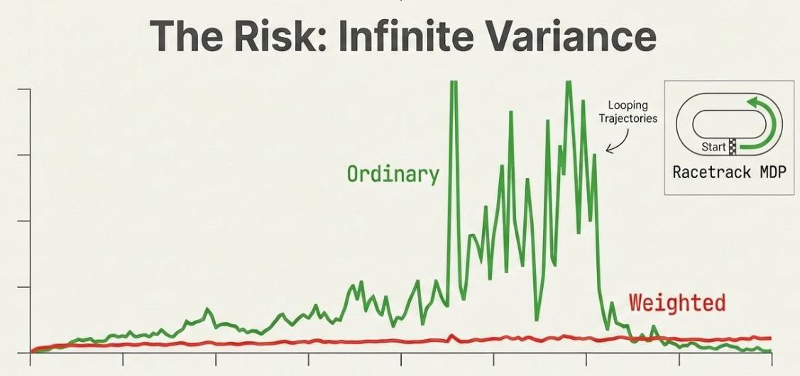

# Chapter 4 – Monte Carlo Methods: The Empirical Learner

Author: [Youssef Mansour](www.linkedin.com/in/youssef-mansour-8b9609212)

---

> *"In theory, theory and practice are the same. In practice, they are not."*
> — Yogi Berra

So far in this book, we have been assuming something quite convenient: that we *know* the environment. In Dynamic Programming (Chapter 3), we needed the full transition model — every probability of every state transition, every reward — spelled out in advance. That is a strong assumption. A chess engine cannot enumerate every possible game position. A self-driving car cannot be handed a perfect map of every possible driver and pedestrian combination. Most interesting real-world problems refuse to hand over their rulebook.

This is where **Monte Carlo (MC) methods** come in. The key insight is almost philosophical in its simplicity:

> *If you want to know the expected outcome of something, just try it many times and average the results.*

No model needed. No transition matrix. Just experience — and a lot of it.

---

## 4.1 The Map vs. The Journey

Before diving in, let's get clear on what makes Monte Carlo different from what we have seen before.

**Dynamic Programming** is like studying a road map before a trip. You have the complete layout — every intersection, every distance, every possible turn. With that map, you can compute the optimal route mathematically. It is powerful, but only if you actually have the map.

**Monte Carlo** is like taking the trip yourself, over and over, and building intuition through experience. You start somewhere, wander through the world according to some policy, collect rewards along the way, and reach a terminal state (the end of an *episode*). Then you look back at what happened and ask: *"Was that trip good or bad? What should I do differently next time?"*

This matters because:

- **No model required.** Monte Carlo works directly from samples of experience — real or simulated.
- **Only sample transitions are needed.** You don't need to know the probability of every possible next state; you just need to see *a* next state.
- **Episode-based.** Monte Carlo requires the task to be *episodic* — it must eventually end. (This is its main limitation: it cannot be applied to never-ending, continuing tasks without modification.)


*Figure 4.1: DP requires a complete model of the environment, while MC learns purely from sampled experience.*

---

## 4.2 Monte Carlo Prediction: Learning Value Functions from Experience

### 4.2.1 The Core Idea

Recall from earlier chapters that the **value of a state** under a policy π is the expected total return (sum of future rewards) starting from that state:

$$v_\pi(s) = \mathbb{E}_\pi[G_t \mid S_t = s]$$

where *G_t* is the return from time *t* onwards:

$$G_t = R_{t+1} + \gamma R_{t+2} + \gamma^2 R_{t+3} + \cdots$$

Monte Carlo prediction estimates this by a beautifully simple mechanism: **run episodes, observe the returns, and average them**. By the Law of Large Numbers, as we collect more and more returns for a given state, their average converges to the true expected value.

### 4.2.2 The Episode as the Basic Unit

An episode is a complete trajectory through the MDP, from start to termination:

$$S_0, A_0, R_1, S_1, A_1, R_2, S_2, \ldots, S_T$$

Here *T* is the terminal time step. At the end of an episode, we can compute the actual return from any time step *t* backwards:

```
G_T     = 0
G_{T-1} = R_T
G_{T-2} = R_{T-1} + γ * G_{T-1}
...
G_t     = R_{t+1} + γ * G_{t+1}
```

This backward computation is efficient — we sweep from the end to the beginning, accumulating the discounted return.

### 4.2.3 First-Visit vs. Every-Visit MC

Now here is a subtle question: what if the agent visits the same state *s* multiple times in a single episode? How many times should we count it?

Two conventions exist:

| Method | Rule |
|---|---|
| **First-Visit MC** | Only count the return after the *first* time *s* is visited in each episode |
| **Every-Visit MC** | Count the return after *every* time *s* is visited |

**Example.** Consider three episodes, all of which visit state *s* at some point:

- Episode 1: visits *s* at step 3 → return from step 3 = R₄
- Episode 2: visits *s* at steps 4 and 5 → First-visit MC uses R₅; Every-visit MC uses both R₅ and R₆
- Episode 3: visits *s* at step 2 → return from step 2 = R₃

**First-visit MC estimate:**

$$\hat{v}_\pi(s) \approx \frac{1}{3}\left[R_4^{(1)} + R_5^{(2)} + R_3^{(3)}\right]$$

**Every-visit MC estimate** would include the second visit in Episode 2 as well.

Both methods converge to the true value *v_π(s)* as the number of visits approaches infinity. First-visit MC is an **unbiased** estimator. Every-visit MC is biased initially but also converges asymptotically — and it tends to be used more often in practice because it is easier to extend to function approximation settings.

### 4.2.4 The Algorithm

Here is the First-Visit MC prediction algorithm in pseudocode:

```
Initialize:
    V(s) ← arbitrary, for all s ∈ S
    Returns(s) ← empty list, for all s ∈ S

Loop forever (each episode):
    Generate episode following π: S₀, A₀, R₁, ..., S_{T-1}, A_{T-1}, R_T
    G ← 0
    Loop for t = T-1, T-2, ..., 0:
        G ← γ·G + R_{t+1}
        If S_t not in {S₀, S₁, ..., S_{t-1}}:   ← "first visit" check
            Append G to Returns(S_t)
            V(S_t) ← average(Returns(S_t))
```

And here is a clean Python implementation:

```python
import numpy as np
from collections import defaultdict

def first_visit_mc_prediction(env, policy, num_episodes, gamma=1.0):
    """
    Estimate the state-value function for a given policy
    using First-Visit Monte Carlo Prediction.

    Args:
        env: an OpenAI Gym-style environment (episodic)
        policy: a callable, policy(state) → action
        num_episodes: number of episodes to sample
        gamma: discount factor

    Returns:
        V: dict mapping state → estimated value
    """
    returns_sum = defaultdict(float)
    returns_count = defaultdict(int)
    V = defaultdict(float)

    for episode_num in range(num_episodes):
        # Generate an episode
        episode = []
        state, _ = env.reset()
        done = False

        while not done:
            action = policy(state)
            next_state, reward, terminated, truncated, _ = env.step(action)
            done = terminated or truncated
            episode.append((state, action, reward))
            state = next_state

        # Compute returns backwards (First-Visit MC)
        states_visited = set()
        G = 0.0
        for t in reversed(range(len(episode))):
            state_t, _, reward_t1 = episode[t]
            G = gamma * G + reward_t1

            if state_t not in states_visited:   # first-visit check
                states_visited.add(state_t)
                returns_sum[state_t] += G
                returns_count[state_t] += 1
                V[state_t] = returns_sum[state_t] / returns_count[state_t]

    return V
```

> **Practical note:** Libraries like [Gymnasium](https://gymnasium.farama.org/) (successor to OpenAI Gym) and [Stable-Baselines3](https://stable-baselines3.readthedocs.io/) provide environments well-suited for Monte Carlo experiments. For teaching purposes, `gym.make('Blackjack-v1')` is a classic testbed — it is episodic, has a manageable state space, and requires no model.

---

## 4.3 Case Study: The Racetrack Task

Let's make this concrete with a case study from Sutton & Barto's textbook — the **Racetrack task**.

**Setup:** Imagine a discrete grid racetrack. A car starts on the starting line and must reach the finish line as quickly as possible without going out of bounds.

- **State:** Current grid position + current velocity (horizontal Vx, vertical Vy)
  - Velocity components: non-negative, each < 5, not both zero (except at start)
- **Actions:** Increment or decrement each velocity component by ±1, or leave unchanged → **9 possible actions**
  - Complication: with probability 0.1, the intended velocity change fails (noise)
- **Rewards:** -1 per step (minimise steps)
- **Termination:** Episode ends when the car crosses the finish line
- **Boundary crash:** Car resets to a random start position with zero velocity; episode *continues*

**What does MC learning look like here?**

1. Generate many sample trajectories (drive the car from start, following some policy)
2. At the end of each trajectory, compute the total return (sum of -1 penalties = negative episode length)
3. For each state-action pair (s, a) encountered, record the return that followed
4. Average those returns to estimate Q(s, a)
5. Improve the policy by choosing the action with the highest estimated Q value

This is learning by doing, not by solving equations. And crucially — you don't need to know the transition probabilities of the physics of the car. You just simulate it.

---

## 4.4 From Prediction to Control: Why We Need Q-Values

Prediction is great, but ultimately we want *control* — an optimal policy for acting. How does value estimation help us improve a policy?

### 4.4.1 The Problem with State Values Alone

If we only estimate *V(s)* (state values), we face a problem: to improve our policy, we need to choose actions. But without a model, we cannot look ahead to see which action leads to the best next state:

$$\pi'(s) = \arg\max_a \sum_{s', r} p(s', r | s, a)\left[r + \gamma V(s')\right]$$

This requires knowing `p(s', r | s, a)` — the transition probabilities. We don't have those.

### 4.4.2 Action-Value Functions to the Rescue

Instead, if we estimate **Q(s, a)** — the action-value function — we can improve our policy *without a model*:

$$\pi'(s) = \arg\max_a Q(s, a)$$

We just pick the action with the best estimated Q-value. No model needed. This is why Monte Carlo control focuses on estimating **Q**, not **V**.

The MC algorithm for action values is identical in structure to the state-value version — just replace "first visit to state s" with "first visit to state-action pair (s, a)."

---

## 4.5 Monte Carlo Control: The General Policy Iteration Loop

Monte Carlo control follows the same **Generalized Policy Iteration (GPI)** structure introduced in Chapter 3, but now using sampled experience instead of model-based computation:

```
          ┌─────────────────────────────────────────┐
          │                                         │
   Generate episodes    ←──────  Update polic       │
   following π                  π ← greedy(Q)       │
          │                          ↑              │
          ▼                          │              │
   Update Q(s,a) estimates  ─────────               │
   using observed returns                           │
          │                                         │
          └─────────────────────────────────────────┘
```

After each episode:
1. **Policy Evaluation:** Update Q estimates using observed returns
2. **Policy Improvement:** Make the policy greedy with respect to current Q

This alternation — episode by episode — converges toward the optimal policy Q* and optimal policy π*.

---

## 4.6 The Exploration-Exploitation Dilemma

Here is where things get interesting — and problematic.

If you always follow a *greedy* policy (always pick the action with the highest estimated Q-value), you will only ever explore actions you already think are good. You will never discover better alternatives. Your Q estimates for non-greedy actions will never improve because you never take those actions.

This is the famous **exploration-exploitation tradeoff**:

> **Exploit:** Use what you know to get good rewards now.
> **Explore:** Try new things to learn whether something better exists.

If you only exploit, you risk converging to a *suboptimal* policy — forever stuck in a local optimum.

There are three main solutions to this problem in the MC setting. Let's walk through each.

---

## 4.7 Solution A: Exploring Starts (MC-ES)

**The idea:** Guarantee that every state-action pair gets visited infinitely often by starting each episode from a *randomly chosen* (s, a) pair, with all pairs having non-zero probability of being selected.

This is called the **Exploring Starts** assumption.

```
MC-ES Algorithm:
Initialize Q(s,a) arbitrarily, π(s) ← greedy w.r.t. Q

Loop forever:
    Choose S₀, A₀ randomly (all pairs with prob > 0)
    Generate episode from (S₀, A₀) following π
    For each (s,a) in episode (first visit):
        G ← return following first occurrence of (s,a)
        Q(s,a) ← average(Returns(s,a) + [G])
        π(s) ← argmax_a Q(s,a)
```

The policy improvement theorem guarantees that this converges to the optimal policy (informally — a full proof remains an open problem in the field!).

**The catch:** Exploring Starts is often unrealistic. You cannot always start a self-driving car mid-crash to ensure a specific starting state-action pair is covered. You cannot start a blackjack game mid-hand whenever you feel like it.

As your slides put it: *"You cannot ask a self-driving car to start a learning episode 'mid-crash'."*

Theoretically sound. Practically impossible.

---

## 4.8 Solution B: On-Policy Control with ε-Greedy Policies

Instead of controlling the starting conditions, what if we build exploration *into the policy itself*?

**ε-greedy policy:** Most of the time (probability 1 - ε), take the greedy action. But with probability ε, take a *random* action. This ensures every action is tried occasionally.

Formally:

$$\pi(a|s) = \begin{cases} 1 - \varepsilon + \frac{\varepsilon}{|\mathcal{A}(s)|} & \text{if } a = \arg\max_a Q(s,a) \\ \frac{\varepsilon}{|\mathcal{A}(s)|} & \text{otherwise} \end{cases}$$

This is an **on-policy** method: the same policy that generates data is the one being improved.

```python
def epsilon_greedy_policy(Q, state, epsilon, n_actions):
    """
    Returns an action drawn from an epsilon-greedy policy.
    """
    if np.random.random() < epsilon:
        return np.random.randint(n_actions)   # explore
    else:
        return np.argmax(Q[state])            # exploit
```

**On-policy first-visit MC control:**

```
Initialize: Q(s,a) arbitrary, π ← ε-soft policy

Loop forever (each episode):
    Generate episode following π
    G ← 0
    For t = T-1, T-2, ..., 0 (first-visit check):
        G ← γ·G + R_{t+1}
        Update Q(S_t, A_t) ← average of returns
        A* ← argmax_a Q(S_t, a)
        For all a:
            π(a|S_t) ← (1 - ε + ε/|A|) if a = A*
                        (ε/|A|)          otherwise
```

**The catch:** On-policy methods learn the best *ε-soft* policy — the best policy *that still explores*. They can never fully commit to a deterministic optimal policy because they must keep exploring. Think of it as always hedging your bets: you learn the best strategy for someone who occasionally makes random decisions, not the absolute best strategy for someone who always decides optimally.

---

## 4.9 Solution C: Off-Policy Control with Importance Sampling

Here is the most powerful and elegant solution. What if we could **separate the policy we learn about from the policy we use to gather data**?

- **Behavior policy** *b*: The policy that actually takes actions and generates episodes. It can be wild and exploratory — maybe even random.
- **Target policy** *π*: The policy we are trying to learn. It can be deterministic and greedy.

This is called **off-policy learning**. And it solves the exploration-exploitation dilemma cleanly: the behavior policy explores; the target policy exploits and improves.

**Requirement (Coverage):** For off-policy to work, every action that the target policy might take must also have a non-zero probability of being taken by the behavior policy:

$$\pi(a|s) > 0 \implies b(a|s) > 0, \quad \forall (s, a)$$

Otherwise, the target policy might "want" to take actions that the behavior policy never explores, meaning we'd have zero data about them.

### 4.9.1 Importance Sampling: Correcting for the Wrong Distribution

The data we have comes from policy *b*, but we want to estimate values under policy *π*. The returns we observe have the wrong expectation — they reflect *b*, not *π*.

**Importance Sampling** is a general statistical technique for estimating expected values under one distribution (π) using samples from another (b). The trick is to weight each return by the ratio of how likely that trajectory was under π vs. b.

The **importance-sampling ratio** for a trajectory from time *t* to *T* is:

$$\rho_{t:T-1} = \prod_{k=t}^{T-1} \frac{\pi(A_k | S_k)}{b(A_k | S_k)}$$

Here's the beautiful cancellation: the trajectory probabilities also depend on the environment's transition probabilities *p(s'|s, a)*, which appear identically in numerator and denominator — so they cancel out. The ratio depends only on the two policies, not on the unknown MDP dynamics.

**Intuition:**
- If a trajectory is *more likely* under π than b → weight it **up** (ρ > 1)
- If a trajectory is *less likely* under π than b → weight it **down** (ρ < 1)
- If a trajectory could *never* happen under π → weight is **zero** (ρ = 0)

### 4.9.2 Ordinary vs. Weighted Importance Sampling

Two variants exist, with a classic bias-variance tradeoff:

**Ordinary Importance Sampling:**
$$V(s) = \frac{\sum_{t \in \mathcal{T}(s)} \rho_{t:T(t)-1} G_t}{|\mathcal{T}(s)|}$$

- Unbiased: $\mathbb{E}[V(s)] = v_\pi(s)$
- High variance — can be *infinite* variance, especially when trajectories involve loops

**Weighted Importance Sampling:**
$$V(s) = \frac{\sum_{t \in \mathcal{T}(s)} \rho_{t:T(t)-1} G_t}{\sum_{t \in \mathcal{T}(s)} \rho_{t:T(t)-1}}$$

- Biased initially (but bias → 0 asymptotically)
- Much lower, bounded variance
- **Strongly preferred in practice**


*Figure 4.2: Ordinary IS can exhibit extreme variance while Weighted IS converges smoothly, despite a small initial bias.*

Here's a concrete Python implementation of both:

```python
def off_policy_mc_prediction(env, target_policy, behavior_policy,
                              num_episodes, gamma=1.0, weighted=True):
    """
    Off-policy MC prediction using Ordinary or Weighted Importance Sampling.

    Args:
        target_policy: deterministic policy, target_policy(state) → action
        behavior_policy: stochastic policy, behavior_policy(state) → action
        weighted: if True, use Weighted IS; otherwise Ordinary IS

    Returns:
        V: estimated value function under target_policy
    """
    numerator = defaultdict(float)
    denominator = defaultdict(float)
    count = defaultdict(int)
    V = defaultdict(float)

    for _ in range(num_episodes):
        episode = []
        state, _ = env.reset()
        done = False

        while not done:
            action, action_prob = behavior_policy(state)  # returns (action, prob)
            next_state, reward, terminated, truncated, _ = env.step(action)
            done = terminated or truncated
            episode.append((state, action, reward, action_prob))
            state = next_state

        G = 0.0
        W = 1.0   # importance weight

        for t in reversed(range(len(episode))):
            state_t, action_t, reward_t1, b_prob = episode[t]
            G = gamma * G + reward_t1

            # Compute importance ratio for this step
            pi_action = target_policy(state_t)
            pi_prob = 1.0 if pi_action == action_t else 0.0
            W = W * (pi_prob / b_prob)

            if W == 0:
                break   # target policy would never take this action; skip

            if weighted:
                numerator[state_t] += W * G
                denominator[state_t] += W
                if denominator[state_t] > 0:
                    V[state_t] = numerator[state_t] / denominator[state_t]
            else:
                # Ordinary IS: simple scaled average
                count[state_t] += 1
                V[state_t] += (W * G - V[state_t]) / count[state_t]

    return V
```

### 4.9.3 Incremental Updates: No Need to Store All Returns

One practical concern: storing all returns and recomputing their average from scratch each time is memory-intensive. We can update the weighted average *incrementally* after each episode, with no need to store past returns.

Define *C_n* = cumulative sum of importance weights for state s after *n* episodes. Then:

$$V_{n+1} = V_n + \frac{W_n}{C_n}\left[G_n - V_n\right]$$
$$C_{n+1} = C_n + W_{n+1}$$

This has the same form as the classic incremental mean update, but with an adaptive learning rate *W/C* instead of 1/n:

```python
# Incremental Weighted IS update (inside the loop)
C[state][action] += W
Q[state][action] += (W / C[state][action]) * (G - Q[state][action])
```

Notice the structure: **learning rate × (target - estimate)**. This is the fundamental pattern of RL updates — you will see it again and again.

---

## 4.10 Off-Policy MC Control: Putting It All Together

Here is the complete off-policy MC control algorithm that estimates the optimal policy π* using a soft behavior policy *b*:

```
Initialize for all s, a:
    Q(s,a) ← arbitrary
    C(s,a) ← 0
    π(s) ← argmax_a Q(s,a)   (ties broken consistently)

Loop forever (each episode):
    b ← any soft policy (e.g., ε-greedy w.r.t. Q)
    Generate episode using b: S₀,A₀,R₁,...,S_{T-1},A_{T-1},R_T
    G ← 0
    W ← 1

    For t = T-1, T-2, ..., 0:
        G ← γ·G + R_{t+1}
        C(S_t, A_t) ← C(S_t, A_t) + W
        Q(S_t, A_t) ← Q(S_t, A_t) + (W / C(S_t, A_t)) × [G - Q(S_t, A_t)]
        π(S_t) ← argmax_a Q(S_t, a)

        If A_t ≠ π(S_t):
            break   ← only update while target policy matches behavior policy
        W ← W × (1 / b(A_t | S_t))
```

Note the `break` condition: we only keep updating backwards while the actions taken match what the target policy would have chosen. The moment the behavior policy diverged from the greedy target policy, the importance weight for subsequent time steps would be zero — so there's nothing to learn from those earlier states in this episode.

---

## 4.11 The Risk: Infinite Variance in Ordinary IS

This section deserves its own spotlight because it catches many practitioners off guard.

**Example (from Sutton & Barto):** Suppose there is one nonterminal state *s* and two actions: `right` and `left`.

- `right` → deterministic termination, reward 0
- `left` → with probability 0.9, loop back to *s*; with probability 0.1, terminate with reward +1

Target policy π always chooses `left`. True value: *v_π(s) = 1*.

Behavior policy *b* chooses `right` or `left` with equal probability (0.5 each).

When we use **ordinary importance sampling**, the variance of the estimates is *infinite* — even though the expected value is correct. In practice, the estimates can swing wildly and never converge, even after millions of episodes.

**Weighted IS**, by contrast, gives an estimate of exactly 1 after just the first successful episode (one that ended with `left`). All other episodes get weight zero.

The lesson: ordinary IS is mathematically cleaner (unbiased) but practically dangerous. **Use weighted IS in practice.**

The MSE comparison from the presentation's racetrack experiment says it clearly:
- Ordinary IS starts with lower initial MSE but has wild oscillations that can go extreme
- Weighted IS starts slightly higher but decays smoothly and reliably to zero

---

## 4.12 Independence of Estimates: A Key Advantage

One structural property of Monte Carlo methods deserves explicit mention because it is easy to overlook.

In Dynamic Programming, the estimate for state *s* depends on estimates for its successor states *s'*. An error in one state propagates to its neighbors through the Bellman equation. This is called **bootstrapping**.

Monte Carlo does **not bootstrap**. Each return *G_t* is computed entirely from real rewards observed in the episode. The estimate of *V(s)* does not depend on the estimate of any other *V(s')*.

This has several consequences:
1. **No error propagation** across states — errors stay local
2. **Parallel computation** is possible — you can update estimates for different states independently
3. **Subset focus** — you can estimate the value of just one state by generating episodes starting from it, ignoring all others. This is impractical in DP.

---

## 4.13 Summary: The Trade-offs at a Glance

Let's zoom out and look at the full landscape of MC methods:

| Approach | Exploration Method | Learns | Limitation |
|---|---|---|---|
| **MC-ES (Exploring Starts)** | Random episode starts | Optimal policy | Unrealistic in practice |
| **On-Policy (ε-greedy)** | Built into policy | Best ε-soft policy | Cannot learn fully greedy optimal |
| **Off-Policy (IS)** | Behavior policy explores | Optimal (target) policy | Higher variance, slower convergence |

And for importance sampling:

| IS Variant | Bias | Variance | Practical Preference |
|---|---|---|---|
| **Ordinary** | None (unbiased) | Can be infinite | Not recommended |
| **Weighted** | Small (→ 0 asymptotically) | Always finite | **Preferred** |

The big-picture message from your slides captures it perfectly: *"Monte Carlo methods allow us to solve complex tasks without understanding the physics of the world."*

---

## 4.14 Exercises

Try these exercises to check your understanding:

1. **Conceptual.** Explain in your own words why state-value estimates V(s) are not sufficient for policy improvement in the model-free setting. What do we need instead?

2. **Implementation.** Implement First-Visit MC prediction for the `Blackjack-v1` environment from Gymnasium. After 500,000 episodes, plot the value function for states with and without a usable ace. Compare your result to Figure 5.1 in Sutton & Barto (2020).

3. **Exploration.** In an ε-greedy policy with ε = 0.1 and |A| = 4 actions, what is the probability of taking the greedy action? What is the probability of taking a specific non-greedy action?

4. **Importance Sampling.** For a trajectory of length 3 where:
   - π always takes action `left` (prob = 1)
   - b takes `left` with prob 0.5, `right` with prob 0.5
   - All three actions taken were `left`
   
   Compute the importance-sampling ratio ρ₀:₂.

5. **Coding Challenge.** Implement the off-policy MC control algorithm for the Blackjack environment. Use a random behavior policy and a greedy target policy. Plot the optimal policy found (similar to Figure 5.2 in Sutton & Barto).

6. **Reflection.** Why might off-policy methods converge more slowly than on-policy methods? In what application scenarios would you prefer off-policy despite the variance cost?

---

## 4.15 Further Reading and Resources

- **Sutton & Barto (2020), Chapter 5** — The authoritative treatment of Monte Carlo methods in RL. Free online at [incompleteideas.net](http://incompleteideas.net/book/the-book.html).
- **Gymnasium Blackjack environment** — Great testbed for MC methods: `pip install gymnasium`
- **Spinning Up in Deep RL (OpenAI)** — Excellent practical resource for RL algorithms
- **Kandemir (2021), SDU Lecture Notes** — Compact and mathematically precise slides on MC methods

---

## References

Sutton, R. S., & Barto, A. G. (2020). *Reinforcement Learning: An Introduction* (2nd ed.). MIT Press. Chapter 5: Monte Carlo Methods, pp. 91–140.

Kandemir, M. (2021). *Monte Carlo Methods in RL* [Lecture slides]. University of Southern Denmark, Department of Mathematics and Computer Science (IMADA).

Singh, S. P., & Sutton, R. S. (1996). Reinforcement learning with replacing eligibility traces. *Machine Learning*, 22(1-3), 123–158.

Precup, D., Sutton, R. S., & Dasgupta, S. (2001). Off-policy temporal-difference learning with function approximation. In *Proceedings of the 18th International Conference on Machine Learning (ICML)*, 417–424.

---

To cite this chapter, please use the following BibTeX:

```bibtex
@misc{mansour_2026_ReinforcementLearning,
  author       = {Mansour, Youssef},
  title        = {Reinforcement Learning: A Gentle Introduction, Chapter 4},
  year         = {2026},
  publisher    = {GitHub},
  howpublished = {\url{https://github.com/amrmsab/reinforcement_learning_book}},
  note         = {Accessed: April 30, 2026}
}
```
