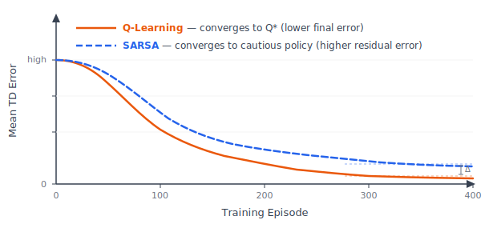
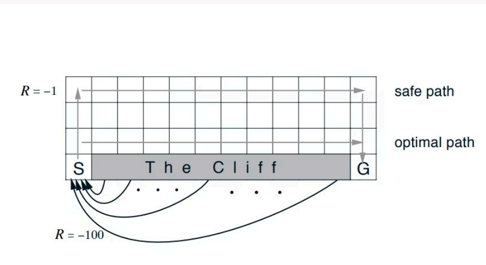
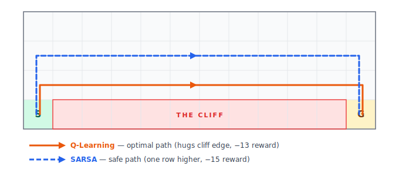

# TD Control: SARSA and Q-Learning

## Introduction

TD learning provides a powerful method for _predicting_ value functions from experience. The natural next step is to use that same idea for _control_ — that is, not just estimating values but actively learning which actions to take. This is the domain of **TD Control**.

Two algorithms define the core of TD control: **SARSA** and **Q-Learning**. Both learn action-value functions using TD updates. The key difference between them lies in a single, consequential choice: when computing the update target, does the algorithm use the action the agent _actually took_, or the action that _looks best_? This choice determines whether the algorithm is on-policy or off-policy, and as we will see, it meaningfully shapes the behavior the agent learns.

---

## TD Control: The Roadmap

TD learning was introduced as a prediction method — estimating $V(s)$ while following a fixed policy. TD control extends this idea to decision-making by estimating $Q(s, a)$, the value of taking action $a$ in state $s$.

The roadmap is straightforward:

- **TD Learning** — foundational prediction method.
- **TD Control** — applying TD updates to learn how to act.
- **SARSA** — on-policy TD control; learns using the current policy's actions.
- **Q-Learning** — off-policy TD control; learns the optimal policy regardless of the current behavior.

---

## On-Policy vs. Off-Policy

Before examining each algorithm, it is important to understand what distinguishes on-policy from off-policy learning. Two policies are involved in every control algorithm:

- **Behavior policy** ($\pi_b$): the policy used to _generate actions_ during learning — i.e., what the agent actually does.
- **Target policy** ($\pi_t$): the policy being _evaluated or improved_ — i.e., what the agent is trying to learn.

The distinction is simple:

- **On-policy**: $\pi_{\text{behavior}} = \pi_{\text{target}}$. The agent learns from the same policy it is using to act.
- **Off-policy**: $\pi_{\text{behavior}} \neq \pi_{\text{target}}$. The agent can behave one way (e.g., explore freely) while learning to optimize a different, often greedy, policy.

This distinction is not merely theoretical — it directly affects which action appears in the update rule, and therefore what the agent ultimately learns to do.

---

## SARSA: On-Policy TD Control

### What It Is

SARSA is an on-policy TD control algorithm. It learns $Q(s, a)$, the value of state-action pairs, by following the current policy and updating estimates based on what actually happened.

The name **SARSA** comes from the five elements involved in each update:

$$\underbrace{S}_{\text{state}},\ \underbrace{A}_{\text{action}},\ \underbrace{R}_{\text{reward}},\ \underbrace{S'}_{\text{next state}},\ \underbrace{A'}_{\text{next action}}$$

### The Update Rule

$$Q(S, A) \leftarrow Q(S, A) + \alpha \left[ R + \gamma Q(S', A') - Q(S, A) \right]$$

The term in brackets is the **TD error**: the difference between the target $R + \gamma Q(S', A')$ and the current estimate $Q(S, A)$.

- $\alpha$ is the learning rate, controlling how much each update shifts the current estimate.
- $\gamma$ is the discount factor, controlling how much future rewards matter.
- $Q(S', A')$ is the Q-value of the _next state and the next action actually chosen by the current policy_.

### Why It Is On-Policy

SARSA is on-policy because the bootstrap target uses $A'$ — the action the agent _actually selected_ in state $S'$ under the current policy. If the agent explores and takes a suboptimal action, that action's Q-value enters the update. Learning is therefore shaped by exploration: the policy the agent follows during training is the same policy it is learning.

### Algorithm

```
Initialize Q(s,a) for all s, a  (Q(terminal, ·) = 0)
Repeat for each episode:
    Initialize S
    Choose A from S using policy derived from Q (e.g., ε-greedy)
    Repeat for each step:
        Take action A, observe R, S'
        Choose A' from S' using policy derived from Q (e.g., ε-greedy)
        Q(S,A) ← Q(S,A) + α [R + γ Q(S',A') − Q(S,A)]
        S ← S'; A ← A'
    Until S is terminal
```

---

## Q-Learning: Off-Policy TD Control

### What It Is

Q-Learning is an off-policy TD control algorithm. It learns the _optimal_ action-value function $Q^*(s, a)$ directly, independently of whatever policy the agent uses to explore.

### The Update Rule

$$Q(S, A) \leftarrow Q(S, A) + \alpha \left[ R + \gamma \max_{a'} Q(S', a') - Q(S, A) \right]$$

The structure is identical to SARSA, with one critical change: instead of $Q(S', A')$, the target uses $\max_{a'} Q(S', a')$ — the highest Q-value available in the next state, regardless of which action would actually be taken.

### Why It Is Off-Policy

Q-Learning is off-policy because its update target assumes that in state $S'$, the agent will take the _best possible action_. The agent's actual behavior (which may include exploration) does not appear in the update. The behavior policy and the target policy are decoupled. The behavior policy can be exploratory; the target policy being learned is always greedy.

### Algorithm

```
Initialize Q(s,a) for all s, a  (Q(terminal, ·) = 0)
Repeat for each episode:
    Initialize S
    Repeat for each step:
        Choose A from S using policy derived from Q (e.g., ε-greedy)
        Take action A, observe R, S'
        Q(S,A) ← Q(S,A) + α [R + γ max_a Q(S',a) − Q(S,A)]
        S ← S'
    Until S is terminal
```

### The Core Distinction in One Line

| Algorithm  | Update target                                             |
| ---------- | --------------------------------------------------------- |
| SARSA      | $R + \gamma\, Q(S', A')$ — action actually taken          |
| Q-Learning | $R + \gamma\, \max_{a'} Q(S', a')$ — best possible action |

---

## The Rooms Example

To make these algorithms concrete, we trace through a small navigation problem. The environment consists of **six rooms (states 0–5)**, connected by doorways. State **5** is the goal.


### Environment Setup

The agent moves between rooms. Reaching the goal (state 5) from an adjacent room yields a reward of **+100**. All other valid moves yield **0** (direct connection exists) or **−1** (no direct connection — an illegal move). The reward table is:

|       | 0   | 1   | 2   | 3   | 4   | 5       |
| ----- | --- | --- | --- | --- | --- | ------- |
| **0** | −1  | −1  | −1  | −1  | 0   | −1      |
| **1** | −1  | −1  | −1  | 0   | −1  | **100** |
| **2** | −1  | −1  | −1  | 0   | −1  | −1      |
| **3** | −1  | 0   | 0   | −1  | 0   | −1      |
| **4** | 0   | −1  | −1  | 0   | −1  | **100** |
| **5** | −1  | 0   | −1  | −1  | 0   | **100** |

The Q-table is initialized to all zeros. Parameters: $\alpha = 0.5$, $\gamma = 0.5$.

### SARSA — Episode 1

The agent starts in **state 3** and follows the current (exploratory) policy.

**Step 1: Move 3 → 1**

The agent selects action to go to state 1. Looking ahead, it picks the next action $A'$ (say, move to state 5) from state 1 under the current policy.

$$Q(3,1) \leftarrow Q(3,1) + 0.5\left[0 + 0.5 \cdot Q(1,5) - Q(3,1)\right] = 0 + 0.5[0 + 0.5(0) - 0] = 0$$

No Q-values have been seen yet, so the update yields zero. The table remains all zeros.

**Step 2: Move 1 → 5 (Goal reached)**

$$Q(1,5) \leftarrow Q(1,5) + 0.5\left[100 + 0.5 \cdot Q(5, a') - Q(1,5)\right] = 0 + 0.5[100 + 0 - 0] = 50$$

The agent reached the goal and collected the +100 reward. **Q(1,5) is now 50.** This is the first meaningful information: the path through room 1 to room 5 is worth something.

After Episode 1:

|     | 0   | 1   | 2   | 3   | 4   | 5      |
| --- | --- | --- | --- | --- | --- | ------ |
| 0   | 0   | 0   | 0   | 0   | 0   | 0      |
| 1   | 0   | 0   | 0   | 0   | 0   | **50** |
| 2   | 0   | 0   | 0   | 0   | 0   | 0      |
| 3   | 0   | 0   | 0   | 0   | 0   | 0      |
| 4   | 0   | 0   | 0   | 0   | 0   | 0      |
| 5   | 0   | 0   | 0   | 0   | 0   | 0      |

### SARSA — Episode 2

The agent starts in **state 4**. The non-zero entry Q(1,5) = 50 now influences the updates.

**Step 1: Move 4 → 3**

$$Q(4,3) \leftarrow 0 + 0.5\left[0 + 0.5 \cdot Q(3,1) - 0\right] = 0$$

State 3's Q-values are still all zero, so no update propagates.

**Step 2: Move 3 → 1**

The policy now picks the next action $A' =$ move to 5, since Q(1,5) = 50 is the highest value visible from state 1.

$$Q(3,1) \leftarrow 0 + 0.5\left[0 + 0.5 \cdot Q(1,5) - 0\right] = 0 + 0.5[0 + 0.5(50) - 0] = 12.5$$

**Q(3,1) is now 12.5.** The value from state 5 has propagated one step further back through the chain.

**Step 3: Move 1 → 5**

$$Q(1,5) \leftarrow 50 + 0.5\left[100 + 0.5(0) - 50\right] = 50 + 0.5(50) = 75$$

After Episode 2:

|     | 0   | 1        | 2   | 3   | 4   | 5      |
| --- | --- | -------- | --- | --- | --- | ------ |
| 0   | 0   | 0        | 0   | 0   | 0   | 0      |
| 1   | 0   | 0        | 0   | 0   | 0   | **75** |
| 2   | 0   | 0        | 0   | 0   | 0   | 0      |
| 3   | 0   | **12.5** | 0   | 0   | 0   | 0      |
| 4   | 0   | 0        | 0   | 0   | 0   | 0      |
| 5   | 0   | 0        | 0   | 0   | 0   | 0      |

The key insight is clear: **reward information propagates backward** through the Q-table, one step per episode. Q(1,5) grows as the agent keeps reaching the goal; Q(3,1) gains value because it leads to state 1, which leads to the goal.

---

## Q-Learning in the Rooms Example

Q-Learning follows the same setup and parameters. The difference is entirely in the update rule: instead of using the next action $A'$ from the current policy, Q-Learning always uses the **maximum Q-value** in the next state.

### Episode 1 — Q-Learning

**Move 3 → 1:** All Q-values are zero, so $\max Q(1, \cdot) = 0$. The update yields zero (same as SARSA at this step).

**Move 1 → 5:**

$$Q(1,5) \leftarrow 0 + 0.5\left[100 + 0.5 \cdot \max_a Q(5,a) - 0\right] = 0 + 0.5[100 + 0] = 50$$

Same result as SARSA — Q(1,5) = 50.

After Episode 1:

|     | 0   | 1   | 2   | 3   | 4   | 5      |
| --- | --- | --- | --- | --- | --- | ------ |
| 0   | 0   | 0   | 0   | 0   | 0   | 0      |
| 1   | 0   | 0   | 0   | 0   | 0   | **50** |
| 2   | 0   | 0   | 0   | 0   | 0   | 0      |
| 3   | 0   | 0   | 0   | 0   | 0   | 0      |
| 4   | 0   | 0   | 0   | 0   | 0   | 0      |
| 5   | 0   | 0   | 0   | 0   | 0   | 0      |

### Episode 2 — Q-Learning

**Move 4 → 3:** $\max Q(3, \cdot) = 0$, so the update yields zero.

**Move 3 → 1:**

$$Q(3,1) \leftarrow 0 + 0.5\left[0 + 0.5 \cdot \max(Q(1,3),\ Q(1,5)) - 0\right] = 0 + 0.5[0 + 0.5 \cdot \max(0, 50)] = 12.5$$

**Move 1 → 5:**

$$Q(1,5) \leftarrow 50 + 0.5\left[100 + 0.5 \cdot \max_a Q(5,a) - 50\right] = 75$$

After Episode 2:

|     | 0   | 1        | 2   | 3   | 4   | 5      |
| --- | --- | -------- | --- | --- | --- | ------ |
| 0   | 0   | 0        | 0   | 0   | 0   | 0      |
| 1   | 0   | 0        | 0   | 0   | 0   | **75** |
| 2   | 0   | 0        | 0   | 0   | 0   | 0      |
| 3   | 0   | **12.5** | 0   | 0   | 0   | 0      |
| 4   | 0   | 0        | 0   | 0   | 0   | 0      |
| 5   | 0   | 0        | 0   | 0   | 0   | 0      |

The numerical results in these early episodes are identical to SARSA. The difference emerges as the policy becomes more defined. In SARSA, the next action $A'$ depends on exploration — the agent might not always select the greedy action, which can dampen propagation. In Q-Learning, the target is always the maximum, so value propagation is never interrupted by exploration noise.

As training continues, this distinction shows up in how quickly each algorithm's Q-values stabilize:



Q-Learning's TD error drops to near zero — its Q-values converge to the true optimal Q\*. SARSA's error plateaus slightly higher because it keeps bootstrapping off exploratory actions; its Q-values stabilize at the best policy _for an epsilon-greedy agent_, not the globally optimal one. The gap (Δ) represents this residual exploration bias.

### Where They Diverge

The two algorithms produce identical updates only when the ε-greedy policy happens to pick the greedy action as A'. The split appears the moment it picks a suboptimal one.

**Setup**: After episode 1, Q(1,5) = 50 in both algorithms. All other Q-values are 0.

**Episode 2, step: Move 3 → 1.** At state 1, the ε-greedy policy must select A'. Suppose exploration fires and picks **A' = 3** (room 3, Q-value = 0) instead of the greedy **A' = 5** (Q-value = 50).

**SARSA** — uses the actual next action A' = 3:

$$Q(3,1) \leftarrow 0 + 0.5\left[0 + 0.5 \cdot Q(1,3) - 0\right] = 0 + 0.5\left[0 + 0.5 \times 0\right] = \mathbf{0}$$

The exploratory choice zeroed the bootstrap. No value propagates back to Q(3,1). The episode also continues along the exploratory path (agent moves to room 3, not room 5), so Q(1,5) is never updated this episode either.

**Q-Learning** — same step, same transition, same exploratory behavior, but uses max regardless:

$$Q(3,1) \leftarrow 0 + 0.5\left[0 + 0.5 \cdot \max_a Q(1,a) - 0\right] = 0 + 0.5\left[0 + 0.5 \times 50\right] = \mathbf{12.5}$$

Q-Learning ignores which action was chosen and always bootstraps from the highest available Q-value. The actual next action the agent takes is still chosen by ε-greedy — only the _update target_ is fixed to the max.

**Q-tables after episode 2 (exploratory scenario):**

| Algorithm  | Q(3,1)   | Q(1,5) |
| ---------- | -------- | ------ |
| SARSA      | **0**    | 50     |
| Q-Learning | **12.5** | 50     |

Both agents followed the same trajectory and the same exploratory action. Only the Q-update differs. This is the core asymmetry: SARSA's Q-values are shaped by what the agent actually did — exploration included. Q-Learning's values are exploration-agnostic; the update is decoupled from behavior.

---

## Convergence

After many episodes, repeated exploration gradually fills in the Q-table. Values propagate further and further from the goal, until every reachable state has a stable Q-value estimate. The table converges to something like:

|     | 0   | 1   | 2   | 3   | 4   | 5       |
| --- | --- | --- | --- | --- | --- | ------- |
| 0   | 0   | 0   | 0   | 0   | 80  | 0       |
| 1   | 0   | 0   | 0   | 60  | 0   | **100** |
| 2   | 0   | 0   | 0   | 50  | 0   | 0       |
| 3   | 0   | 70  | 40  | 0   | 65  | 0       |
| 4   | 55  | 0   | 0   | 75  | 0   | **90**  |
| 5   | 0   | 0   | 0   | 0   | 0   | 0       |

Once converged, selecting the best action from any state is straightforward: at each state, pick the action with the **highest Q-value** in that row. For example, from state 3, the highest value is Q(3,1) = 70, so the agent moves to room 1. From room 1, Q(1,5) = 100, so the agent moves directly to the goal. The learned Q-table encodes a complete navigation policy without any further computation.

---

## Cliff Walking: The Behavioral Difference



The Cliff Walking task makes the practical difference between SARSA and Q-Learning vivid. The agent starts at S and must reach G, but a cliff runs along the bottom of the grid. Falling off the cliff gives a reward of −100.

Two paths exist:

- A **safe path** that arcs far above the cliff.
- An **optimal path** that runs directly along the cliff's edge.



### SARSA Takes the Safe Path

Because SARSA learns under the same exploratory policy it uses to act, it _accounts for its own exploration_. Near the cliff edge, an exploratory action could push the agent off, incurring the large penalty. SARSA's values reflect this risk. As a result, the agent learns to stay farther from the cliff and follows the safer, longer route.

### Q-Learning Takes the Optimal Path

Q-Learning's target always assumes the best action will be taken next. It does not account for the possibility of exploratory slips. The values it learns reflect a world where behavior is always greedy. Therefore, Q-Learning converges to the cliff-edge path — the theoretically shortest route. In practice during training, the exploratory agent does occasionally fall off, but the _learned policy_ points straight along the cliff.

This is not a flaw in either algorithm — it is a feature. SARSA learns the best policy _given that exploration is ongoing_, which makes it more cautious. Q-Learning learns the optimal policy independent of exploration, which makes it more efficient when the learned policy is eventually deployed without exploration.

---

## SARSA vs. Q-Learning: Direct Comparison

The single structural difference between the two algorithms is the bootstrap target:

| Algorithm  | Update target                                             |
| ---------- | --------------------------------------------------------- |
| SARSA      | $R + \gamma\, Q(S', A')$ — action actually taken          |
| Q-Learning | $R + \gamma\, \max_{a'} Q(S', a')$ — best possible action |

Everything that follows — convergence behavior, safety, sample efficiency — flows from this one substitution.

### What Each Converges To

Both algorithms converge, but to different targets:

- **SARSA** converges to the optimal policy **for the exploring agent**. Its Q-values reflect that exploratory actions will occasionally be taken — so near-risky states, those risks are priced in. As $\varepsilon \to 0$, SARSA's solution gradually approaches Q-Learning's.
- **Q-Learning** converges to **Q\***, the true optimal action-value function, independent of exploration. The policy it learns assumes the agent will act greedily at deployment.

### Online Performance vs. Final Policy Quality

|                     | SARSA                            | Q-Learning                                 |
| ------------------- | -------------------------------- | ------------------------------------------ |
| **During training** | Safer — avoids high-risk states  | May incur penalties from exploratory slips |
| **Deployed policy** | Near-optimal (epsilon-dependent) | Optimal (deploy with $\varepsilon = 0$)    |

The cliff walking example illustrates this exactly. SARSA prices in the risk of falling off the cliff because it knows it explores. Q-Learning ignores that risk in its values — it learns the cliff-edge path because that is what a greedy agent would take.

### Exploration Sensitivity

SARSA's Q-values are tied to the exploration strategy. Changing $\varepsilon$ changes the policy, which changes the Q-values. Q-Learning's Q-values are **decoupled from behavior** — you can explore aggressively to cover the state space and still converge to the optimal greedy policy.

This decoupling is what enables Q-Learning to support **experience replay**: old transitions can be stored and reused, since the update does not depend on the current policy. SARSA cannot use experience replay in the same way — its update must reflect the policy that was active when the data was collected.

### Computation

Both algorithms require a single lookup and one update per step — O(1) per transition. Q-Learning adds a `max` over the action space in the next state, which is negligible for small discrete action spaces but grows linearly with the number of actions.

### When to Use Which

- **SARSA** — when mistakes during training are costly: physical robots, safety-critical systems, or any setting where the agent cannot afford to explore recklessly. The learned policy is well-calibrated to an agent that still explores.
- **Q-Learning** — when training safety is not a concern and you want the best possible final policy. Also the natural choice when learning from stored or offline data, since it is off-policy by design.

---

## Final Takeaways

- **TD control** applies TD updates to action-value functions to learn decision-making policies directly from experience.
- The **on-policy / off-policy** distinction hinges on whether the update uses the action the agent _actually took_ (SARSA) or the _best possible action_ (Q-Learning).
- **SARSA** is on-policy: its update uses $(S, A, R, S', A')$, and learning is shaped by exploration. It tends toward safe, cautious behavior in risky environments.
- **Q-Learning** is off-policy: its update uses $\max_{a'} Q(S', a')$, decoupling learning from behavior. It converges to optimal values but may be riskier during training.
- Both algorithms propagate value backward from rewarding states through the Q-table, episode by episode, until estimates stabilize.
- Once **convergence** is reached, the Q-table provides a complete policy: at each state, choose the action with the highest Q-value.

> **SARSA** = on-policy control. **Q-Learning** = off-policy control. The difference is a single letter in the update rule — but it defines how, and how safely, the agent learns.

### References

**References:**

- [Sutton, R. S., & Barto, A. G. (2018). _Reinforcement Learning: An Introduction_ (2nd ed.). MIT Press. (Specifically Chapter 6: Temporal-Difference Learning, pp. 143-154)](https://web.stanford.edu/class/psych209/Readings/SuttonBartoIPRLBook2ndEd.pdf).
