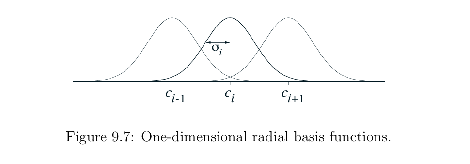

# Chapter 6: Function Approximation in Reinforcement Learning

## 1. Introduction.

Early reinforcement learning (RL) methods assumed a **tabular setting**, where the value of every state or state–action pair is stored explicitly in a table. While intuitive and mathematically convenient, this approach becomes impractical in real-world environments.

Modern RL problems often involve:

- Continuous state spaces (e.g., position, velocity, angles)
- High-dimensional observations (e.g., images or sensor readings)
- Massive or combinatorial state spaces

In such environments, an agent may **never encounter the exact same state twice**. As a result, learning separate values for each state or state–action pair becomes impossible due to memory, computation, and data limitations.

The fundamental challenge is therefore **generalization**:

> How can an agent learn from limited experience and apply that knowledge to unseen states and actions?

Function approximation provides the solution. Instead of storing values in a table, we learn a **parameterized value function** that can generalize across similar states.

For value prediction, we approximate the state-value function:

$$
\hat{v}(s, \mathbf{w}) \approx v_\pi(s)
$$

For control, we approximate the action-value function:

$$
\hat{q}(s, a, \mathbf{w}) \approx q_\pi(s, a)
$$

In linear function approximation, the action-value function is commonly written as:

$$
\hat{q}(s, a, \mathbf{w}) = \mathbf{w}^T \mathbf{x}(s, a)
$$

where:

- $\mathbf{w}$ is a weight vector of learnable parameters
- $\mathbf{x}(s, a)$ is a feature vector describing the state–action pair

This transformation shifts the problem from **memorization** to **learning a function**, enabling reinforcement learning to scale to realistic problems.

---

## 2. Why Function Approximation?

### The Curse of Dimensionality

A key motivation for function approximation is the **explosion of the state space** in realistic problems.

Consider a simple robot equipped with:

- 10 sensors  
- each sensor can take 100 distinct readings  

The number of possible states becomes:

$$
|S| = 100^{10} = 10^{20}
$$

This means the agent would need to store **100 quintillion values** in a table.  
Even if each value required only 8 bytes, the storage requirement would exceed any practical computing system.  
More importantly, the agent would **never visit more than a tiny fraction** of these states during training.

This highlights a deeper issue:

> Tabular methods cannot generalize.  
> They only learn about states that have been visited.

---
<figure>
	
	<figcaption>Figure: As the dimensionality of the feature space increases, the number of configurations can grow exponentially.</figcaption>
</figure>

### From Tables to Functions

To overcome this limitation, we replace the lookup table with a **parameterized function** that can generalize across states:

$$
\hat{v}(s, \mathbf{w}) \approx v_\pi(s)
$$

Where:

- $\hat{v}(s, \mathbf{w})$ is the **approximate value function**
- $v_\pi(s)$ is the true value under policy $\pi$
- $\mathbf{w} \in \mathbb{R}^n$ is a vector of learnable parameters
- Typically, $n \ll |S|$

Instead of learning one value per state, we now learn **a small set of parameters** that define a function mapping states to values.

---

### Why This Enables Generalization

In tabular learning:

- Updating one state affects **only that state**

In function approximation:

- Updating one parameter affects **many states simultaneously**

A single experience can therefore improve value estimates for **unseen but similar states**.

This is the core idea that allows reinforcement learning to scale to:

- Robotics  
- Autonomous driving  
- Game playing  
- Real-world decision-making systems---

## 3. RL as Supervised Learning (But Harder)

At first glance, value-function learning with function approximation looks very similar to **supervised learning**.  
In both settings, we learn a function that maps inputs to target outputs and improve it using gradient descent.

However, reinforcement learning introduces several additional difficulties that make the problem significantly harder.

| Property     | Supervised Learning | Reinforcement Learning |
|--------------|--------------------|------------------------|
| Dataset      | Fixed and pre-collected | Generated online during interaction |
| Targets      | Stationary (fixed labels) | Non-stationary (constantly changing) |
| Independence | IID samples | Sequential and correlated data |

---

### 3.1 The Supervised Learning View

In supervised learning, we are given a dataset of input–output pairs:

$$
(x_i, y_i)
$$

We train a model to minimize prediction error:

$$
\text{Loss} = (y_i - \hat{y}(x_i))^2
$$

In value prediction, the analogy becomes:

| Supervised Learning | Reinforcement Learning |
|---|---|
| Input $x$ | State $s$ |
| Label $y$ | Target value $V_t$ |
| Model $\hat{y}(x)$ | Approximate value $\hat{v}(s,\mathbf{w})$ |

So we can write a similar loss:

$$
\left(V_t - \hat{v}(S_t,\mathbf{w})\right)^2
$$

Although the mathematics looks familiar, the **data-generation process** is completely different.

---

### 3.2 Online Learning

In supervised learning:
- The dataset is fixed before training begins.
- The algorithm can iterate over the same data many times.

In reinforcement learning:
- The agent must **generate its own data** by interacting with the environment.
- Every new action changes the future data the agent will observe.

This creates a feedback loop:

$$
\text{Policy} \rightarrow \text{Data} \rightarrow \text{Learning} \rightarrow \text{Improved Policy}
$$

Because of this loop:
- The data distribution is constantly changing.
- The algorithm must learn **incrementally and continuously**.

---

### 3.3 Correlated and Sequential Data

Supervised learning typically assumes **IID samples** (Independent and Identically Distributed).

In RL, consecutive samples come from trajectories:

$$
S_t \rightarrow S_{t+1} \rightarrow S_{t+2} \rightarrow \dots
$$

This means:
- Samples are highly correlated.
- Standard optimization assumptions break down.
- Learning becomes less stable.

This is one reason experience replay is used in deep RL.

---

### 3.4 Non-Stationary Targets

This is the most important difference.

In supervised learning:
- The label $y$ never changes.

In reinforcement learning:
- The target value **depends on the model itself**.

For example, the TD target is:

$$
V_t = R_{t+1} + \gamma \hat{v}(S_{t+1}, \mathbf{w})
$$

Notice that the target contains the **current model prediction**.  
As the weights change, the target changes too.

This creates a moving target problem:

> The model is trying to predict a quantity that shifts as learning progresses.

This makes RL inherently more unstable than supervised learning.

---

### 3.5 Why This Matters

Because of these challenges, RL with function approximation requires:

- Small learning rates  
- Careful feature design  
- Stable algorithms (e.g., linear TD methods)  

Understanding this connection to supervised learning helps us reuse optimization tools, while also highlighting the unique difficulties of reinforcement learning.

---

## 4. Performance Measure — Root Mean Squared Error (RMSE)

With function approximation, the number of parameters is much smaller than the number of states.  
As a result, it is generally **impossible to make the value estimate perfect for every state**.

Instead, we aim to find parameters that perform well **on average** over the states the agent actually visits.

We therefore minimize the **on-policy mean squared error**:

$$
\text{RMSE}(\mathbf{w}) =
\sum_{s \in S} d_\pi(s)\left[ v_\pi(s) - \hat{v}(s,\mathbf{w}) \right]^2
$$

where $d_\pi(s)$ is the probability of visiting state $s$ while following policy $\pi$.

### Why the State Distribution Matters

Not all states are equally important.  
Some states may rarely occur, while others appear frequently during interaction.

The distribution $d_\pi(s)$ ensures that:

- Frequently visited states receive **higher priority**
- Rare or irrelevant states receive **less emphasis**

This means the function approximator focuses its limited capacity on the **most relevant parts of the state space**.

### Key Insight

The approximator focuses on **states the agent actually visits**.

---

## 5. Gradient-Descent Value Prediction

To minimize the prediction error, we update the weight vector using **stochastic gradient descent (SGD)** after every interaction step:

$$
\mathbf{w}_{t+1} =
\mathbf{w}_t +
\alpha\left[ V_t - \hat{v}(S_t,\mathbf{w}_t) \right]
\nabla \hat{v}(S_t,\mathbf{w}_t)
$$

Where:

- $\alpha$ is the **step-size (learning rate)**  
- $V_t$ is the **target value**  
- $\nabla \hat{v}(S_t,\mathbf{w}_t)$ is the gradient of the value estimate with respect to the weights  

### Intuition

The update is driven by the **prediction error**:

$$
\text{Error} = V_t - \hat{v}(S_t,\mathbf{w}_t)
$$

- If the prediction is too low → weights increase  
- If the prediction is too high → weights decrease  

The gradient term determines **how each parameter influences the prediction**, guiding the direction of the update.

Using small incremental updates helps the algorithm gradually find a set of parameters that balances errors across many states.

---

## 6. Monte-Carlo vs TD Targets

The learning target $V_t$ determines how the value function is updated.  
Two fundamental choices are **Monte-Carlo (MC)** and **Temporal-Difference (TD)** targets.

---

### Monte-Carlo Target

$$
V_t = G_t
$$

Here, $G_t$ is the **total return** observed after time step $t$ until the end of the episode.

**Properties**

- **Unbiased:** it uses the true observed return, so its expected value equals the true value.
- **High variance:** returns depend on long sequences of random rewards.
- **Episode-based:** updates can only occur **after the episode ends**.

Monte-Carlo methods learn from **complete experience**, making them stable but often slow.

---

### TD(0) Target

$$
V_t = R_{t+1} + \gamma \hat{v}(S_{t+1}, \mathbf{w})
$$

This target uses **bootstrapping**: it combines the immediate reward with the model’s current estimate of the next state.

**Properties**

- **Biased:** the target depends on the current approximation.
- **Lower variance:** relies on one-step predictions instead of full returns.
- **Online learning:** updates occur **after every step**, without waiting for episode termination.
- **Faster learning:** information propagates quickly through the state space.

---

### Bias–Variance Tradeoff

Monte-Carlo and TD methods illustrate a classic tradeoff:

- MC → **accurate but noisy**
- TD → **slightly biased but efficient**

In practice, TD methods are widely preferred for large or continuing tasks because they learn **faster and more incrementally**.
---

## 7. Linear Function Approximation

$$
\hat{v}(s,\mathbf{w}) = \mathbf{w}^\top \mathbf{x}(s)
$$

Gradient:

$$
\nabla \hat{v}(s,\mathbf{w}) = \mathbf{x}(s)
$$

Linear methods provide:

- Convex optimization
- Single global optimum
- Stability with TD learning

---

## 8. Python Demonstration — Linear TD(0)

### Install Libraries

```bash
pip install numpy matplotlib

import numpy as np
import matplotlib.pyplot as plt

n_states = 5
gamma = 1.0

def step(state):
    move = np.random.choice([-1, 1])
    next_state = state + move
    reward = 1 if next_state == n_states else 0
    next_state = max(0, min(n_states, next_state))
    return next_state, reward

class LinearValueFunction:
    def __init__(self, n_features, alpha=0.1):
        self.w = np.zeros(n_features)
        self.alpha = alpha

    def features(self, s):
        x = np.zeros(n_states + 1)
        x[s] = 1
        return x

    def predict(self, s):
        return np.dot(self.w, self.features(s))

    def update_td(self, s, r, s_next):
        x = self.features(s)
        target = r + gamma * self.predict(s_next)
        prediction = self.predict(s)
        self.w += self.alpha * (target - prediction) * x

model = LinearValueFunction(n_states + 1)

episodes = 200
values_history = []

for ep in range(episodes):
    state = np.random.randint(1, n_states)
    while state not in [0, n_states]:
        next_state, reward = step(state)
        model.update_td(state, reward, next_state)
        state = next_state

    values_history.append(model.w.copy())

values_history = np.array(values_history)

for i in range(n_states + 1):
    plt.plot(values_history[:, i], label=f"V(s={i})")

plt.legend()
plt.title("Learning State Values with Linear TD(0)")
plt.xlabel("Episode")
plt.ylabel("Value Estimate")
plt.show()

---
```

## From Prediction to Control

So far, we have focused on **value prediction**, where the goal is to estimate the value function $v_\pi(s)$ for a fixed policy $\pi$.

However, in reinforcement learning, the ultimate objective is not just to evaluate a policy, but to **improve it**. To do this, the agent must compare actions and choose those that lead to higher rewards.

This requires estimating the **action-value function**:

$$
\hat{q}(s, a, \mathbf{w}) \approx q\_\pi(s, a)
$$

Unlike the state-value function, which evaluates states, the action-value function directly evaluates **state–action pairs**, allowing the agent to select better actions.

In tabular settings, moving from $v(s)$ to $q(s,a)$ is straightforward. With function approximation, however, we must carefully design representations and learning algorithms that generalize across both states and actions.

In the following sections, we extend the ideas of function approximation from value prediction to **control**, using methods such as SARSA.

## 9. Control with Function Approximation

In the previous section, we introduced the need to estimate action-value functions for control. We now show how function approximation enables this in large or continuous environments.

In tabular methods:

```python
Q[s, a] = updated independently
```

With function approximation:

- A single update affects many states
- Knowledge is shared across similar inputs
- Learning becomes scalable

```python
w ← w + α * error * gradient
```

A single update now affects many states, allowing knowledge to generalize across the state space. This coupling is both the main advantage and the main challenge of function approximation.

This means that learning in one part of the state space influences many others, making the representation critical for controlling how knowledge is shared.

## 10. Feature Construction: Representing the State Space

The effectiveness of function approximation depends heavily on feature design. Features define how states are represented numerically.

Before discussing specific feature construction methods, it is useful to explain how state features can be extended to state–action features.

A common construction is to allocate a separate **feature block for each action**. The features of the current state are placed in the block corresponding to the chosen action, while the other blocks are set to zero.

For example, with two actions $a_1, a_2$ and three state features $[f_1, f_2, f_3]$:

$$
\mathbf{x}(s, a_1) = [f_1, f_2, f_3, 0, 0, 0]
$$

$$
\mathbf{x}(s, a_2) = [0, 0, 0, f_1, f_2, f_3]
$$

This construction allows the same state features to be reused for different actions while still learning separate action values.

In this section, we focus on four key methods for constructing $\mathbf{x}(s, a)$:

### 10.1 Coarse Coding

Coarse coding represents states using overlapping regions.

Each feature corresponds to a region (e.g., circle in space)
A feature is 1 if the state lies in the region, otherwise 0

Nearby states share features, which enables generalization.

<figure>
	
	<figcaption>Coarse coding circles overlapping in 2D space. Two states share features, which creates partial generalization.</figcaption>
</figure>

**How to control generalization**

- **Region size**: Larger regions → broader generalization; smaller regions → more localized updates
- **Overlap amount**: More overlap → smoother transitions between states
- **Number of features/regions**: More features increase the representational capacity and allow finer distinctions

A useful way to think about coarse coding is that it defines _which states should influence each other during learning_.

<figure>
	
	<figcaption>Larger overlapping regions increase feature sharing across states, which improves generalization.</figcaption>
</figure>

**How it works:**

In practice, coarse coding defines a set of regions (receptive fields) that cover the state space, often with significant overlap. When a state is observed, multiple features may become active simultaneously. The approximate value (or action-value) is then computed as a weighted sum of all active features. Updating one state also updates nearby states that share features.

### 10.2 Tile Coding

Tile coding improves coarse coding by using structured grids:

Multiple overlapping grids (tilings)
Each tiling partitions space differently
Exactly one tile active per tiling

<figure>
	
	<figcaption>Multiple offset grids. A state activates one tile in each tiling/grid, which creates a richer representation.</figcaption>
</figure>

**How to control generalization**

- **Tile width**: Larger tiles → broader generalization across states
- **Number of tilings**: More tilings → higher resolution and better discrimination
- **Offsets between tilings**: Proper offsets prevent identical partitions and improve representation quality

**How it works:**

Each tiling acts as an independent partition of the state space. For a given state, exactly one tile per tiling is active, meaning the total number of active features is fixed. The final feature vector is formed by combining all active tiles across tilings. This structured sparsity makes computation efficient and ensures stable learning updates.

Because different tilings are offset, nearby states will share _some but not all_ active tiles. This creates controlled partial generalization: similar states influence each other, but not uniformly.

Tile coding is especially powerful because it provides a **direct and interpretable way to tune generalization vs. precision**.

---

### 10.3 Radial Basis Functions (RBFs)

RBFs use smooth, continuous features:

$$
x_i(s) = \exp\left(-\frac{\|s - c_i\|^2}{2\sigma_i^2}\right)
$$

Here, $x(s)$ is the feature vector, and each component $x_i(s)$ measures how strongly state $s$ activates the $i$th radial basis function.

Here, $c_i$ is the center of the $i$th basis function, and $\sigma_i$ controls its width or spread. A larger $\sigma_i$ makes the basis function broader, so nearby states receive more similar feature values.

Intuitively, each center $c_i$ represents a **prototype state** or a reference point in the state space. The radial basis function measures how similar the current state $s$ is to this prototype. If $s$ is close to $c_i$, the feature $x_i(s)$ will be close to 1; if it is far away, the feature value will decay smoothly toward 0.

In this sense, $c_i$ defines _where_ in the state space a feature is focused, while $\sigma_i$ defines _how far its influence extends_. Together, they determine both the location and the spread of generalization.

<figure>
	
	<figcaption>Radial basis functions centered at different points. States closer to a center activate that feature more strongly.</figcaption>
</figure>

- Each feature measures similarity to a center
- Produces smooth value functions

**How to control generalization**

- **Width parameter ($\sigma_i$)**:
  - Large $\sigma$ → broad, smooth generalization
  - Small $\sigma$ → localized, sharp responses
- **Number of centers**: More centers → higher representational capacity
- **Placement of centers ($c_i$)**:
  - Uniform grid → structured coverage
  - Data-driven placement → focuses on important regions

**How it works:**

Unlike coarse or tile coding, RBF features are **continuous-valued**, not binary. Each feature responds smoothly based on distance to its center. The closer a state is to a center, the higher the activation. The approximate value is computed as a weighted sum of these smooth activations, resulting in a continuous and differentiable function.

This smoothness allows the agent to generalize in a more natural way, especially in environments where value changes gradually across the state space.

RBFs provide fine-grained control over _how quickly similarity decays with distance_, making them well-suited for smooth environments.

---

### 10.4 Kanerva Coding

- Randomly chosen prototype states
- Features activated by similarity

**How it works:**

Kanerva coding represents states by comparing them to a set of randomly selected **prototype states**. Each feature corresponds to one prototype and becomes active if the current state is sufficiently similar to it (e.g., within a certain distance threshold). This creates a sparse binary feature representation.

Unlike grid-based methods, Kanerva coding does not rely on geometric partitioning. Instead, it distributes prototypes throughout the state space, often randomly, allowing it to scale to very high-dimensional problems.

**How to control generalization**

- **Number of prototypes**: More prototypes → richer representation
- **Similarity threshold**: Determines how many features activate for a given state
- **Distance metric**: Defines what “similar” means (e.g., Euclidean distance, Hamming distance)

A key advantage is that **complexity depends on the number of features, not the dimensionality of the state space**, making Kanerva coding particularly useful in high-dimensional settings.

### Comparison of Feature Methods

The methods above differ mainly in how they control generalization:

- Coarse coding: simple overlapping regions, intuitive but less structured
- Tile coding: structured and efficient, with precise control over resolution
- RBFs: smooth and continuous generalization, suitable for gradual value changes
- Kanerva coding: scalable to high-dimensional spaces using similarity to prototypes

Choosing a feature representation is often more important than the learning algorithm itself, as it determines how experience generalizes across the state space.

## 11. Learning Control with SARSA

### 11.1 The Control Loop

We now combine function approximation with reinforcement learning to enable control in large or continuous environments.

At each time step:

1. Estimate action values:

$$
\hat{q}(s, a, \mathbf{w}) \quad \forall a
$$

2. Select an action using $\varepsilon$-greedy behavior:
   - With probability $\varepsilon$, explore
   - Otherwise, choose the best action
3. Observe the reward and next state
4. Update the weights using SARSA

### 11.2 SARSA with Function Approximation

Update rule:

$$
\mathbf{w}_{t+1} = \mathbf{w}_t + \alpha \left[\underbrace{R_{t+1} + \gamma \hat{q}(S_{t+1}, A_{t+1}, \mathbf{w}_t)}_{U_t\,\text{(target)}} - \underbrace{\hat{q}(S_t, A_t, \mathbf{w}_t)}_{\text{estimate/prediction}}\right] \underbrace{\nabla_{\mathbf{w}} \hat{q}(S_t, A_t, \mathbf{w}_t)}_{\text{gradient}}
$$

1. $\alpha$ is the learning rate.
2. $\gamma$ is the discount factor.
3. The TD error is

$$
\delta_t = U_t - \hat{q}(S_t, A_t, \mathbf{w}_t) = R_{t+1} + \gamma \hat{q}(S_{t+1}, A_{t+1}, \mathbf{w}_t) - \hat{q}(S_t, A_t, \mathbf{w}_t).
$$

### Pseudocode for SARSA with function approximation

We first present the simpler one-step version of SARSA, often called SARSA(0), before extending it to the more general SARSA(λ) algorithm with eligibility traces.

#### 1. SARSA(0)

```text
Initialize parameters θ arbitrarily (e.g., θ = 0)

for each episode do
	Choose initial state s
	Choose a from s using policy derived from Q_θ (e.g., ε-greedy)
	repeat
		Execute action a, observe r, s'
		Choose a' from s' using policy derived from Q_θ (e.g., ε-greedy)
		θ ← θ + α (r + γ Q_θ(s', a') − Q_θ(s, a)) φ(s)
		s ← s'; a ← a'
	until s is terminal
end for
```

#### 2. SARSA(λ) with Eligibility Traces

```text
Initialize weight vector θ

For each episode:

    Initialize eligibility trace vector e = 0

    Observe initial state S
    Choose action A using ε-greedy policy from q_hat(S, A, θ)

    Repeat for each step:

        Take action A
        Observe reward R and next state S'

        q_current = q_hat(S, A, θ)

        Update eligibility trace:
            e = γ λ e + ∇q_hat(S, A, θ)

        If S' is terminal:
            δ = R - q_current
            θ = θ + α δ e
            End episode

        Else:
            Choose next action A' using ε-greedy policy from q_hat(S', A', θ)

            q_next = q_hat(S', A', θ)

            δ = R + γ q_next - q_current

            θ = θ + α δ e

            S = S'
            A = A'
```

### Interpreting the Algorithms

The two algorithms above share the same core idea: they update the parameters of an approximate action-value function using the **temporal-difference (TD) error**:

$$
\delta = r + \gamma \hat{q}(s', a') - \hat{q}(s, a)
$$

This error measures how “surprised” the agent is after taking an action. If the observed outcome is better than expected, the weights are increased; if it is worse, they are decreased.

---

### From SARSA(0) to SARSA(λ)

SARSA(0) performs a **local update**:

- Only the features associated with the current state–action pair $(s, a)$ are updated
- Learning is simple and computationally efficient
- However, credit assignment is limited to a single step

In contrast, SARSA(λ) introduces **eligibility traces**, which act as a short-term memory of recently visited state–action pairs.

Instead of updating only the current features, SARSA(λ):

- Accumulates traces for recently visited features
- Uses a single TD error to update **multiple past steps**
- Allows credit (or blame) to propagate backward in time

---

### Intuition Behind Eligibility Traces

The eligibility trace vector $e$ can be interpreted as a **decaying memory**:

- When a feature becomes active, its trace increases
- Over time, traces decay by a factor of $\gamma \lambda$
- Recently visited features have higher traces → receive larger updates

This mechanism enables the agent to answer the key question:

> Which past decisions contributed to the current outcome?

---

### The Role of $\lambda$

The parameter $\lambda \in [0,1]$ controls how far updates propagate:

- $\lambda = 0$ → equivalent to SARSA(0), only current step is updated
- $\lambda \approx 1$ → long-range credit assignment (similar to Monte Carlo)
- Intermediate values → balance between bias and variance

This creates a continuum between:

- **Bootstrapping methods** (low $\lambda$)
- **Full return methods** (high $\lambda$)

---

### Practical Considerations

- **SARSA(0)** is easier to implement and requires less computation per step
- **SARSA(λ)** typically learns faster in problems with delayed rewards
- The choice of $\lambda$ is task-dependent and often tuned empirically

When combined with function approximation, especially linear methods, SARSA(λ) provides a powerful and scalable approach for learning in continuous or high-dimensional environments.

---

### Key Takeaway

> SARSA(0) updates _what just happened_, while SARSA(λ) updates _what led to what just happened_.

This distinction becomes crucial in environments where rewards are delayed and correct behavior depends on sequences of actions rather than single decisions.

---

## 12. Bootstrapping: A Critical Design Choice

The update rules used in SARSA and SARSA(λ) rely on an important idea: **bootstrapping**..

Bootstrapping means:

> Updating estimates using other learned estimates

In temporal-difference methods such as SARSA, this means that the target value is constructed using the current estimate of the value function itself. Instead of waiting until the end of an episode to compute the true return, the agent updates its estimate using another estimate of the next state–action pair:

$$
\delta = r + \gamma \hat{q}(s', a') - \hat{q}(s, a)
$$

This allows learning to occur incrementally, step by step, during interaction with the environment.

---

### 12.1 Bootstrapping vs Non-Bootstrapping

| Method            | Target                | Example     |
| ----------------- | --------------------- | ----------- |
| Bootstrapping     | Uses current estimate | TD, SARSA   |
| Non-bootstrapping | Uses full return      | Monte Carlo |

The key distinction is whether the target depends on the agent’s current estimate:

- In bootstrapping methods, the target includes $\hat{q}(s', a')$, which is itself an estimate
- In non-bootstrapping methods, the target is based only on actual observed rewards

This difference has important consequences for learning speed and stability.

---

### 12.2 Why Use Bootstrapping?

Despite weaker theoretical guarantees, bootstrapping methods are widely used in practice because they:

- **Learn faster** by updating after every step instead of waiting until the end of an episode
- **Use less data**, since each transition contributes immediately to learning
- **Work well with function approximation**, especially in large or continuous state spaces

However, bootstrapping introduces bias because it relies on imperfect estimates rather than true returns.

---

### 12.3 Intuition

Bootstrapping can be thought of as _learning from guesses_. The agent updates its value estimates using other estimates that may still be inaccurate. This introduces bias, but it significantly reduces variance and speeds up learning.

In contrast, non-bootstrapping methods (such as Monte Carlo) wait for the full outcome before updating. This provides unbiased targets, but can be slow and inefficient, especially in long episodes.

---

### 12.4 When to Use Each

**Use bootstrapping when:**

- Learning must happen online (step-by-step)
- Data is limited or expensive to collect
- The environment has long episodes or delayed rewards
- Function approximation is used

**Use non-bootstrapping when:**

- Accurate, unbiased estimates are more important than speed
- Episodes are short and complete returns are easy to obtain
- Training can be done offline with full trajectories

---

### Key Takeaway

In practice, most modern reinforcement learning methods rely on bootstrapping because its efficiency and ability to learn online outweigh its theoretical limitations.

## 13. Case Study: The Mountain Car Problem

The Mountain Car problem illustrates why function approximation and bootstrapping are essential in practice.

This problem highlights the importance of function approximation, as the continuous state space makes tabular methods infeasible. Using methods such as tile coding with SARSA allows the agent to generalize across states and learn an effective policy.

### 13.1 Problem Description

- State: position + velocity (continuous)
- Actions: accelerate left, right, or none
- Goal: reach the top of a hill

Challenge:

- Engine is too weak to climb directly
- Agent must first move away from the goal

### 13.2 Why This Is Difficult

- Requires long-term planning
- Immediate rewards are misleading
- State space is continuous

### 13.3 Learned Behavior

The agent learns to:

- Move left (away from goal)
- Build momentum
- Accelerate right to reach the goal

<figure>
  
  <figcaption>The mountain–car task (upper left panel) and the cost-to-go
function (−maxa ˆq(s,a,w)) learned during one run.</figcaption>
</figure>

## 14. Trade-offs in Function Approximation

While powerful, function approximation introduces new challenges:

### Strengths

- Scales to large/continuous spaces
- Enables generalization
- Works well with bootstrapping

### Limitations

- Sensitive to feature design
- May diverge (especially off-policy)
- Harder to analyze than tabular methods

Important takeaway:

> The success of RL with function approximation depends more on representation than on the algorithm itself.
