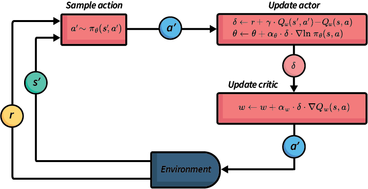

# Actor-Critic Methods
### By [Ahmed Said Saleh](https://www.linkedin.com/in/ahmedsaidsaleh/)

---
# Brief Introduction to Actor-Critic Methods

Actor-Critic methods are a class of Reinforcement Learning (RL) algorithms that combine two major ideas in RL:

- **Policy-based learning** → learning *how to act*
- **Value-based learning** → learning *how good actions or states are*

Instead of relying only on value estimates like Q-Learning, or only optimizing a policy like REINFORCE, Actor-Critic methods combine both approaches into a single framework.

The method consists of two components:

- **Actor**
  Responsible for selecting actions using a learned policy.

- **Critic**
  Responsible for evaluating the quality of the actor’s decisions using a value function.

The critic guides the actor using a learning signal called the **Temporal Difference (TD) error**, which helps stabilize learning and reduce variance.

Actor-Critic methods are especially useful in:
- continuous action spaces
- robotics
- autonomous systems
- control problems
- modern deep reinforcement learning

Many advanced RL algorithms such as PPO, A3C, DDPG, and SAC are built on Actor-Critic principles.

# Why Do We Need Actor-Critic Methods?

Traditional Reinforcement Learning methods face several limitations when solving complex or continuous-control problems.

## Value-Based Methods (Q-Learning)

Q-Learning learns action values directly using a Q-table or Q-function.

### Problems:
- Difficult to scale to continuous action spaces
- Requires selecting the maximum action explicitly
- Large state spaces become inefficient
- Policies are indirectly learned from Q-values

Q-Learning works well in discrete environments, but struggles when actions are continuous, such as:
- steering angles
- robot movement
- acceleration control

---

## Policy Gradient Methods (REINFORCE)

Policy-gradient methods directly optimize the policy.

### Advantages:
- Naturally support continuous actions
- Learn stochastic policies directly

### Problems:
- High variance updates
- Unstable learning
- Requires full episode returns before updating
- Slower convergence

---

# Why Actor-Critic?

Actor-Critic combines the strengths of both approaches:

| Method | Strength | Weakness |
|---|---|---|
| Q-Learning | Stable value estimation | Poor for continuous actions |
| Policy Gradient | Direct policy optimization | High variance |
| Actor-Critic | Combines both advantages | More complex implementation |

Actor-Critic methods:
- reduce variance using a critic
- support continuous actions
- update online during interaction
- converge faster and more smoothly

---

# Core Idea of Actor-Critic

Actor-Critic uses two separate components:

## Actor
The actor decides which action to take.

It learns a policy:

$$
\pi(a|s)
$$

---

## Critic
The critic evaluates how good the current state or action is.

It learns a value function:

$$
V(s)
$$

The critic helps stabilize learning by guiding the actor using TD learning.

---

# General Actor-Critic Algorithm


----
At every timestep:

1. Observe current state $s_t$
2. Sample action $a_t \sim \pi(a|s)$
3. Execute action in environment
4. Receive reward $r_t$ and next state $s_{t+1}$
5. Compute TD error
6. Update actor
7. Update critic

---

# TD Error

The Temporal Difference (TD) error is the main learning signal:

$$
\delta_t = r_t + \gamma V(s_{t+1}) - V(s_t)
$$

Where:

- $r_t$ → immediate reward
- $\gamma$ → discount factor
- $V(s_t)$ → current value estimate
- $V(s_{t+1})$ → estimated future value

Interpretation:
- Positive TD error → action was better than expected
- Negative TD error → action was worse than expected

---

# Problem Setup

## Environment

We consider a car moving on a 1D track.

State:

$$
s = (x,v)
$$

Where:
- $x$ → position
- $v$ → velocity

Initial state:

$$
x=0,\quad v=1
$$

Goal:

$$
x=10
$$

Action:
- continuous acceleration value

---

# Model Definitions

## Policy (Actor)

Actions are sampled from a Gaussian policy:

$$
a \sim \mathcal{N}(\mu(s), \sigma^2)
$$

Policy mean:

$$
\mu(s)=\theta_1 x + \theta_2 v
$$

Initial parameters:

$$
\theta=(0.5,1.0)
$$

---

## Value Function (Critic)

The critic estimates state value:

$$
V(s)=w_1 x + w_2 v
$$

Initial critic parameters:

$$
w=(1.0,0.5)
$$

Other hyperparameters:

$$
\sigma=1,\quad \alpha=0.1,\quad \gamma=1
$$

---

# Environment Dynamics

The environment updates according to:

$$
v' = v + a
$$

$$
x' = x + v'
$$

---

# Reward Function

The reward encourages:
- reaching the goal
- smooth movement
- avoiding excessive acceleration

Reward:

$$
r_t = -|x_t-10| - 0.1a_t^2
$$

---

# Step 1 — Observe State

Initial state:

$$
s_0=(0,1)
$$

---

# Step 2 — Sample Action

Policy mean:

$$
\mu(s_0)=0.5(0)+1.0(1)=1
$$

Suppose the sampled action is:

$$
a_0=2
$$

---

# Step 3 — Environment Transition

Velocity update:

$$
v_1=1+2=3
$$

Position update:

$$
x_1=0+3=3
$$

Next state:

$$
s_1=(3,3)
$$

Reward:

$$
r_0=-|3-10|-0.1(2^2)
$$

$$
r_0=-7.4
$$

---

# Step 4 — Compute TD Error

Old state value:

$$
V(s_0)=1(0)+0.5(1)=0.5
$$

Next state value:

$$
V(s_1)=1(3)+0.5(3)=4.5
$$

TD error:

$$
\delta_0=-7.4+4.5-0.5
$$

$$
\delta_0=-3.4
$$

The negative TD error means the action was worse than expected.

---

# Step 5 — Actor Update

Policy gradient:

$$
\nabla \log \pi = \frac{(a-\mu)}{\sigma^2}[x,v]
$$

Substituting values:

$$
(2-1)(0,1)=(0,1)
$$

Actor update:

$$
\Delta \theta = 0.1(-3.4)(0,1)
$$

$$
\Delta \theta=(0,-0.34)
$$

Updated parameters:

$$
\theta=(0.5,0.66)
$$

The actor becomes less likely to produce similar poor actions.

---

# Step 6 — Critic Update

Critic update rule:

$$
\Delta w=\alpha \delta [x,v]
$$

Substituting values:

$$
\Delta w=0.1(-3.4)(0,1)
$$

$$
\Delta w=(0,-0.34)
$$

Updated critic parameters:

$$
w=(1.0,0.16)
$$

The critic adjusts its value estimation based on experience.

---

# Step 1 (t=1) — Observe

Current state:

$$
s_1=(3,3)
$$

---

# Step 2 (t=1) — Sample Action

Policy mean:

$$
\mu(s_1)=0.5(3)+0.66(3)=3.48
$$

Suppose:

$$
a_1=3.5
$$

---

# Step 3 (t=1) — Transition

Velocity:

$$
v_2=3+3.5=6.5
$$

Position:

$$
x_2=3+6.5=9.5
$$

Next state:

$$
s_2=(9.5,6.5)
$$

Reward:

$$
r_1=-|9.5-10|-0.1(3.5^2)
$$

$$
r_1=-1.725
$$

---

# Step 4 (t=1) — TD Error

Current value:

$$
V(s_1)=1(3)+0.16(3)=3.48
$$

Next value:

$$
V(s_2)=1(9.5)+0.16(6.5)=10.54
$$

TD error:

$$
\delta_1=-1.725+10.54-3.48
$$

$$
\delta_1=5.335
$$

A positive TD error means the action was very beneficial.

---

# Step 5 (t=1) — Actor Update

Gradient:

$$
\nabla \log \pi = (3.5-3.48)(3,3)
$$

$$
=(0.06,0.06)
$$

Actor update:

$$
\Delta \theta=0.1(5.335)(0.06,0.06)
$$

$$
\Delta \theta \approx (0.032,0.032)
$$

Updated actor parameters:

$$
\theta=(0.532,0.692)
$$

---

# Step 6 (t=1) — Critic Update

Critic update:

$$
\Delta w=0.1(5.335)(3,3)
$$

$$
\Delta w \approx (1.6005,1.6005)
$$

Updated critic parameters:

$$
w=(2.6005,1.7605)
$$

---

# Why Actor-Critic Works Well

Actor-Critic methods:
- reduce variance
- support continuous actions
- stabilize policy learning
- allow online updates
- converge faster than pure policy-gradient methods


---

# Applications

Actor-Critic methods are widely used in:
- robotics
- autonomous vehicles
- drone navigation
- game AI
- industrial control systems
- financial optimization

Modern RL algorithms based on Actor-Critic include:
- A2C
- A3C
- PPO
- DDPG
- SAC

---

# Conclusion

Actor-Critic combines:
- policy optimization from policy-gradient methods
- stable value estimation from value-based methods

The actor chooses actions, while the critic evaluates them using TD learning.

This combination enables efficient and stable learning in complex continuous-control environments.

## Citation

To cite this chapter, please use the following BibTeX:

```bibtex
@misc{saleh_2026_ReinforcementLearning,
  author       = {Ahmed Said Abbas Saleh},
  title        = {Reinforcement Learning: A Gentle Introduction, Chapter 7 Part 2},
  year         = {2026},
  publisher    = {GitHub},
  howpublished = {\url{https://github.com/amrmsab/reinforcement_learning_book}},
  note         = {Accessed: April 30, 2026}
}
```