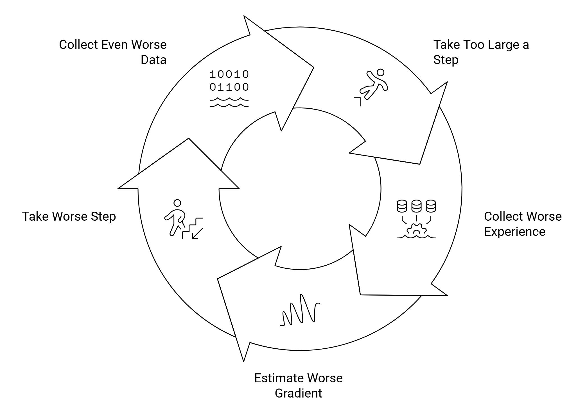
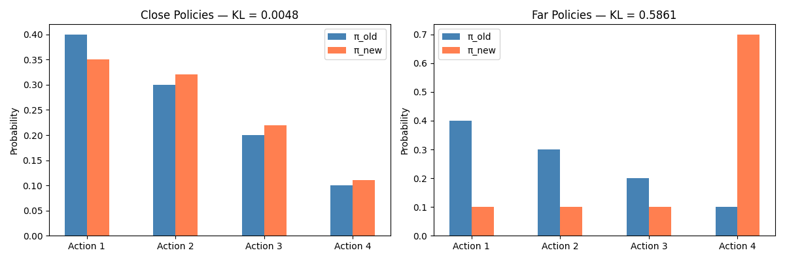
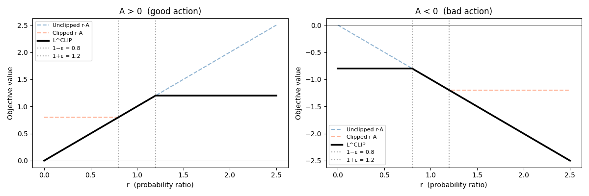
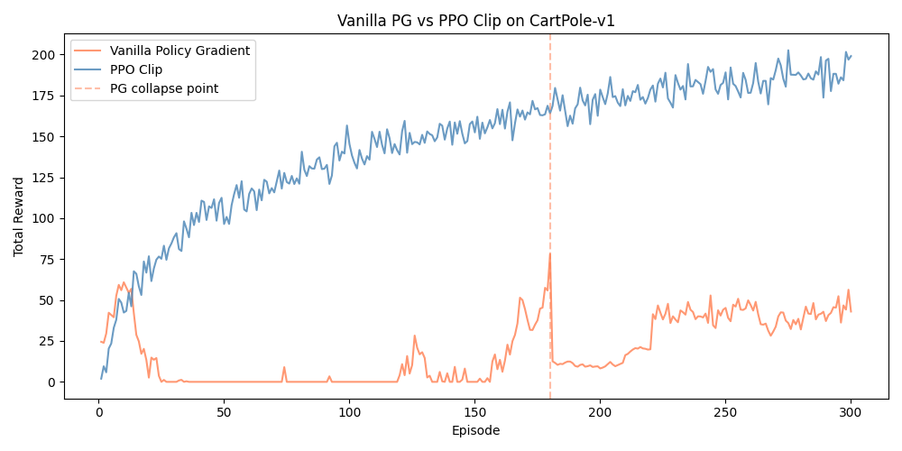
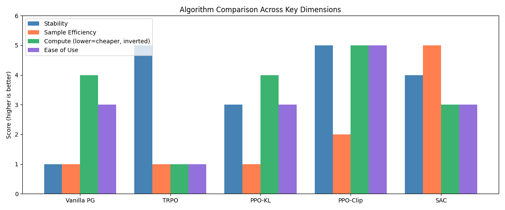

# Chapter 8.2 — Teaching Your Agent to Walk Without Falling: TRPO and PPO

**Author:** [Yaseen Ashraf](https://www.linkedin.com/in/zoatel)

> This chapter covers the second half of Week 8 in the course. The first half, covering Deep Q-Networks and their improvements, is in Chapter 8.1. If you are not yet familiar with policy gradient methods and the REINFORCE algorithm, Chapter 7 is a good place to start before reading this one.

<a name="section-1"></a>

## 8.2.1 The Problem with Taking Big Steps

If you have ever tried to learn how to ride a bike, you know that the worst thing you can do is overcorrect. You wobble to the left, you panic and yank the handlebars hard to the right, and suddenly you are on the ground wondering what went wrong. The fall did not happen because you were a bad cyclist, it happened because your correction was too aggressive. Reinforcement learning has exactly the same problem.

By this point in the book, you have seen how policy gradient methods work. The agent collects some experience, estimates which actions led to better outcomes using the advantage function, and nudges the policy in that direction. Clean, intuitive, and it works, at least in theory.

The trouble starts when we ask: how big should that nudge be?

### The Step Size Is Not What You Think

When people first hear "step size problem," they usually think of the learning rate, that small number $\alpha$ in the gradient update:

$$
\theta(k+1) = \theta(k) + \alpha \cdot \nabla J(\theta(k))
$$

If $\alpha$ is too large, we overshoot. If it is too small, we learn painfully slowly. This is a familiar problem from supervised learning, and we have good tools for dealing with it, learning rate schedules, adaptive optimizers like Adam, and so on.

But the step size problem in policy gradient is something deeper and more dangerous than a badly tuned learning rate. Here is why.

Imagine you have a neural network policy. You change one weight that sits right before the final softmax layer, the layer that converts raw scores into action probabilities. Even a tiny change there can completely flip which action the policy considers most likely. Now imagine you change a weight deep in the early layers, far from the output. You could change it by a large amount and the action probabilities might barely budge.

This means that the same step size α can be catastrophically large in one part of the network and completely harmless in another. The parameters $\theta$ and the actual behavior of the policy live in two different worlds. Moving a fixed distance in parameter space tells you nothing about how much the policy's behavior actually changed.

This is the core of the problem: **we are trying to control policy behavior, but we can only directly touch policy parameters.** And the relationship between the two is complicated and nonlinear.

### When a Bad Step Becomes a Catastrophe

In supervised learning, taking a bad gradient step is annoying but recoverable. Your loss spikes, you reduce the learning rate, and you carry on, your training data is still sitting there, unchanged and waiting for you.

In reinforcement learning, a bad step is a much bigger deal. Here is why: your training data is not fixed. It comes from the policy itself. Every batch of experience you collect is generated by running your current policy in the environment.

So the sequence of events after one bad update looks like this:

1. You take too large a step and the policy becomes slightly worse
2. You now collect your next batch of experience using this slightly worse policy
3. That experience is noisier and less informative than before
4. Your next gradient estimate is worse, so your next step is worse
5. The policy deteriorates further, collecting even worse data
6. Repeat until the policy has completely collapsed



This is not a theoretical edge case. It happens in practice, and when it does, recovery is almost impossible without restarting training from scratch. One bad step poisons everything that comes after it.

### What We Actually Need

So what would a safe update look like? Ideally, we want something that says: _take the best possible step, but do not let the new policy behave too differently from the old one._ Small enough that if it turns out to be a bad step, the next batch of data is not completely corrupted. Large enough that we are actually making progress.

The challenge is that to enforce this, we first need a way to measure how differently two policies are behaving. Not how different their parameters are, we just saw why that is misleading, but how different their actual behavior in the environment is.

That question, how do we measure the distance between two policies in a meaningful way, is going to drive everything that follows in this chapter. We will need to build one new mathematical tool, use it to construct the first real solution to this problem, and then find a way to make that solution practical enough to actually use.

Let us start by addressing a simpler version of the problem: what if we could reuse data from our old policy to evaluate our new one?

> 💭 **Pause and think:** Before reading on, in supervised learning, why does a bad gradient step not compound the way it does in RL? What is the structural difference between the two settings that makes RL so much more fragile?

---

<a name="section-2"></a>

## 8.2.2 Reusing Old Data: Importance Sampling

Let's say you want to know the average opinion of an entire country on some political issue. You run a survey, but due to budget constraints, you end up interviewing mostly university students. Your sample is biased, it does not reflect the true population. What do you do?

You could throw the survey away and start over with a properly representative sample. But that is expensive. Instead, a smarter approach is to _correct_ for the bias mathematically. You know that university students are overrepresented in your sample, so you downweight their responses. You know that older citizens are underrepresented, so you upweight theirs. With the right correction factors, you can recover a reasonable estimate of the national opinion without collecting a single additional response.

This idea, reweighting samples from one distribution to estimate expectations under another, is called **importance sampling** [Sutton & Barto, 2018]. And it turns out to be exactly the tool we need in reinforcement learning.

### The Mismatch Problem

Recall the policy gradient update from Chapter 7. The gradient estimate requires data collected from the current policy $\pi_\theta$ [Sutton et al., 2000]:

$$
\nabla J(\theta) = \mathbb{E}_{s,a \sim \pi_\theta}
\left[
\nabla \log \pi_\theta(a|s) \cdot A(s,a)
\right]
$$

The expectation here assumes that the states and actions we are averaging over were generated by $\pi_\theta$ itself. But in practice, here is what actually happens:

1. We run the **old** policy $\pi_{old}$ in the environment and collect a batch of trajectories
2. We compute a gradient estimate from that data
3. We update the parameters to get a **new** policy $\pi_{new}$
4. We want to evaluate how good $\pi_{new}$ is, but our data came from $\pi_{old}$

The formula assumes the data comes from $\pi_\theta$. Reality gives us data from $\pi_{old}$. These are two different distributions, and using one where the other is expected gives us a biased, potentially misleading gradient estimate. This is the mismatch.

### The Fix: Reweighting

Here is where the survey analogy comes back. Just like we could reweight survey responses to correct for sampling bias, we can reweight our trajectory samples to correct for the policy mismatch.

The math behind this is elegant. Suppose we want to compute an expectation under distribution p, but we only have samples from distribution q:

$$
\mathbb{E}_{\tau \sim p}[f(\tau)] =
\mathbb{E}_{\tau \sim q}
\left[
\frac{p(\tau)}{q(\tau)} \cdot f(\tau)
\right]
$$

This works because:

$$
\int p(\tau)\, f(\tau)\, d\tau
=
\int q(\tau)\cdot \frac{p(\tau)}{q(\tau)} \cdot f(\tau)\, d\tau
$$

We are not changing what we are computing, we are just changing _how_ we compute it. The ratio $\frac{p(\tau)}{q(\tau)}$ is the correction weight. It tells us: given that this sample was generated by q, how much should it contribute when we are trying to estimate something about p?

In our RL setting, p is the new policy $\pi_{new}$ and q is the old policy $\pi_{old}$. The ratio simplifies beautifully. Full trajectories involve products of many probabilities, but most of those terms cancel out when you work through the math. What you are left with is a simple per-timestep ratio:

$$
\frac{\pi_{\text{new}}(a_t \mid s_t)}
{\pi_{\text{old}}(a_t \mid s_t)}
$$

This ratio has a clean intuitive meaning. If the new policy assigns a much higher probability to an action than the old policy did, the ratio is large, this sample is more relevant to the new policy than the old one suggested, so we upweight it. If the new policy assigns a much lower probability, the ratio is small, this sample is less relevant, so we downweight it.

### The Surrogate Objective

Plugging this into our objective gives us what is called the **surrogate objective**, a proxy for the true policy gradient objective that we can compute using old data:

$$
\max_{\theta}\;
\mathbb{E}_{\tau \sim \pi_{\text{old}}}
\left[
\frac{\pi_{\text{new}}(a \mid s)}
{\pi_{\text{old}}(a \mid s)}
\cdot A(s,a)
\right]
$$

Compare this to where we started:

$$
\max_{\theta}\;
\mathbb{E}_{\tau \sim \pi_{\theta}}
\left[
\log \pi_{\theta}(a \mid s) \cdot A(s,a)
\right]
$$

The expectation has shifted from $\pi_\theta$ to $\pi_{old}$, meaning we can now evaluate the new policy using trajectories we already collected. We have gained some data efficiency. Instead of throwing everything away after a single gradient step, we can potentially reuse the same batch for multiple updates.

### What We Did and Did Not Fix

We reformulated the objective. That is all. The surrogate objective is mathematically equivalent to the original under one critical assumption: that the old and new policies are not too different. When that assumption holds, the reweighting is accurate and everything works. When it breaks down, the surrogate becomes a poor approximation of what we actually want to optimize.

And here is the uncomfortable truth: we have done nothing to enforce that assumption. We have no mechanism preventing the new policy from wandering far from the old one. The step size problem from 8.2.1 is completely untouched.

Worse, by introducing the ratio, we have created a new fragility. A quick example makes this concrete:

```python
import numpy as np

# Old policy rarely took this action
pi_old = 0.05

# New policy takes it much more often
pi_new = 0.80

ratio = pi_new / pi_old
print(f"Importance ratio: {ratio:.1f}")
# Output: Importance ratio: 16.0
```

A ratio of 16 means this single sample is being weighted sixteen times more heavily than it should be under a balanced estimate. If the advantage for this action happens to be large, this one sample could dominate your entire gradient update, based on a single observation.

As the new policy diverges from the old one during training, these extreme ratios become more and more common. The result is gradient estimates with very high variance, and update steps that can be catastrophically large.

So where does that leave us? We have a cleaner objective and a small gain in data efficiency. But we have also introduced a new source of instability, and we have not solved the original problem at all.

What we need is a formal constraint. Something that takes the surrogate objective and adds a guardrail: _you may optimize freely, but only within a safe neighborhood of the current policy._

To build that guardrail, we first need a proper way to measure how far two policies have drifted apart. Not in parameter space, we already saw why that is misleading, but in the space of actual behavior.

That measurement tool is KL divergence. And building it from the ground up is exactly where we are headed next.

> 💭 **Pause and think:** The importance ratio can become very large or very small. Can you think of a simple way to prevent this, before reading the next section, that does not require any new mathematics?

---

<a name="section-3"></a>

## 8.2.3 Measuring Policy Distance: KL Divergence

We have been circling the same problem for a while now. The policy needs to stay close to its previous version during updates, but "close" has been poorly defined. Close in parameter space is meaningless, we saw why. Close in terms of the importance ratio is a symptom we can observe after things go wrong, not a constraint we can enforce before they do.

What we need is a way to measure, before we take a step, how differently the new policy will actually behave compared to the old one. Not how different their weights are. How different their *decisions* are.

The tool that gives us this is KL divergence. It is worth understanding properly, not just as a formula to plug in, but as an idea that makes intuitive sense from the ground up, because it will follow us for the rest of this chapter and well beyond it.

### Building KL Divergence From Scratch

Most textbooks introduce KL divergence as a formula and move on. We are going to build it from first principles instead, because once you see where it comes from, the formula stops being something to memorize and starts being something that makes obvious sense.

**Step 1: Surprise**

Start with a simple question: how surprising is an event?

If someone tells you the sun rose this morning, you are not surprised at all, it happens every day with near certainty. If someone tells you they flipped a fair coin ten times and got heads every time, you raise an eyebrow. If someone tells you they won the lottery, you are shocked.

The pattern is clear: the rarer the event, the more surprising it is. Mathematically, if an event has probability p of occurring, we define its **self-information**, its surprise value, as:

$$
I(x) = -\log(p(x))
$$

The negative sign is there because log(p) is negative for probabilities between 0 and 1, and we want surprise to be a positive number. The logarithm gives us a useful property: the surprise of two independent events happening together equals the sum of their individual surprises, which matches our intuition nicely.

**Step 2: Entropy**

Now suppose you have an entire probability distribution, not just one event, but a whole range of possible outcomes with their associated probabilities. How surprising is this distribution _on average_?

The answer is the **entropy** of the distribution, written $H(p)$:

$$
H(p) = -\sum p(x) \cdot \log(p(x))
$$

This is just the expected value of the surprise. A distribution that is highly concentrated, one outcome is almost certain, has low entropy, because you are almost never surprised. A distribution that is completely uniform, every outcome equally likely, has maximum entropy, because every outcome is equally unexpected.

In the context of a policy, entropy tells you how decisive or random the policy is. A policy with high entropy spreads probability across many actions. A policy with low entropy is confident and concentrated.

**Step 3: Cross-Entropy**

Now comes the interesting part. What if you are _experiencing_ one distribution but _expecting_ another?

Imagine your policy $\pi_{old}$ has learned some behavior and you have internalized its action preferences. Now a new policy $\pi_{new}$ comes along with slightly different preferences. When $\pi_{new}$ takes actions, you are evaluating them through the lens of what $\pi_{old}$ would have expected. The expected surprise you experience in this situation is called the **cross-entropy**:

$$
H(p, q) = -\sum p(x) \cdot \log(q(x))
$$

Here p is what is actually happening (the new policy's distribution) and q is what you were expecting (the old policy's distribution). If the two are identical, cross-entropy equals ordinary entropy and you experience no extra surprise. If they differ, you are systematically caught off guard.

**Step 4: KL Divergence as the Gap**

We are almost there. KL divergence is simply the _extra_ surprise you experience when you use the wrong model, the gap between cross-entropy and ordinary entropy:

$$
\mathrm{KL}(p \mid q) = H(p, q) - H(p)\\
= -\sum p(x)\log q(x) - \left(-\sum p(x)\log p(x)\right)\\
= \sum p(x)\,\log\left(\frac{p(x)}{q(x)}\right)
$$

Read it this way: KL(p||q) measures how much more surprised you are, on average, when you experience distribution p but were expecting distribution q. If p and q are identical, the ratio inside the log is always 1, the log is always 0, and KL is 0, no extra surprise. As they diverge, KL grows.

In our RL setting, p is $\pi_{old}$ and q is $\pi_{new}$:

$$
\mathrm{KL}(\pi_{\text{old}} \,\|\, \pi_{\text{new}})
= \sum_a \pi_{\text{old}}(a \mid s)\,
\log\left(\frac{\pi_{\text{old}}(a \mid s)}{\pi_{\text{new}}(a \mid s)}\right)
$$

This tells us: if I generate actions from the old policy and evaluate them under the new policy, how surprised am I on average? Small KL means the policies behave similarly. Large KL means they have drifted significantly apart.

Let us make this concrete with code you can run yourself:

```python
import numpy as np
import matplotlib.pyplot as plt

# Action probabilities for 4 possible actions
pi_old       = np.array([0.4,  0.3,  0.2,  0.1 ])
pi_new_close = np.array([0.35, 0.32, 0.22, 0.11])  # similar behavior
pi_new_far   = np.array([0.1,  0.1,  0.1,  0.7 ])  # very different behavior

def kl_divergence(p, q):
    # Small epsilon to avoid log(0)
    return np.sum(p * np.log(p / (q + 1e-8)))

print(f"KL (close policies): {kl_divergence(pi_old, pi_new_close):.4f}")
print(f"KL (far policies):   {kl_divergence(pi_old, pi_new_far):.4f}")
# KL (close policies): 0.0048
# KL (far policies):   0.5861

# Visualization
actions = ['Action 1', 'Action 2', 'Action 3', 'Action 4']
x       = np.arange(len(actions))
width   = 0.25

fig, axes = plt.subplots(1, 2, figsize=(12, 4))

for ax, pi_new, title in zip(
    axes,
    [pi_new_close, pi_new_far],
    ['Close Policies — KL = 0.0048', 'Far Policies — KL = 0.5861']
):
    ax.bar(x - width/2, pi_old, width, label='π_old', color='steelblue')
    ax.bar(x + width/2, pi_new, width, label='π_new', color='coral'    )
    ax.set_title(title)
    ax.set_xticks(x)
    ax.set_xticklabels(actions)
    ax.set_ylabel('Probability')
    ax.legend()

plt.tight_layout()
plt.savefig('kl_visualization.png', dpi=150)
plt.show()
```



Run this yourself and look at the two plots side by side. In the left plot, the bars for π_old and π_new are almost identical, KL is near zero. In the right plot, the distributions look completely different, KL reflects that immediately.

### Three Properties Worth Knowing

Before we plug KL into TRPO, there are three properties worth understanding, not to memorize, but because they come up repeatedly.

**Non-negativity:** KL(p||q) is always greater than or equal to zero, with equality only when p and q are identical. This follows from Jensen's inequality applied to the concave function log, the formal proof is one line, but the intuition is simpler: you can never be _less_ surprised on average by using the wrong model. The best case is no extra surprise at all.

**Asymmetry:** KL(p||q) is not equal to KL(q||p) in general. This trips people up because we are used to distances being symmetric, the distance from A to B equals the distance from B to A. KL is not a distance in that sense. The direction matters. TRPO uses KL(π_old||π_new), we anchor our perspective at the old policy and ask how far the new one has wandered from it. That is the natural direction for our constraint.

**KL = 0 only when distributions are identical:** You cannot have zero KL between two different distributions. If two policies assign even slightly different probabilities to any action in any state, their KL is strictly positive. This makes KL a faithful measure, it never declares two different policies identical.

Now we have the right measuring stick. The question is how to use it, and that is exactly what TRPO answers.

> 💭 **Pause and think:** KL(p||q) and KL(q||p) are different. In the TRPO constraint, we use KL(π_old || π_new), we anchor from the old policy's perspective. What do you think would change if we used KL(π_new || π_old) instead? Would the constraint be stricter or looser in practice?

<a name="section-4"></a>

## 8.2.4 TRPO: The First Real Fix

We now have a meaningful way to measure how far two policies have drifted apart behaviorally. The next question is how to use it.

In 2015, Schulman et al. proposed a deceptively simple idea: take the surrogate objective we already have, and add a hard constraint that prevents the new policy from ever exceeding a KL distance of δ from the old one [Schulman et al., 2015]. This is Trust Region Policy Optimization — TRPO.

$$
\max_{\theta}\;\mathbb{E}_t \left[
\frac{\pi_{\theta}(a_t \mid s_t)}{\pi_{\text{old}}(a_t \mid s_t)} \cdot \hat{A}_t
\right]
$$

subject to:

$$
\mathbb{E}_t \left[
\mathrm{KL}\big(\pi_{\text{old}}(\cdot \mid s_t)\,\|\,\pi_{\theta}(\cdot \mid s_t)\big)
\right] \le \delta
$$

Read this in plain English: find the policy parameters θ that maximize the advantage-weighted surrogate objective, but only consider policies whose behavior stays within a KL distance of δ from the current policy. δ is a small threshold, a trust region around the current policy within which you are confident the surrogate objective is a reliable approximation of the true objective.

Every part of this formulation now has a clear motivation:

- The surrogate objective: lets us use old data via importance sampling
- The KL constraint: ensures the old data remains a valid approximation for the new policy
- The δ threshold: controls how conservative you want to be

The TRPO algorithm puts this together as follows:

```
for iteration = 1, 2, ... do
    Run current policy π_old for T timesteps or N trajectories
    Estimate advantage function Â_t at all timesteps
    Compute policy gradient g = ∇_θ surrogate objective
    Use conjugate gradients to compute F⁻¹g
        where F is the Fisher Information Matrix
    Perform line search to find largest step satisfying KL constraint
end for
```

### Why a Hard Constraint Forces Expensive Math

Here is where things get computationally uncomfortable, and understanding why is important, because the computational cost of TRPO is not accidental. It is a direct consequence of the hard constraint.

Think of it this way. Imagine you are driving in Cairo and you want to get as far as possible, but you cannot spend more than 20 minutes in the car. If all roads were equally fast, you would just pick a direction and drive. Simple.

But Cairo's roads are not a grid. They curve, they double back, they disappear into dead ends. 20 minutes on the Ring Road gets you across the city. 20 minutes stuck in Tahrir at 5pm gets you three blocks. Same time, completely different displacement, it depends entirely on which road you took.

The KL constraint works the same way. The boundary is not a uniform circle in parameter space. The same parameter step can move you a tiny amount in KL space in one direction, and shoot you straight through the constraint boundary in another. The geometry is uneven and local, it changes at every point.

This means that when you take a gradient step on the surrogate objective, you cannot just follow the raw gradient g. The raw gradient lives in parameter space and is completely blind to the KL geometry. Following it naively would almost certainly violate the constraint, or leave you far short of the boundary when you could have gone further.

What you actually need is a gradient that has been transformed to account for the local shape of the KL constraint. That transformation requires knowing the curvature of the KL landscape, second-order information about how the constraint bends and warps in the neighborhood of your current policy.

### The Fisher Information Matrix

The mathematical object that captures this curvature is called the **Fisher Information Matrix**, denoted F. It is a square matrix whose entries describe, for every pair of parameter dimensions, how much the KL divergence changes when you move in those directions simultaneously.

Geometrically, F tells you the shape of the KL constraint surface at your current location. Directions in which F is large are directions where small parameter changes cause big behavioral shifts. Directions in which F is small are directions where you can move a lot without affecting behavior much.

To take a step that is both maximally improving on the surrogate objective and precisely calibrated to the KL constraint, TRPO computes what is called the **natural gradient** [Amari, 1998]: F⁻¹g, where g is the ordinary policy gradient. This rescaled gradient has been transformed from parameter space into a direction that respects the local KL geometry, moving as far as possible in terms of objective improvement while staying within the trust region boundary.

### Why This Is Expensive

The problem is that F is enormous. Its size is the number of parameters squared. A modest neural network with one million parameters produces an F matrix with one trillion entries. You cannot store it. You certainly cannot invert it directly.

TRPO sidesteps this by never forming F explicitly. Instead it uses **conjugate gradients** — an iterative algorithm that can compute the product F⁻¹g without ever materializing F itself. To do this, it only needs to compute products of the form Fv for arbitrary vectors v. And computing Fv turns out to require differentiating through the gradients of the KL divergence — which means differentiating your gradients twice. That is second-order optimization.

In practical terms: every TRPO update requires multiple passes through the network computing Hessian-vector products, followed by a line search that checks whether each candidate step actually satisfies the KL constraint. The whole procedure is correct and principled, but it is many times more expensive than a single gradient step.

TRPO works. It genuinely solves the instability problem and has the theoretical guarantees to prove it. But for large neural networks, the computational cost at every iteration is brutal. And this naturally leads to a question: do we really need a _hard_ constraint to get stable updates? What if we relaxed it slightly, made it softer, and traded a little theoretical purity for a lot of practical efficiency?

That trade is exactly what PPO makes. And it turns out to be a very good deal.

> 💭 **Pause and think:** TRPO uses a hard constraint, the update is simply not allowed to violate the KL boundary. PPO (as we will see) uses a soft approach instead. Can you think of a scenario where the hard constraint would actually matter, where a soft approximation might fail but TRPO would succeed?

---

<a name="section-5"></a>

## 8.2.5 PPO: The Practical Winner

TRPO solved the instability problem. That is not a small thing, it was the first algorithm to give us a principled, theoretically grounded way to update a policy without risking catastrophic collapse. But principled and practical are two different things, and TRPO's computational cost made it difficult to scale to the large neural networks that modern RL problems demand.

The question the RL community asked next was natural: do we really need all that machinery? The KL constraint is doing the important work, keeping the new policy close to the old one. But enforcing it as a hard constraint is what forces us into second-order optimization. What if we could get the same protective effect through a simpler mechanism?

Proximal Policy Optimization -- PPO -- is the answer to that question [Schulman et al., 2017]. It comes in two flavors, and understanding both helps you appreciate why the second one became the default choice across almost every modern RL application.

### PPO v1: Softening the Constraint

The first idea was straightforward: instead of enforcing the KL divergence as a hard constraint, fold it directly into the objective as a penalty term. This technique is called Lagrangian relaxation, rather than saying _"you are not allowed to exceed this KL threshold,"_ we say _"every time you drift too far from the old policy, we subtract a penalty from your reward."_

The resulting objective looks like this:

$$
\max_{\theta}\;
\mathbb{E}_t \left[
\frac{\pi_{\theta}(a_t \mid s_t)}{\pi_{\text{old}}(a_t \mid s_t)} \cdot \hat{A}_t
- \beta \cdot \mathrm{KL}\big(\pi_{\text{old}}(\cdot \mid s_t)\,\|\,\pi_{\theta}(\cdot \mid s_t)\big)
\right]
$$

The coefficient β controls how severely we penalize large policy changes. High β means any drift from the old policy is heavily punished, conservative updates. Low β means drift is tolerated, more aggressive updates.

Compared to TRPO, this is computationally liberating. There is no Fisher Information Matrix to approximate, no conjugate gradients, no second-order information required at all. We are back to plain gradient descent on a single unconstrained objective. Fast, simple, and scalable.

So why is PPO v1 not the algorithm everyone uses?

The problem is β. Early in training the policy is changing rapidly and needs strong regularization, a large β keeps updates conservative. But as training progresses and the policy stabilizes, that same large β becomes suffocating. It prevents the policy from making the fine-grained improvements it needs to squeeze out the last bit of performance.

Set β too high and your policy barely moves, learning stalls. Set it too low and you are back to the instability we started with. In other words, PPO v1 traded the computational cost of TRPO for a hyperparameter sensitivity problem. The step size problem we have been fighting since 8.2.1 has not gone away, it has just changed shape. It is now hiding inside β.

PPO v1 is not a failed idea. The Lagrangian relaxation is the right direction. But β makes it fragile in practice, and fragile algorithms do not become community standards. Something better was needed.

### PPO Clip: The Elegant Solution

The insight behind PPO-Clip is to stop trying to measure and penalize policy change, and instead directly prevent the update from going too far in the first place.

Here is the key observation: the importance ratio $r_t(\theta) = \frac{\pi_{\text{new}}(a_t \mid s_t)}{\pi_{\text{old}}(a_t \mid s_t)}$ is what connects the surrogate objective to the old data. When this ratio stays close to 1, the new and old policies are behaving similarly and the surrogate is a reliable approximation. When it strays far from 1, the approximation breaks down and updates become unreliable.

So instead of penalizing large KL divergence after the fact, PPO-Clip simply clips the ratio itself. It refuses to let the ratio go above 1+ε or below 1-ε, where ε is typically 0.2. The clipped objective is [Schulman et al., 2017]:

$$
L^{\mathrm{CLIP}}(\theta)
= \mathbb{E}_t \left[
\min\Big(
r_t(\theta)\,\hat{A}_t,\;
\mathrm{clip}\big(r_t(\theta),\, 1-\epsilon,\, 1+\epsilon\big)\,\hat{A}_t
\Big)
\right]
$$

That min operation is the clever part. Let us walk through what it does in each situation, because this is the heart of the algorithm.

**Case 1: Good action, policy moving toward it (A > 0, r > 1+ε)**

The action had a positive advantage, it was better than expected. The new policy is assigning it higher probability than the old policy did, so r > 1. This seems good: we are reinforcing a good action. But if r gets too large, we are over-committing, changing the policy too aggressively based on a single observation. The clip cuts off the objective at 1+ε, removing the gradient signal that would push r even higher. The policy is told: _you have moved far enough in this direction, stop here._

**Case 2: Good action, policy moving away from it (A > 0, r < 1−ε)**

The action was good, but the new policy is assigning it lower probability. This is a problem , we are moving away from something that worked. The clip does not activate here. The gradient signal is preserved and continues pushing the policy back toward this action.

**Case 3: Bad action, policy moving away from it (A < 0, r < 1−ε)**

The action had a negative advantage, it was worse than expected. The new policy is correctly assigning it lower probability. Good. But if r gets too small, we are over-correcting. The clip activates, cutting off the gradient that would push avoidance even further. _You have moved far enough away from this action, stop here._

**Case 4: Bad action, policy moving toward it (A < 0, r > 1+ε)**

The action was bad, but the new policy is assigning it higher probability anyway. This is the most dangerous case, we are reinforcing bad behavior. The clip does not activate here; the gradient signal is fully preserved and pushes back hard against this tendency.

The pattern across all four cases is consistent: **the clip only activates when the policy has already moved enough in the right direction.** It never blocks corrections that need to happen, it only limits over-corrections.

Let us visualize this:



Look at the bold black line in each plot, that is $L^{\mathrm{CLIP}}$. It is linear in the region where r is close to 1, meaning updates proceed normally there. But it flattens out once r crosses the clipping boundaries. The gradient in that flat region is zero, the algorithm has stopped responding to further drift in that direction.

### The PPO Clip Loss in Code

Here is a clean implementation of the PPO clip loss in PyTorch. This is the core of what you would find in any modern PPO implementation:

```python
import torch

def ppo_clip_loss(log_pi_new, log_pi_old, advantages, epsilon=0.2):
    """
    Computes the PPO-Clip surrogate loss.

    Arguments:
        log_pi_new  : log-probabilities of actions under new policy  (tensor)
        log_pi_old  : log-probabilities of actions under old policy  (tensor, detached)
        advantages  : estimated advantage values                     (tensor)
        epsilon     : clipping parameter, typically 0.2             (float)

    Returns:
        loss : scalar tensor, ready for backpropagation
    """

    # Compute probability ratio in log space for numerical stability
    # log(π_new / π_old) = log(π_new) - log(π_old)
    ratio = torch.exp(log_pi_new - log_pi_old)

    # Two versions of the objective
    unclipped = ratio * advantages
    clipped   = torch.clamp(ratio, 1 - epsilon, 1 + epsilon) * advantages

    # Take the pessimistic (minimum) bound element-wise
    # then average over the batch
    loss = -torch.mean(torch.min(unclipped, clipped))

    # Negative because PyTorch minimizes, but we want to maximize
    return loss
```

A few things worth noticing. First, we work in log space for the ratio, subtracting log probabilities instead of dividing raw probabilities. Raw probabilities for individual actions can be very small numbers, and dividing them directly risks floating point underflow. Working in log space keeps everything numerically stable.

Second, the loss is negated at the end. PyTorch's optimizers minimize by default, but PPO is a maximization problem. Negating converts maximization into minimization without changing the solution.

Third, notice how short this is compared to TRPO. No Fisher matrix. No conjugate gradients. No line search. Just two lines of tensor arithmetic and a min operation.

### Does It Actually Work?

The proof is in the training curve. Here is what you would typically see comparing vanilla policy gradient against PPO clip on CartPole-v1, a gym environment where the goal is to keep a pole balanced on a moving cart:



The collapse of vanilla PG is not hypothetical, it is the norm rather than the exception on environments where a single bad update can spiral. PPO clip's training curve is not perfectly smooth either; there is natural variance in any RL training run. But the catastrophic drops that define vanilla PG are absent.

### Why PPO Clip Matters Beyond Games

It is worth pausing to appreciate how far PPO clip's influence extends beyond CartPole and Atari.

PPO clip is the algorithm behind many of the largest language model alignment pipelines in existence today. Reinforcement Learning from Human Feedback -- RLHF -- the technique that fine-tunes language models to follow instructions and behave helpfully, uses PPO as its core policy optimizer. An algorithm that started as a practical simplification of TRPO ended up shaping systems like ChatGPT and Claude. [Ouyang et al., 2022].

The clipping mechanism that prevents a robot's walking policy from collapsing is the same mechanism that prevents a language model's response policy from drifting into incoherence during fine-tuning. The problem is the same at both scales. So is the solution.

> 💭 **Pause and think:** PPO clip controls how much the policy can change per update. But it says nothing about the direction of change, only the magnitude. Can you think of a situation where this might still allow harmful updates, even within the clipped range?

---

<a name="section-6"></a>

## 8.2.6 Where PPO Falls Short

PPO clip is genuinely excellent. It is stable, simple, and has proven itself across an enormous range of problems. If you are starting a new RL project today and you are not sure which algorithm to use, PPO clip is almost certainly the right default choice.

But default choice does not mean universal answer. Every algorithm embodies a set of tradeoffs, and PPO clip is no exception. Understanding where it struggles is not about undermining it, it is about knowing when to reach for something else. And that judgment is one of the most valuable skills you can develop as an RL practitioner.

### The Sample Efficiency Problem

Let us go back to something we established earlier. Importance sampling gave us a small win in data efficiency, we can reuse trajectories from the old policy for a few gradient updates before they become too stale. PPO clip takes advantage of this by running several epochs of updates on each collected batch.

But PPO is still fundamentally **on-policy**. After those few epochs, the new policy has drifted far enough from the old one that the importance ratios are no longer reliable, the clipping mechanism itself is the signal that we have pushed the data as far as it can go. At that point, the entire batch is discarded and we go back to the environment to collect fresh experience.

In a fast simulator like CartPole or Atari, this is manageable, interactions are cheap and we can collect millions of them quickly. But consider a physical robot learning to walk in the real world. Every interaction involves real hardware, real time, and real wear on mechanical components. A robot might be able to collect a few hundred interactions per hour. Throwing away data after a handful of gradient updates is not just wasteful, it is a serious practical limitation that can make learning infeasible.

This is not a bug in PPO's design. It is a direct consequence of the clipping mechanism. On-policy data collection is the price of on-policy stability.

### Hyperparameter Sensitivity

We escaped the β tuning problem of PPO v1. But PPO clip introduces its own sensitivities, and they interact in non-obvious ways.

The clipping parameter ε controls how much the ratio is allowed to deviate from 1. The typical value is 0.2, and it works well across a surprisingly wide range of problems. But it is not universal. In environments with very high-dimensional action spaces or unusual reward scales, the right ε can look quite different. Too large and the clipping provides no real protection. Too small and you are throttling learning unnecessarily.

Beyond ε, the number of epochs per batch, the batch size, the learning rate, and the method used to estimate advantages all interact with each other. Getting PPO to perform well on a new environment often requires careful tuning of several things simultaneously, Engstrom et al. [2020] showed empirically that many of PPO's reported gains can be attributed to specific implementation choices rather than the clipping mechanism itself, underscoring how sensitive the algorithm's behavior is to its full configuration.

### Sparse Rewards

PPO relies on advantage estimates to know which actions were better than expected. That signal is what drives learning. But what if rewards are rare?

Imagine an agent learning to solve a maze. It wanders through corridors, takes thousands of steps, and receives a reward signal only when it reaches the exit, or receives nothing at all if it fails. For most of the episode, the advantage estimates are near zero. The algorithm has no signal to learn from, no way to distinguish which of the thousands of steps it took were actually useful.

PPO has no special mechanism for dealing with this. It relies on the reward signal to be informative enough that the advantage function can extract useful gradients. When that signal is sparse or delayed, learning stalls.

Addressing sparse rewards requires additional techniques like reward shaping, curiosity-driven exploration, or hierarchical learning, none of which are built into PPO itself.

### The Root Cause

These three limitations, sample inefficiency, hyperparameter sensitivity, and struggles with sparse rewards, share a common root: **PPO is on-policy.**

Because PPO can only learn from data collected by the current policy, it is always constrained by the quality and quantity of recent experience. It cannot draw on a rich history of past interactions. Every update is anchored to the immediate present.

Changing this requires a fundamentally different approach. Algorithms that can learn from any data, regardless of which policy collected it, are called **off-policy** methods. They maintain a replay buffer, a memory of past experience, and can draw on it at any time.

The most prominent off-policy algorithm for continuous action spaces is Soft Actor-Critic -- SAC [Haarnoja et al., 2018] -- which adds entropy maximization on top of off-policy learning. Rather than just maximizing expected reward, SAC also encourages the policy to remain as exploratory as possible while still performing well. This built-in exploration bonus helps with sparse rewards and leads to more robust policies in complex environments.

SAC trades PPO's simplicity for sample efficiency and exploration depth. It is harder to implement and requires careful management of the replay buffer. But in environments where interactions are expensive or rewards are sparse, it can be dramatically more effective. Chapter 9 covers SAC and the broader family of off-policy continuous control algorithms in detail.


---

<a name="summary"></a>

## 8.2.7 The Journey We Took

Let us zoom out one final time.

We started with a simple observation: vanilla policy gradient works, but it is fragile. One bad update poisons the data, the data poisons the next update, and the whole thing spirals. The root of the problem was that parameter space and behavior space are two different things, moving a fixed distance in one tells you nothing about how far you have moved in the other.

Importance sampling gave us a way to reuse old data, which was a small practical win. But it also introduced a new fragility: importance ratios that explode or vanish when policies diverge, turning gradient estimates into noise.

KL divergence gave us the right measuring stick, a way to quantify behavioral difference between policies that lives in probability space rather than parameter space. We built it from scratch, from the simple idea of surprise, through entropy and cross-entropy, to the final formula. It is not just a mathematical tool; it is a principled answer to the question of what "close" means for two policies.

TRPO put KL to work as a hard constraint, giving us the first algorithm that could reliably prevent policy collapse. The theoretical guarantees were real. The computational cost was brutal.

PPO v1 softened the constraint into a penalty, recovering computational efficiency but introducing β as a fragile hyperparameter. The step size problem in disguise.

PPO clip bypassed the whole measurement-and-penalty framework and went straight to the source: clip the ratio, prevent the objective from responding to excessive drift. Same stability, fraction of the cost, simple enough to implement in twenty lines. The practical winner.

And then we looked honestly at what PPO clip cannot do, and found that its limitations are coherent, not random. They all trace back to being on-policy. Understanding that root cause points directly toward what to look for next, in Chapter 9.

> _"There is no universally best algorithm in reinforcement learning. There is only the best algorithm for your problem. The goal of this chapter was not to hand you PPO as the answer, it was to show you the reasoning that produced it, so you can follow the same reasoning when the next problem, and the next algorithm, comes along."_


---

<a name="section-7"></a>

## 8.2.8 Choosing Your Algorithm

Everything in this chapter was ultimately in service of one practical skill: knowing which tool to reach for when you sit down to solve a real problem.

Algorithm selection is one of the most consequential decisions in RL. The wrong choice can cost you weeks of compute, produce misleading results, or make a solvable problem appear intractable. The right choice can make a hard problem tractable with surprisingly little effort.

There is no formula for this. But there are four questions that will get you most of the way there.

### Question 1: Can You Afford to Throw Away Data?

This is the on-policy versus off-policy question, and it is usually the most important one.

If you are working in a fast simulator, environments like CartPole, MuJoCo locomotion tasks, or Atari games, environment interactions are cheap. You can collect millions of them without significant cost. In this regime, PPO's on-policy data collection is not a serious limitation. The stability and simplicity it offers are worth the data inefficiency.

If every interaction is expensive, a physical robot, a medical treatment decision, a financial trading system, you cannot afford to throw data away. Every observation is precious. In this regime, an off-policy method like SAC that can learn from a growing replay buffer is likely the better choice.

### Question 2: What Does Your Action Space Look Like?

Discrete action spaces, choosing from a fixed menu of options like game controls, routing decisions, or categorical choices, are the home territory of value-based methods like DQN and its variants from Chapter 8.1. These algorithms work extremely well there.

Continuous action spaces, specifying exact values like joint torques, steering angles, or force magnitudes, require policy gradient methods. PPO handles both discrete and continuous actions, but it particularly shines in continuous control. SAC was designed specifically for continuous action spaces and often outperforms PPO there when sample efficiency matters.

### Question 3: How Dense Is Your Reward Signal?

If rewards are frequent and informative, most modern algorithms will learn effectively. PPO is a fine choice here.

If rewards are sparse or delayed, you need to think carefully about exploration. PPO's advantage estimates become uninformative under sparse rewards. You may need an algorithm with built-in exploration bonuses, or you may need to engineer the reward signal before worrying about algorithm selection.

### Question 4: Are You in a Simulator or the Real World?

Simulators are forgiving. You can reset the environment, collect unlimited data, and run experiments in parallel. Almost any algorithm can eventually work in a simulator given enough compute.

The real world is unforgiving. You cannot reset it. Interactions take real time. Bad policies can cause real damage, to hardware, to patients, to financial systems. In real-world settings, sample efficiency becomes critical and safety constraints become non-negotiable.

### Putting It Together



|                         | Vanilla PG | TRPO      | PPO-KL | PPO-Clip | SAC                |
| ----------------------- | ---------- | --------- | ------ | -------- | ------------------ |
| **Stability**           | Low        | High      | Medium | High     | High               |
| **Sample Efficiency**   | Low        | Low       | Low    | Low      | High               |
| **Computational Cost**  | Low        | Very High | Low    | Low      | Medium             |
| **Action Space**        | Both       | Both      | Both   | Both     | Continuous         |
| **Ease of Use**         | Medium     | Hard      | Medium | Easy     | Medium             |
| **Practical Use Today** | Rarely     | Rarely    | Rarely | Default  | Continuous control |

No single row dominates all the others. PPO-Clip wins on ease of use and practical applicability. SAC wins on sample efficiency and continuous control performance. TRPO wins on theoretical guarantees but loses everywhere else in practice. The right algorithm is the one whose strengths align with your problem's constraints and whose weaknesses your problem can tolerate.

> 💭 **Pause and think:** You are training a robotic arm to sort objects in a warehouse. The arm can only run for about two hours per day before needing maintenance. Rewards are given only when an object is successfully placed. Which algorithm would you choose, and why?

---

<a name="references"></a>

## References

- Haarnoja, T., Zhou, A., Abbeel, P., & Levine, S. (2018). Soft Actor-Critic: Off-Policy Maximum Entropy Deep Reinforcement Learning with a Stochastic Actor. _arXiv preprint arXiv:1801.01290_.

- Schulman, J., Levine, S., Moritz, P., Jordan, M. I., & Abbeel, P. (2015). Trust Region Policy Optimization. _Proceedings of the 32nd International Conference on Machine Learning (ICML)_.

- Schulman, J., Wolski, F., Dhariwal, P., Radford, A., & Klimov, O. (2017). Proximal Policy Optimization Algorithms. _arXiv preprint arXiv:1707.06347_.

- Sutton, R. S., & Barto, A. G. (2018). _Reinforcement Learning: An Introduction_ (2nd ed.). MIT Press.

- Sutton, R. S., McAllester, D. A., Singh, S. P., & Mansour, Y. (2000). Policy Gradient Methods for Reinforcement Learning with Function Approximation. _Advances in Neural Information Processing Systems, 12_, 1057–1063.

- Amari, S. (1998). Natural Gradient Works Efficiently in Learning. *Neural Computation, 10*(2), 251–276.

- Ouyang, L., Wu, J., Jiang, X., Almeida, D., Wainwright, C. L., Mishkin, P., Zhang, C., Agarwal, S., Slama, K., Ray, A., Schulman, J., Hilton, J., Kelton, F., Miller, L., Simens, M., Askell, A., Welinder, P., Christiano, P., Leike, J., & Lowe, R. (2022). Training language models to follow instructions with human feedback. *Advances in Neural Information Processing Systems, 35*, 27730–27744.

- Engstrom, L., Ilyas, A., Santurkar, S., Tsipras, D., Janoos, F., Rudolph, L., & Madry, A. (2020). Implementation Matters in Deep RL: A Case Study on PPO and TRPO. *International Conference on Learning Representations (ICLR)*.

---

_To cite this chapter, please use the following:_

```bibtex
@misc{Abdulmajeed_2026_ReinforcementLearning,
  author       = {Yaseen Abdulmajeed},
  title        = {Reinforcement Learning: A Gentle Introduction, Chapter 8.2},
  year         = {2026},
  publisher    = {GitHub},
  howpublished = {\url{https://github.com/amrmsab/reinforcement_learning_book}},
  note         = {Accessed: April 30, 2026}
}
```
