# Chapter 9: Applications in Robotics and Control
**By Manuella Eskandar and Mostafa Ahmed**

Robotics has traditionally relied on precise models and controlled environments, where system behavior can be predicted and control strategies can be designed in advance. In these settings, robots execute predefined actions with high accuracy and reliability.

That world is changing. Modern robotic systems are increasingly expected to act in environments that are messy, unstructured, and unpredictable, where objects vary in shape and weight, lighting conditions shift, and no two interactions are the same.

---
> **Figure 9.1:** 
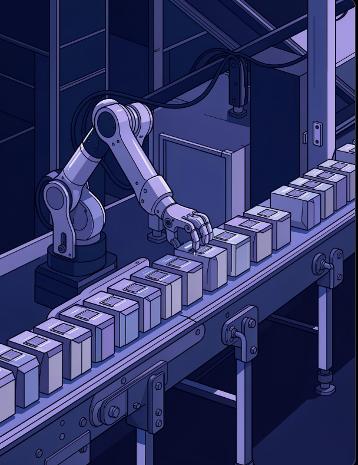
> *Caption: A robotic arm on a conveyor belt handling identical boxes in a fully structured environment. Classical control works well here because objects, timing, and system dynamics are all known in advance.*
---

In such predictable settings, classical approaches like PID controllers, Linear Quadratic Regulation (LQR), and model-based planners perform admirably. Every variable is known: the geometry of objects, their positions, the timing of events. Control policies can be designed and optimized entirely offline, before the robot ever touches the real world.

But consider a fundamentally different scenario: a robotic arm tasked with sorting a pile of mixed recyclables, bottles, cans, and cardboard, each with different shapes, weights, and friction properties, where some objects can be slippery while others provide stable contact.

---
> **Figure 9.2:** 
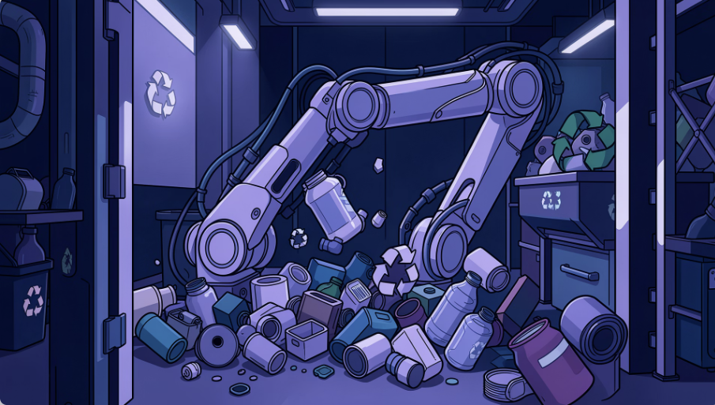
> *Caption: The same class of robotic arm now faces a pile of mixed recyclables. Object shapes, weights, and friction are all unknown, so classical control fails here.*
---

Here, classical control breaks down. No model can fully capture the contact dynamics of a deformable plastic bottle versus a rigid aluminum can, and you simply cannot write a rule for every possible object.

Reinforcement learning (RL) offers a fundamentally different answer: instead of programming the robot with rules, let it *learn* from experience. The robot tries, fails, receives feedback, and gradually improves, much the same way a child learns to stack blocks [18].

This chapter covers the two core continuous-control algorithms used in manipulation, DDPG and SAC, and then surveys the landmark applications of RL to each major class of manipulation task.

---

## 9.1 Why Classical RL Falls Short in Robotics

### 9.1.1. The Continuous Action Problem

As established in Chapter 6, classical RL algorithms such as Q-learning break down in continuous action spaces because solving $a^* = \arg\max_a Q(s,a)$ becomes computationally infeasible when actions are real-valued vectors rather than discrete choices. A 6-DOF robotic arm outputting joint torques in $\mathbb{R}^6$ at every time step is precisely this case. DDPG and SAC were designed specifically to address this limitation, which will be explained later in this chapter.

### 9.1.2. High-Dimensional State Spaces and Contact Dynamics

A robotic system typically observes the world through camera images, joint angle sensors, and force/torque readings at the end-effector. Processing these high-dimensional inputs requires deep neural networks, which form the bridge between classical RL and modern deep RL. Manipulation tasks such as pushing, grasping, and insertion all involve contact between surfaces where friction and deformation play a significant role, and these effects are extremely difficult to model analytically [2].

---

## 9.2 Actor-Critic Architecture: The Foundation

Both DDPG and SAC are built on the **actor-critic** framework, which splits the learning problem into two cooperating components:

| Component | Role | Output |
|-----------|------|--------|
| **Actor** $\mu(s)$ or $\pi(s)$ | Decides what action to take | Action vector $a \in \mathbb{R}^n$ |
| **Critic** $Q(s, a)$ | Evaluates how good the action was | Scalar value estimate |

The critic is updated using the Bellman equation:

$$Q(s, a) \leftarrow r + \gamma \, Q(s', a')$$

The actor is then updated by gradient ascent, pushing actions in the direction the critic says is better:

$$\nabla_\theta J \approx \nabla_a Q(s, a)\big|_{a=\mu_\theta(s)} \cdot \nabla_\theta \mu_\theta(s)$$

This is the **deterministic policy gradient theorem**, which forms the theoretical backbone of DDPG [20].

---

## 9.3 Deep Deterministic Policy Gradient (DDPG)

### Overview

DDPG, introduced by Lillicrap et al. (2016) [21], was the first algorithm to successfully combine the actor-critic framework with deep neural networks for continuous control. Its key insight is that if the policy is deterministic, always outputting one specific action for each state, then the maximization over actions becomes a simple gradient computation.

### Architecture

DDPG maintains four neural networks:

```
Actor Network     μ(s; θ^μ)       →  outputs action a
Critic Network    Q(s,a; θ^Q)     →  outputs scalar Q-value

Target Actor      μ'(s; θ^μ')     →  slowly-updated copy of actor
Target Critic     Q'(s,a; θ^Q')   →  slowly-updated copy of critic
```

Target networks are critical for stability. Without them, the Q-value target $r + \gamma Q(s', a')$ changes every step, which makes training unstable. Targets are updated via **Polyak averaging**:

$$\theta' \leftarrow \tau \theta + (1 - \tau)\theta', \quad \tau \ll 1$$

### Replay Buffer and Exploration

DDPG uses an **experience replay buffer** that stores transitions $(s, a, r, s')$. Random mini-batch sampling breaks temporal correlations and improves data efficiency.

Because the policy is deterministic, DDPG must add exploration explicitly via **Ornstein-Uhlenbeck (OU) noise**, which are temporally correlated random perturbations:

$$a_{\text{explore}} = \mu(s) + \mathcal{N}$$

### Training Loop

```python
for episode in range(max_episodes):
    state = env.reset()
    for step in range(max_steps):
        action = actor(state) + ou_noise.sample()
        action = clip(action, action_low, action_high)
        next_state, reward, done = env.step(action)
        buffer.store(state, action, reward, next_state, done)

        if buffer.size() > batch_size:
            batch = buffer.sample(batch_size)

            # Update critic: minimize Bellman error
            target_q = batch.reward + gamma * target_critic(
                batch.next_state, target_actor(batch.next_state)
            )
            critic_loss = MSE(critic(batch.state, batch.action), target_q)
            critic.update(critic_loss)

            # Update actor: maximize Q
            actor_loss = -critic(batch.state, actor(batch.state)).mean()
            actor.update(actor_loss)

            soft_update(target_actor, actor, tau)
            soft_update(target_critic, critic, tau)

        state = next_state
        if done: break
```

### Limitations of DDPG

DDPG was a milestone, but it carries known weaknesses. It is brittle to hyperparameter choices, relies on crude fixed-noise exploration, and tends to overestimate Q-values, which leads to instability. These limitations motivated the development of SAC.

---

## 9.4 Soft Actor-Critic (SAC)

### The Maximum Entropy Framework

SAC, introduced by Haarnoja et al. (2018) [22], reframes the RL objective. Instead of simply maximizing expected reward, the agent maximizes reward and entropy at the same time:

$$J(\pi) = \mathbb{E}_{\pi}\left[\sum_{t=0}^{\infty} \gamma^t \left(r_t + \alpha \, \mathcal{H}(\pi(\cdot \mid s_t))\right)\right]$$

where $\mathcal{H}(\pi(\cdot \mid s)) = -\mathbb{E}_{a \sim \pi}[\log \pi(a \mid s)]$ is the policy entropy and $\alpha > 0$ is the **temperature parameter**. An agent that maximizes entropy is rewarded for keeping its options open, spreading probability mass across actions rather than locking into one. This naturally encourages exploration without any hand-tuned noise.

### Architecture: Twin Critics

SAC uses **two independent critic networks** and takes the minimum when computing targets, which is known as the clipped double-Q trick:

$$y = r + \gamma \left(\min_{i=1,2} Q_i'(s', \tilde{a}') - \alpha \log \pi(\tilde{a}' \mid s')\right)$$

This directly addresses DDPG's overestimation bias. By always using the more pessimistic estimate, SAC avoids the positive feedback loop where inflated Q-values lead to overconfident actions.

### Automatic Temperature Tuning

A key practical advantage of SAC is **automatic tuning** of $\alpha$. If the policy is too deterministic, meaning entropy is below the target, $\alpha$ increases and pushes toward exploration. If the policy is too random, $\alpha$ decreases and tightens it. This self-regulation is one of SAC's most practical strengths:

$$\alpha^* = \arg\min_\alpha \;\mathbb{E}_{a \sim \pi}\left[-\alpha \log \pi(a \mid s) - \alpha \mathcal{H}_{\text{target}}\right]$$

### Training Loop

```python
for step in range(max_steps):
    action, log_prob = actor.sample(state)
    next_state, reward, done = env.step(action)
    buffer.store(state, action, reward, next_state, done)

    if buffer.size() > batch_size:
        batch = buffer.sample(batch_size)
        next_action, next_log_prob = actor.sample(batch.next_state)

        # Twin critic targets with entropy bonus
        target_q = batch.reward + gamma * (
            min(target_q1(batch.next_state, next_action),
                target_q2(batch.next_state, next_action))
            - alpha * next_log_prob
        )

        q1.update(MSE(q1(batch.state, batch.action), target_q))
        q2.update(MSE(q2(batch.state, batch.action), target_q))

        # Actor: maximize Q minus entropy cost
        sampled_action, log_prob = actor.sample(batch.state)
        actor_loss = (alpha * log_prob - min(
            q1(batch.state, sampled_action),
            q2(batch.state, sampled_action)
        )).mean()
        actor.update(actor_loss)

        # Auto-tune temperature
        alpha_loss = -(alpha * (log_prob + target_entropy)).mean()
        alpha.update(alpha_loss)

        soft_update(target_q1, q1, tau)
        soft_update(target_q2, q2, tau)
```

### Python Libraries

```python
# Stable-Baselines3 (recommended)
from stable_baselines3 import SAC, DDPG
import gymnasium as gym

env = gym.make("FetchReach-v2")
model = SAC("MlpPolicy", env, verbose=1, learning_rate=3e-4)
model.learn(total_timesteps=500_000)
```

---

## 9.5 DDPG vs. SAC: A Structured Comparison

| Feature | DDPG | SAC |
|---------|------|-----|
| Policy type | Deterministic | Stochastic |
| Exploration | External noise (OU noise) | Built-in via entropy maximization |
| Number of critics | 1 | 2 (twin critics) |
| Temperature $\alpha$ | N/A | Automatic tuning |
| Overestimation bias | Prone | Reduced by min-Q trick |
| Stability | Moderate | High |
| Sample efficiency | Moderate | High |
| Best suited for | Structured tasks | Complex, unstructured tasks |

Performance is evaluated on standard continuous control benchmarks from the MuJoCo simulator, including HalfCheetah, Hopper, Walker2d, Ant, and Humanoid. These environments range from simple systems with few degrees of freedom to highly complex robotic bodies. SAC consistently achieves higher average returns and more stable convergence than DDPG, PPO, and TD3 across all tasks, particularly in challenging environments such as Humanoid. This improvement comes from entropy maximization and the use of twin Q-networks [22].

---
> **Figure 9.3:** 
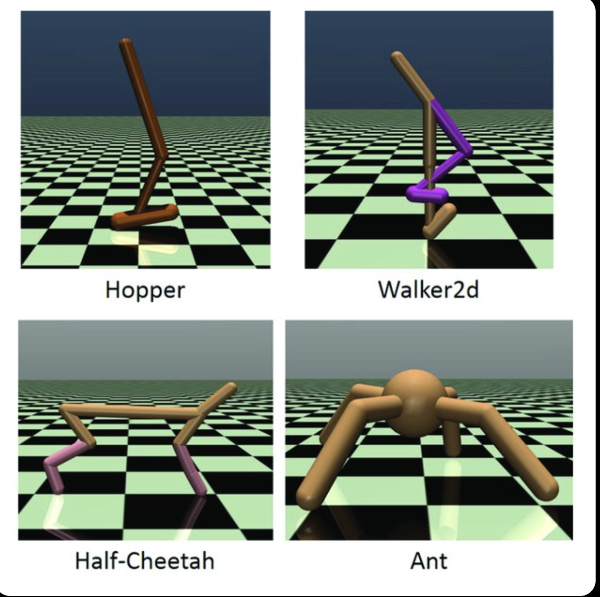
> *Caption: Examples of MuJoCo continuous control environments used to evaluate RL algorithms. Adapted from Haarnoja et al. [22]*
---
These environments represent a range of control challenges, from simple systems with few degrees of freedom to highly complex robotic bodies. The agent must learn to output continuous actions corresponding to joint torques in order to achieve task-specific objectives such as balancing, locomotion, or reaching a target

Haarnoja et al. [22] used some of these tasks to compare the performance of SAC to DDPG, TD3, PPO.

---
> **Figure 9.4:** 
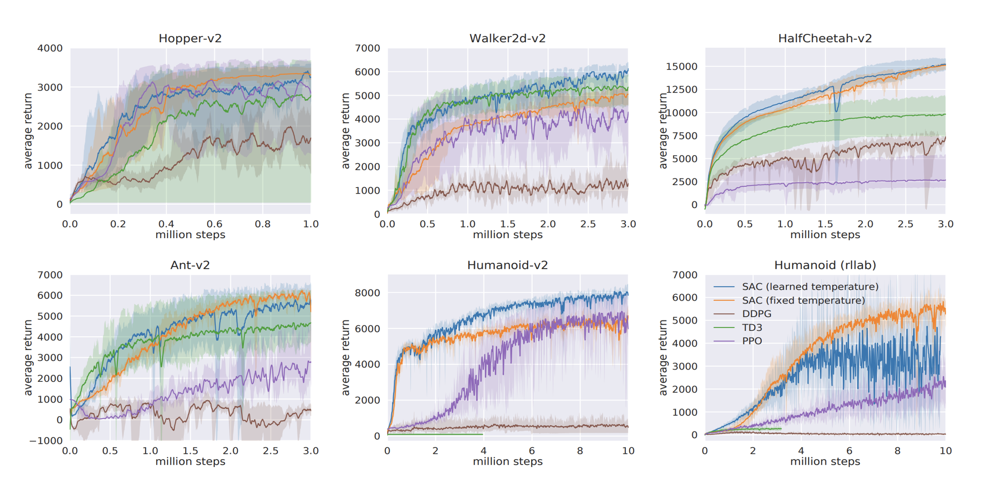
> *Caption: Training performance of SAC compared to DDPG, PPO, and TD3 on continuous control benchmarks. SAC achieves higher returns and more stable convergence across all tasks.*

DDPG is simpler and historically important, but SAC, as seen in Figure 9.4 and as you will see later in this chapter in applications section, has largely superseded it in robotics benchmarks due to its superior stability, exploration, and robustness.

---


## 9.6 Sim-to-Real Transfer

Let's start with an uncomfortable truth about teaching robots to do things.
Reinforcement learning works by letting an agent try stuff, fail, and gradually figure out what works ,purely through experience. No handholding, no instruction manual. In theory, this is beautiful. In practice, it means a robot arm might spend its first thousand attempts flailing around wildly before it learns anything useful. That's fine in a video game. It's considerably less fine when the arm is attached to a real motor, mounted on an expensive chassis, next to a human being.
This is the core problem that sim-to-real transfer tries to resolve. Train the robot in a simulated world ,where crashes are free, time can be sped up, and nothing actually breaks ,then take the policy it learned and drop it into the real world. Simple enough as an idea. But tricky in practice.
---

> **Figure 9.5:** 
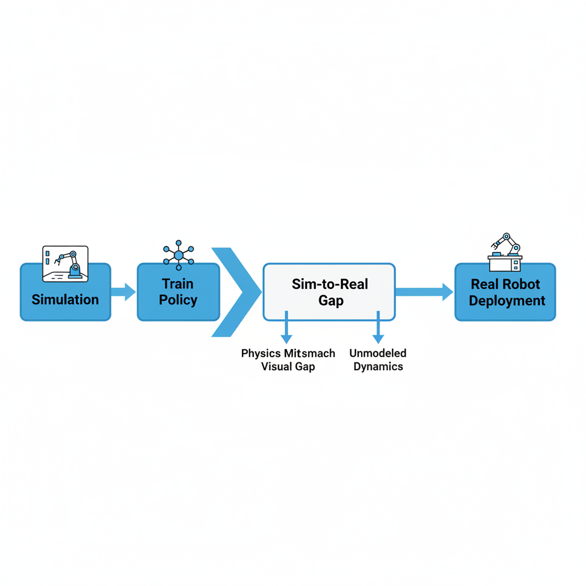
> *Caption: The sim-to-real transfer pipeline.*

---

### 9.6.1 Motivation

Why train in a simulation? The three main reasons are:

**It's safer**. Early in training, an RL agent is essentially a toddler with no sense of consequences ,it will try anything. On a real robot, "trying anything" can mean a robotic arm swinging a torque command that snaps a joint, or a self-driving car making a random steering decision at 60 km/h. Simulation gives the agent a consequence-free sandbox to be incompetent in. Fail a thousand times. Fall down stairs. Drive into walls. Nobody gets hurt, and every failure is data [1].

**It's fast**. Real robots are bound by real time. One hour of practice takes one hour. Modern simulators break this constraint entirely ,they can run hundreds or thousands of virtual robots in parallel, all learning simultaneously. What would take months on physical hardware can be compressed into hours of wall-clock time [1]. This is genuinely one of the more magical things about modern RL research: the equivalent of years of experience can be generated before lunch.

**It's cheap**. A high-end robotic hand can cost tens of thousands of dollars. Running it through uncontrolled RL training ,where it will inevitably collide with things, fall over, and generally be clumsy ,grinds down motors and joints quickly. Keeping the chaos inside a simulator means the real hardware only comes out when the policy is already competent, and the expensive hardware stays in one piece [5].
Together, these three factors make simulation indispensable. But they come with a catch.
---

### 9.6.2 The Sim-to-Real Gap


Simulators are a great option, as we mentioned, but they’re not exact. What do we mean by that? We mean it’s hard to capture all the forces, frictions, and subtle dynamics of reality. A simulator is always a simplified approximation of the real world. That doesn’t make it useless, but it does mean that a policy trained in simulation often learns to exploit the specific conditions of its virtual environment. When deployed in reality, the environment no longer matches the virtualized one, leaving the policy to face new conditions it has never encountered. This mismatch is called the sim-to-real gap, or the reality gap. It shows up in three main areas.

---
> **Figure 9.6:** 
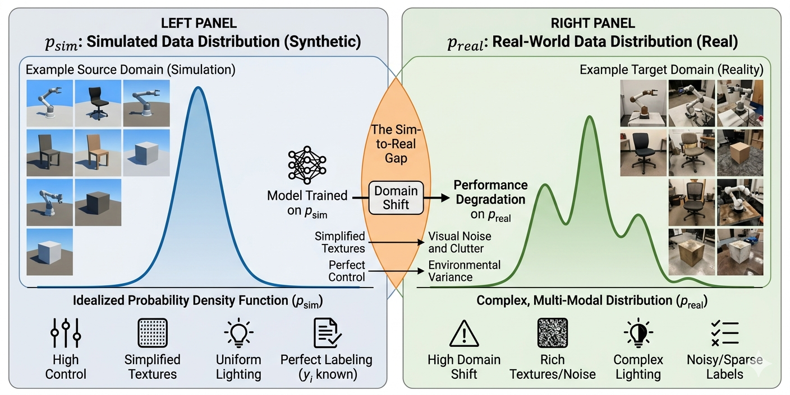
> *Caption: Small mismatches between simulation and reality compound over time. A policy that looks fine in the simulator can behave completely differently after just a few seconds of real-world deployment.*
---

#### Physics Mismatch
Simulators model friction. Real friction is messier. It depends on surface texture, temperature, humidity, and how worn down a surface is after months of use. A simulator uses a clean mathematical approximation; the real floor has history.
The same goes for mass distribution, joint stiffness, and actuator response. The CAD model says a robotic limb weighs X grams, distributed in this exact way ,but the manufactured part is a little different. The motor responds a little slower than the simulator assumes. These are small errors individually. Over a long rollout, they stack [1, 2].
#### The Visual Gap
If a policy learns from visual input ,a camera feed rather than direct sensor readings ,then the gap between a rendered image and a real photograph becomes critical. Simulated scenes tend to look clean, evenly lit, and a bit plastic. Real cameras introduce blur, lens distortion, reflections, and noise. A policy trained to recognize a object in a perfect render may completely fail to spot the same object under a ceiling light at 3pm on a cloudy Tuesday [1].
#### Unmodeled Dynamics
Some real-world phenomena don't appear in standard simulators at all. Gear backlash ,the slight mechanical slop in a gearbox ,isn't there. Cable flex isn't there. The specific way a gripper's rubber fingers deform when they press against a surface isn't there. A policy will happily learn to exploit dynamics that only exist in simulation, or remain completely unprepared for dynamics that only exist in reality [5].
The combined effect is a policy that performs beautifully in the simulator and puzzlingly in the real world. Bridging that gap is what the rest of this section is about.
---

### 9.6.3 Approaches to Bridging the Sim-to-Real Gap


So we have a problem. Simulation is essential for training, but simulation isn't exact. As we mentioned it can't capture exact physics or visualization, and sometimes misses entire dynamics. Researchers have spent the last decade developing ways to deal with each of them. None of them fully solves the problem. They each chip away at it from a different angle, and in practice, the most successful real-world systems stack several of these approaches together. Here are some examples.

---

#### 9.6.3.1 Domain Randomization

##### Core Idea
The first instinct when facing the sim-to-real gap is to make the simulator more accurate. Model friction better. Improve the lighting. Add noise to the sensors. This seems reasonable ,and it is ,but it's chasing an impossible goal. No simulator will ever be a perfect replica of the real world. There will always be something it gets wrong.
Domain randomization flips the problem entirely. Instead of trying to make the simulator right, it deliberately makes the simulator random.
The idea is this: if you train a policy across thousands of slightly different simulated worlds ,some with slippery floors, some with sticky ones, some with bright lights, some with dim ones, some with heavy robot arms, some with lighter ones ,the policy can't afford to specialize. It has to find behaviors that work across all of them. And if the distribution of those simulated worlds is broad enough, the real world starts to look like just one more sample from the training set [1].
Think of it like training for a hiking trip. You could obsess over memorizing the exact trail, or you could train on dozens of different terrains and trust that your legs will handle whatever shows up. Domain randomization takes the second approach.
---
> **Figure 9.7:** 
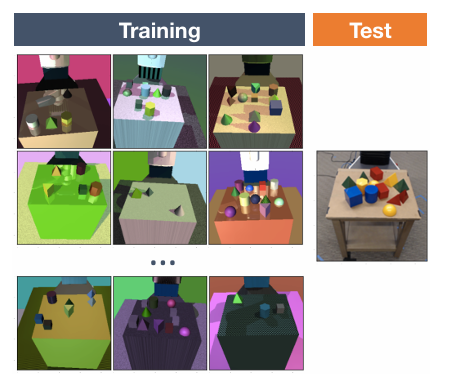
> *Caption: Domain randomization trains across a wide distribution of simulated environments, encouraging the policy to learn robust behaviors that generalize to the real world. The real world becomes just another point in the training distribution. Adapted from Tobin et al. [1]*
---

##### What Gets Randomized
In practice, randomization can be applied across a broad range of simulation properties [1, 2]:

- **Physical parameters:** friction coefficients, mass and inertia tensors, joint damping, contact stiffness, and actuator gains.
- **Visual properties:** lighting conditions, textures, surface colors, camera position and field of view, and rendering artifacts such as noise or blur.
- **Dynamics and actuation:** sensor noise levels, control delays, actuator response times, and force limits.
- **Environment configuration:** object shapes, sizes, initial positions, and environmental obstacles.

```python
import numpy as np

def sample_domain_params():
    return {
        "friction":      np.random.uniform(0.3, 1.5),
        "mass_scale":    np.random.uniform(0.8, 1.2),
        "motor_delay_s": np.random.uniform(0.0, 0.02),
        "joint_damping": np.random.uniform(0.1, 0.9),
        "camera_fov":    np.random.uniform(60, 90),   # degrees
    }
```
*Code Snippet 9.1: A minimal domain randomization sampler. Each training episode gets a freshly drawn set of physics and sensor parameters. The policy never sees the same world twice ,which is exactly the point.*

The episode runs, the policy learns, and next episode it gets a completely different set of numbers. Over millions of episodes, it builds up an implicit understanding of how to behave robustly across the whole distribution.

##### What the Research Found

####### What the Research Found
The landmark paper here is Tobin et al. [1], and the results are still a little surprising when you first read them. Their setup: train an object detector entirely on synthetic images ,not photorealistic ones, but deliberately ugly, algorithmically generated textures, randomized lighting, randomized camera angles (you can see them in Figure 9.7). Then deploy it on a real robot arm with a real camera in a real room, and ask it to locate objects precisely. No fine-tuning on any real images at all.
It worked. Localization accuracy within 1.5 cm.The images it trained on looked nothing like the real world, but the diversity of those images was enough to generalize.

Peng et al. [2] showed that the same principle holds in the dynamics domain ,randomizing mass, friction, and damping during locomotion and manipulation training produced policies that transferred significantly better to real hardware than those trained on a single, carefully calibrated simulation. They applied this training to a robotic arm whose task was to move objects to a desired spot, achieving 91% ± 3% accuracy.

Even when calibration was done carefully, the results were not as good as those with randomization. This is a slightly counterintuitive result: random noise beats careful tuning. But it makes sense once you accept that the goal is not accuracy, but robustness.
##### A Striking Real-World Example of Domain Randomization at Scale
OpenAI's Dactyl project trained a robotic hand to solve a Rubik's Cube using massive domain randomization ,randomizing hundreds of physical parameters simultaneously. The full story and videos are at openai.com/research/solving-rubiks-cube. It's worth watching. The hand moves like nothing trained in clean simulation.

##### Trade-offs

Domain randomization is powerful but not free. The randomization distribution is a design choice, and getting it wrong hurts in both directions.
Too narrow, and the real world still falls outside your training distribution ,you've just added noise without real coverage. Too wide, and the policy learns to be paralyzed. If friction can be anywhere from near-zero to near-infinite, the only universally safe behavior might be to barely move. You get a robot that's technically robust to everything but useful for nothing.
There's also a real training cost. A policy learning across a wide distribution needs far more experience to converge than one learning in a single fixed world ,and the computational cost scales with both the number of randomized parameters and how wide each range is [7].

Finding the right distribution has historically been a job for domain experts working through trial and error. Which brings us neatly to the next approach.

#### 9.6.3.2 LLM-Guided Sim-to-Real Transfer: DrEureka

Domain randomization solves one problem and creates another. The gap it leaves ,figuring out which parameters to randomize, how widely, and designing a reward function that produces safe real-world behavior ,has historically been a slow, manual, expert-driven process. For every new robot task, an engineer sits down and makes judgment calls. How bouncy should the floor be? How wobbly should the joints be? What gets penalized?
Ma et al. [5] asked a natural question: what if you just asked a language model to do this instead?
The result is DrEureka ,Domain Randomization Eureka. And it's a good example of how language models are starting to show up in places you might not expect.

##### The Problem with the Old Way
Designing a reward function for a real-world robot task is harder than it sounds. You don't just want a policy that performs well in simulation ,you want one that performs well on hardware, which means it needs to be robust to the sim-to-real gap, and it needs to avoid damaging the robot in the process. A policy that sprints across a gym floor in simulation might drag its motors on real carpet. A reward function that doesn't penalize extreme torque outputs might produce behaviors that are thrilling to watch but ruinous for the hardware.
Historically, there was no principled automated way to design either the reward or the randomization distribution. Every new task was a fresh engineering problem [5].

##### Three Stages, One LLM
DrEureka breaks the design problem into three sequential stages, each using an LLM for a different kind of reasoning [5].

---
> **Figure 9.8:**
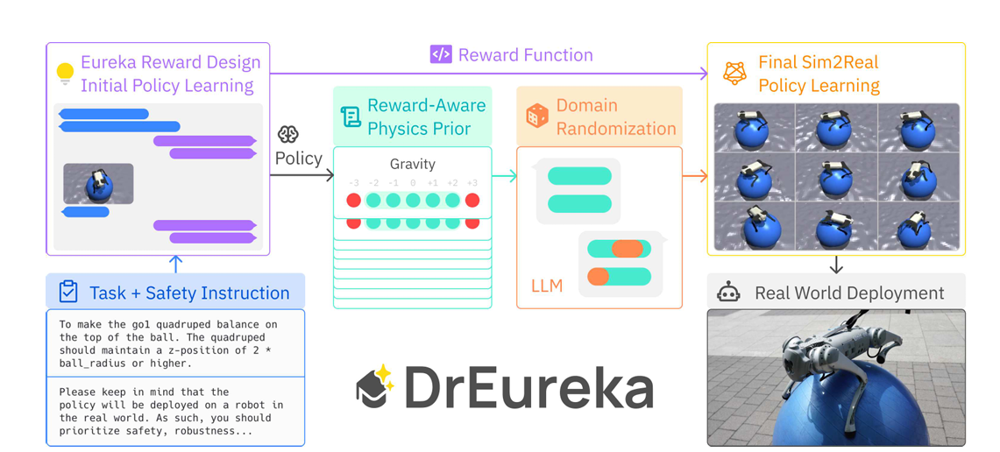
> *Caption: The DrEureka pipeline. Adapted from Ma et al. [5]*
---
##### Stage 1: Write the Reward Function
The LLM is given the environment source code and a description of the task. It generates candidate reward functions as executable Python ,not vague natural-language descriptions, actual runnable code. Crucially, a safety instruction is included in the prompt, asking the LLM to penalize behaviors like excessive motor torques or unstable gaits. Multiple candidates are generated, each one is trained against, and the performance scores are fed back to the LLM so it can refine. It turns out that LLMs are quite good at balancing safety terms against task performance in ways that are genuinely difficult to achieve by manually tuning penalty weights after the fact.
##### Stage 2: Figure Out What the Policy Is Sensitive To
Once a good reward function and policy exist, RAPP (Reward-Aware Physics Prior) runs a systematic sensitivity analysis. RAPP is a lightweight mechanism that restricts the ranges of physics parameters to those where the policy still performs well, ensuring domain randomization is grounded in actual reward outcomes rather than arbitrary engineering choices. For each randomizable physics parameter, RAPP perturbs the value while holding everything else constant and measures how much the policy’s performance degrades. The output is a set of ranges: “the policy still succeeds when friction is anywhere from X to Y.” These are empirically grounded bounds, tied to the actual learned behavior rather than to intuition alone.
##### Stage 3: Choose What to Randomize
The sensitivity ranges from Stage 2 are handed to the LLM as context. It's then asked to select which parameters to include in the randomization distribution and to set the ranges , but it isn't just told to fill in the bounds mechanically. It applies physical reasoning. In the locomotion task, for example, the LLM chose a narrower range for restitution with the explanation that "restitution affects how the robot bounces off surfaces … lower range as we're not focusing on bouncing." That's not a lookup; that's a judgment call about task relevance.
##### The Results
DrEureka was tested on two platforms: a Unitree Go1 quadruped (walking) and a LEAP dexterous hand (rotating a cube in-hand) [5].
On locomotion, the human-engineered baseline achieved a mean forward velocity of 1.32 m/s. DrEureka's mean was 1.66 m/s ,about 26% faster ,and the best DrEureka policy hit 1.83 m/s. Notably, policies designed using only the Eureka reward-generation framework but without any domain randomization failed to walk on real hardware at all. Good reward design alone is not enough.

On the cube rotation task, the best DrEureka policy achieved nearly three times as many rotations as the human baseline within a 20-second window.

The more impressive demonstration might be the yoga ball task. A robot dog balancing and walking atop an inflated ball presents a genuine challenge: the deformable, bouncy dynamics of the real ball don't exist in the IsaacGym simulator at all. DrEureka produced a policy that balanced on the real ball for over 15 seconds on average ,and for more than four minutes during extended outdoor trials across grass, sidewalks, and bridges. Without any task-specific engineering [5].

The DrEureka paper page includes videos of the walking globe task and the cube rotation results ,eureka-research.github.io/dr-eureka. The yoga ball clips are genuinely remarkable.

#### 9.6.3.3 Bridging the Visual Gap: Data-Driven Simulation and Domain Abstraction
Domain randomization addresses the visual sim-to-real gap by making the training distribution wide enough to hopefully include the real world. But this approach still depends on the renderer ,the software generating the images ,being at least roughly right. There's no guarantee that any amount of randomization over a synthetic renderer will produce the right coverage of real photographic conditions.
Two research directions emerged that sidestep the renderer problem altogether, and they do it in opposite ways.
Amini et al. [8] throw the renderer out entirely and replace it with real-world data. Schlereth-Groh et al. [9] go in the opposite direction: instead of making the training images more realistic, they strip images down to something so abstract that it looks the same whether it came from simulation or reality.


##### VISTA: When You Use Reality as the Simulator
The starting observation in Amini et al. [8] says: policies trained in CARLA didn't transfer to real roads. Full stop. Despite domain randomization, despite viewpoint augmentation, the visual gap was too large. The rendered world and the photographed world were just too different.
Their solution: don't render the world at all. Collect an hour of real driving footage per environment ,a human drives, the camera records ,and build a simulator that generates training observations by transforming those real images, not by generating synthetic ones.

Here's how VISTA works. The system records the human's trajectory through the environment. When the virtual agent decides to take a slightly different path ,say, drifting toward the lane edge ,VISTA doesn't render what that view would look like. Instead, it takes the nearest real recorded frame, estimates a depth map using a neural network, lifts that frame into 3D space, shifts the virtual camera to where the agent actually is, and re-projects it back to 2D. The output is a photorealistic image of what the agent would actually see from its new position ,because it was built from a photograph, not a render [8].
This approach covers the full range of positions within a lane ,up to ±1.5 m lateral offset and ±15° rotation ,including the off-center positions a car might end up in during a near-miss.
---
> **Figure 9.9:**
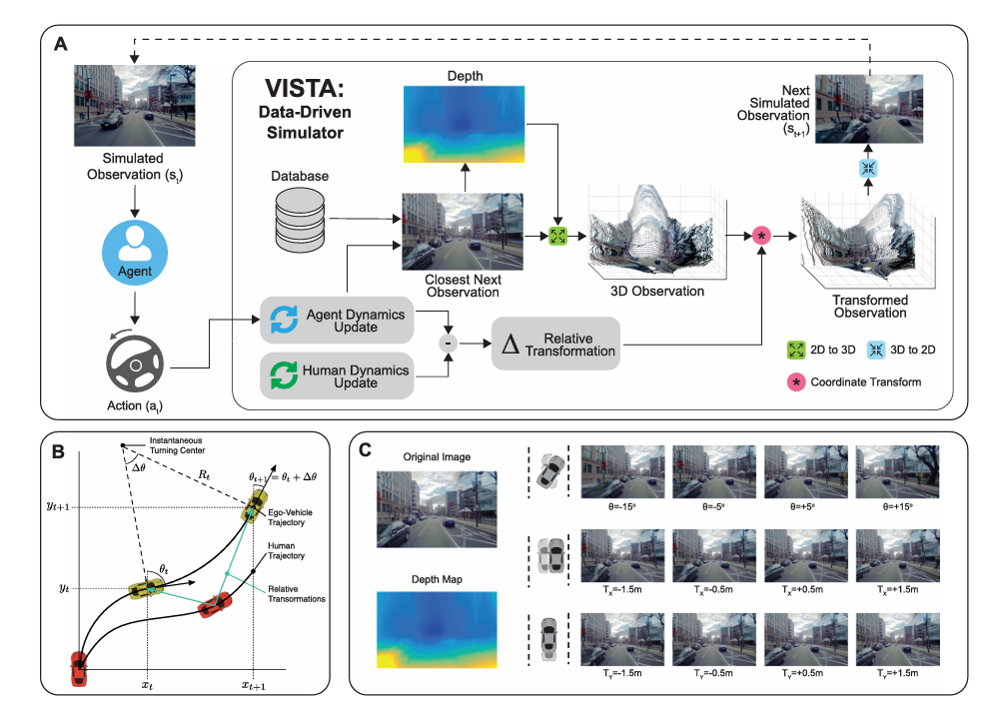
> *Caption: Panel A shows the autonomous agent's interaction loop with the data-driven simulator; Panel B compares the simulated motion in VISTA to the human's estimated motion in the real world; Panel C illustrates how a new observation is generated from the agent's virtual viewpoint. Adapted from Amini et al. [8]*
---

The training signal is sparse and clean: a reward of 1 for every timestep the agent stays in its lane, 0 the moment it doesn't. No human control labels. The agent discovers lane-stable driving on its own.

The real-world results were striking. Deployed on a full-scale retrofitted Toyota Prius on roads it had never seen, the VISTA-trained policy completed the entire test track without a single intervention. Every other method tested ,including the strongest imitation learning baseline and CARLA-trained domain-adapted models ,required interventions, some frequently. In deliberate near-crash recovery trials, VISTA agents recovered successfully more than twice as often as the next-best approach [8].

The method isn't without limits. It requires a pre-collected driving dataset, so it can't generalize to roads that weren't in the recording. It's currently monocular and focused on lane-keeping rather than full navigation. But as a proof of concept for data-driven simulation, the results are hard to argue with.

**BEV-RL: Domain-Invariant Navigation via Semantic Abstraction**

Schlereth-Groh et al. [9] start from a different diagnosis. The visual gap exists because images contain huge amounts of domain-specific information ,textures, lighting conditions, lens distortion, color rendering ,that are completely irrelevant to navigation but cause policies trained on simulated images to behave differently on real ones.
What if you removed all of that? What if you converted both simulated and real camera feeds into a representation so minimal that the two are indistinguishable?

Their pipeline has two stages. First, a YOLO-based segmentation network processes every camera frame and produces a binary mask: pixels belonging to the drivable area are white, everything else is black. Second, this mask is transformed into a bird's-eye view ,a top-down representation computed from the camera's intrinsic parameters. The result is a compact, geometrically consistent map of the drivable area, stripped of all texture, color, and lighting [9].

The RL policy is then trained entirely on these BEV masks ,not on photographs, not on rendered images, just on binary top-down maps. Since the masks look the same whether they came from a simulated camera or a real one, the policy never encounters a visual domain shift. There's nothing domain-specific left to shift on.
> **Figure 9.10a:** 
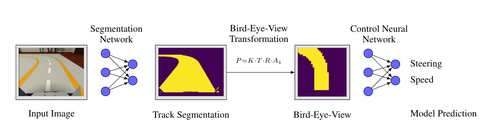
> *Caption: BEV-RL full pipeline diagram, first panel. Adapted from Schlereth-Groh et al. [9]*

> **Figure 9.10b:** 
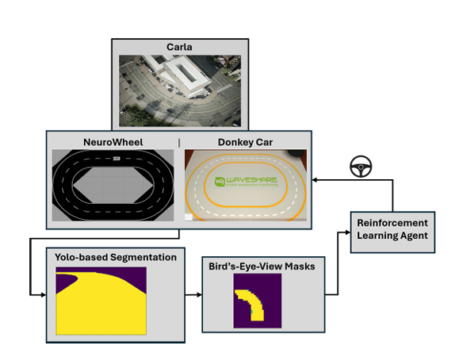
> *Caption: BEV-RL full pipeline diagram, second panel. Adapted from Schlereth-Groh et al. [9]*


Training happens in a vectorized Gymnasium environment ,thousands of parallel simulation instances ,completing a million training episodes in around five hours. The control network is a simple DQN with three fully connected layers. The segmentation and control components are trained independently, which means the segmentation model can be updated or retrained for a new environment without touching the driving policy [9].

In CARLA ,the hardest test environment, with varying lighting conditions ,the RL policy outperformed a classical PD lane-following baseline that struggled badly with photometric changes. In DonkeyCar, the policy beat human driving time (11.66 s vs 12.95 s for a human). Physical deployment on the lab's RC car was attempted and the pipeline ran correctly, but motor communication issues prevented a clean evaluation.

#### 9.6.3.4 Safe Learning for Real-World Deployment

Here's the thing that all the methods above have in common: they make the policy more likely to behave correctly.But not guaranteed.
For a lot of applications, that's fine. A navigation robot that works 95% of the time is useful. But for some applications ,a robotic arm working next to a human, a drone flying over a crowd, a medical device ,"likely to be safe" isn't good enough. You need something stronger. You need to be able to say: regardless of what disturbances show up at deployment, this system will not violate its safety constraints.
This is the domain of safe learning in robotics [3], and it's a field that has developed a sophisticated set of tools for exactly this problem.

##### Why This Is Hard
Even after training with domain randomization, real-world deployment introduces uncertainties that weren't in the training distribution. Sensor noise that was randomized slightly wrong. A configuration the robot was never placed in during training. An unexpected external disturbance. In a safety-critical system, any of these can cascade into a failure [3].
Brunke et al. [3] lay out the challenge clearly. The robot's dynamics are never perfectly modeled ,there are always residual unknowns that grow more significant in unusual configurations. Sensors are noisy and may be systematically biased. The environment may contain other agents whose behavior can't be predicted. These aren't engineering oversights. They're fundamental properties of the real world. The question is how to build systems that remain safe in spite of them.

##### Three Levels of Safety
Not all safety guarantees are equal. Brunke et al. [3] define three levels of safety, which is worth understanding before diving into the methods.
##### Level I: Soft Constraints
The reward function includes a penalty for unsafe behavior, so the policy learns to avoid it. This is easy to implement and often works well in practice, but provides no formal guarantee ,the policy might still violate the constraint if conditions are unusual enough.

##### Level II: Probabilistic Guarantees
The policy satisfies safety constraints with high probability ,say, 99% of the time ,under its deployment distribution. This is formally stronger and often practically sufficient.

##### Level III: Hard Constraints
The system is guaranteed to satisfy all safety constraints, always, under any disturbance within a defined uncertainty set. No exceptions. This is the strongest and most demanding guarantee, and it requires the most prior knowledge about the system's dynamics.

##### Safety Filters: A Practical Approach

One of the most practically useful ideas in this space is the safety filter [3]. The concept is simple. The RL policy proposes an action each timestep, as usual. Before that action is executed, a separate supervisory module ,the safety filter ,checks whether it would violate a constraint. If it's safe, it passes through unchanged. If it's unsafe, the filter replaces it with the closest safe action and executes that instead.

This separation is powerful because it's modular. You can take any RL policy, trained any way, and add a safety filter without retraining. The filter doesn't care how the policy was designed. It just makes sure what gets sent to the motors is safe.

Control Barrier Functions (CBFs) provide a principled mathematical foundation for this: they define a "safe set" of states and enforce a condition on how the system's state changes over time that guarantees it can never leave that set [3].

Model Predictive Safety Certification (MPSC) takes a related approach: instead of checking the current action in isolation, it simulates a short window of future states and certifies that the entire trajectory stays within safe bounds, even accounting for bounded model error.

Berkenkamp et al. [6] showed something particularly elegant: by modeling unknown dynamics with Gaussian processes ,which give not just predictions but calibrated uncertainty estimates ,you can expand the certified safe region of a controller incrementally during training, exploring only states from which the system can be provably stabilized. Safety is maintained throughout learning, not just at deployment.

##### The Bigger Picture
It's tempting to think of safe learning and sim-to-real transfer as alternatives ,two separate ways to handle uncertainty. Brunke et al. [3] make a compelling argument that they're better understood as complements. Sim-to-real transfer, including domain randomization, is about closing the gap: making the policy behave well in the real world. Safe learning is about managing what remains after the gap is closed: ensuring that the residual uncertainty doesn't lead to harm.

In practice, robust deployed robotic systems tend to use both. The policy is trained in simulation with randomization to get it working well. Safety mechanisms are layered on top to ensure it stays within bounds when the unexpected happens. Neither is sufficient alone. Together, they're a meaningful step toward robots that can be trusted.

### 9.6.4 Summary
Sim-to-real transfer is one of those problems that looks simple from a distance and gets more interesting the closer you get. Simulation is obviously necessary ,training on real hardware at the scale modern RL requires is impractical. But unfortunately, simulation is also not entirely correct, and the history of the field is largely a story of progressively more creative ways to handle that wrongness.

Domain randomization [1, 2] reframes the problem: instead of trying to make the simulator accurate, make it diverse. A policy that has trained across thousands of different simulated worlds develops robustness by necessity. This is now a standard part of the robotics RL toolkit. Automating the hard parts of this process ,reward design and distribution selection ,is the contribution of DrEureka [5], which showed that language models can reason about physics well enough to replace the human engineer in the loop for many tasks. The yoga ball demonstration is the kind of result that makes you update your priors about what automated systems can do. For the visual gap specifically, VISTA [8] and BEV-RL [9] demonstrate two philosophically opposite strategies that both work: ground your training observations in reality directly, or strip them down to something so abstract that the domain stops mattering. And layered on top of all of this, safe learning methods [3, 6] provide the mathematical machinery to certify that policies behave safely at deployment ,not just probably, but provably, within defined bounds.

No single approach eliminates the sim-to-real gap. But used together, they make it manageable. The field is moving fast, and new discoveries are made everyday.
## 9.7 Applications of RL in Robot Navigation

### 9.7.1 What Is Robot Navigation?
Getting from A to B sounds simple. For a human, it mostly is ,we do it without thinking, constantly, in crowded spaces, in the dark, on unfamiliar terrain, while carrying a coffee. We read the room. We anticipate. We make a thousand micro-decisions per minute without being aware of any of them.

Getting a robot to do this is one of the oldest unsolved problems in robotics.

Robot navigation is, at its most basic, the problem of enabling a mobile robot to move from a starting location to a goal while avoiding things in its way [4]. That framing sounds manageable. But the moment you start adding real-world conditions ,obstacles that move, maps that don't exist yet, floors that are slippery, humans who don't behave predictably ,the problem grows very fast.

The range of applications makes this concrete. An autonomous car needs to thread through urban traffic, predict what the cyclist next to it is about to do, and obey lane markings it might not have seen before. A hospital delivery robot needs to navigate a corridor without blocking a nurse pushing a patient, manage a slow elevator interaction, and not alarm anyone in the process. A planetary rover on Mars needs to cross terrain with no map, no GPS, and no one to call for help. A search-and-rescue drone needs to fly through a collapsed building where every sensor reading is unreliable and new hazards appear constantly.

What all of these share is that simple path-following isn't enough. The robot needs to sense its environment, interpret what it's seeing, make decisions in real time, and act ,all continuously, all together, often in situations nobody anticipated when the system was designed.

One of the most interesting subproblems to emerge recently is social navigation ,navigating in spaces shared with people. This turns out to be surprisingly hard. Humans follow unspoken rules about how close to walk behind someone, which side of a corridor to take, how to signal that you're about to cross someone's path. These conventions vary by culture, by context, even by time of day. They can't be written down as a complete set of rules. But violate them with a robot and people notice immediately ,a delivery robot that cuts someone off, or hovers at an uncomfortable distance, or blocks a conversation, is experienced as rude even if it never physically contacts anyone [10]. Teaching a robot to be polite is a genuine research challenge.

---

### 9.7.2 The Classical Navigation Pipeline

Before learning-based methods arrived, robotics researchers spent decades building navigation systems the careful, engineering-heavy way. The result is a well-understood architecture that still underpins most deployed mobile robots today. It's worth understanding it clearly ,both because it works, and because knowing where it breaks is exactly what motivates everything that comes after.

---
> **Figure 9.11:** 
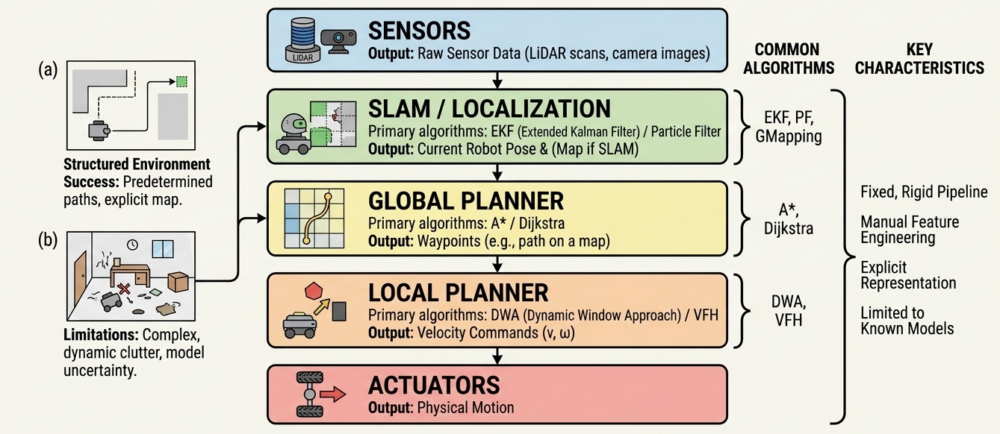
> *Caption: The classical navigation pipeline: a fixed stack of modular components, each solving one piece of the problem and handing its output to the next. Robust in structured environments, brittle when reality does not match the assumptions baked in at design time. Adapted from Ogunsina et al. [4]*
---

The classical pipeline is modular. Each stage handles one well-defined sub-problem and passes its output downstream. Clean, auditable, and ,in the right environment ,very reliable.

#### Mapping and Localization
You can't navigate if you don't know your position. Classical systems solve this with SLAM ,Simultaneous Localization and Mapping ,which does what the name says: builds a map of the environment while simultaneously figuring out where in that map the robot currently is.

SLAM uses sensor data ,cameras, LiDAR rangefinders, sonar ,to identify landmarks in the environment and track how the robot's position changes relative to them. The map might be an occupancy grid (a 2D array of cells, each marked as free, occupied, or unknown), a feature map (a set of identified landmarks), or a topological graph (a network of waypoints connected by traversable paths). Uncertainty is managed using probabilistic filters ,the Extended Kalman Filter, the Particle Filter, and more recently factor graph optimization ,which track a probability distribution over possible positions rather than committing to a single estimate.

Once a map exists, localization can run on its own. Monte Carlo Localization (MCL) keeps track of a cloud of hypotheses about where the robot might be and updates that cloud as new sensor readings come in. Over time the cloud converges to the correct position. Unless the environment has changed substantially since the map was built ,in which case it might converge to the wrong one, or not converge at all.

#### Path Planning
Given a map and a position, the robot needs to find a path to its goal. Classical planners search the map for the optimal route ,minimizing distance, or time, or energy, depending on the objective.

Dijkstra's algorithm and A* are the most common. They treat the map as a graph and find the shortest path through it with guaranteed correctness ,if a path exists, they'll find the shortest one. For robots with complex dynamics or high-dimensional configuration spaces, sampling-based planners like RRT (Rapidly-exploring Random Tree) are more practical: instead of exhaustively searching a grid, they randomly sample the space and build a tree of reachable states. Less guaranteed, but much more scalable.

The catch with all global planners: they assume the world holds still while the plan is being executed. The path is computed once, from a static map, and then followed. If something moves into the way ,a person, another robot, a chair that wasn't where it was yesterday ,the global plan doesn't know.
#### Local Obstacle Avoidance
This is where the local planner comes in. While the global planner charts the overall route, the local planner handles moment-to-moment collision avoidance ,reacting to obstacles the sensors detect in real time, regardless of whether they're on the map.

The Dynamic Window Approach (DWA) is the classic method here. At each timestep, it samples a range of possible velocity commands within what the robot can physically execute, scores each one against a function that balances proximity to the goal with clearance from obstacles, and picks the best. Potential field methods do something similar conceptually: the goal exerts an attractive force on the robot, obstacles exert repulsive forces, and the robot follows the gradient of the resulting field.

These methods are fast and easy to reason about. They also have well-known failure modes ,oscillation in narrow passages, and getting trapped in local minima where the repulsive forces from surrounding obstacles point in all directions and there's no downhill gradient to follow.

---

### 9.7.3 Limitations of Classical Navigation Approaches

The classical pipeline is a genuine engineering achievement. In the right environment ,structured, predictable, well-mapped, static ,it works remarkably well. The problem is that the real world is none of those things, most of the time.

These aren't edge cases that better implementations would fix. They're structural limitations of the approach [4].

**The world doesn't hold still**. The global planner computed a route based on a map. That map was accurate when it was built. Now there's a delivery trolley parked in the corridor, a group of students clustered around a doorway, and a cleaning robot crossing the path at irregular intervals. None of these are in the map. The local planner can react to each one individually ,but it has no mechanism to understand that the overall route is now wrong, or to anticipate where any of these obstacles will be in ten seconds. In a sufficiently dynamic environment, the local planner essentially runs in a permanent reactive panic while the global plan becomes fiction [10].

**Other agents aren't just obstacles**. A classical system treats a person walking toward it the same way it treats a wall moving toward it: a physical object to avoid. It has no concept of intention. It can't tell that the pedestrian is about to stop and hold a door. It can't recognize that the person gesturing at it is trying to communicate something. It can't distinguish between a group of people blocking a path who will happily step aside if asked and a genuinely impassable obstruction. The result is navigation that's physically safe but socially odd ,a robot that cuts between people mid-conversation, or freezes indefinitely because it can't figure out which way to go around someone, or triggers mild alarm in every person it approaches [11].

**Anything unplanned breaks it.** Classical systems are designed for anticipated scenarios. An unusual floor texture that confuses the LiDAR. A lighting change that makes visual localization fail. A type of obstacle that wasn't in the training set for the object detector. When these things happen, the system has no mechanism to recover gracefully. Every edge case has to be explicitly identified, characterized, and patched. As deployment environments grow more complex, this becomes an engineering treadmill ,you're always catching up to surprises, never ahead of them [4].

**It doesn't get better.** Perhaps the most fundamental limitation: a classical navigation system that has operated in a hospital for a year is not better at navigating that hospital than it was on the first day. It has learned nothing. Every near-collision, every inefficient detour, every localization failure ,none of these inform future behavior. They just happen again. Humans become better at navigating spaces through experience. Classical robots don't.

---

### 9.7.4 Reinforcement Learning for Robot Navigation

RL reframes navigation from the ground up. Instead of designing a pipeline of hand-coded components, you define a reward signal and let the robot learn what works through experience. Reach the goal ,reward. Hit something ,penalty. Stay too close to a person ,penalty. Find a smooth, efficient path ,reward. The robot figures out the rest.

In the standard formulation, the navigation problem is cast as an MDP [4]. The robot's state includes its own position and velocity, information about nearby obstacles and pedestrians, and the direction and distance to the goal. The action space is typically continuous velocity and steering commands. The reward function encodes what we want: reaching the goal, avoiding collisions, maintaining comfortable distances, and moving smoothly and efficiently.

The key word is learned. The policy that emerges from training doesn't need to have been explicitly told how to navigate a crowded corridor. If the training environment included crowded corridors, and the reward function penalized getting too close to people, the policy will have internalized something about how to handle crowds. If the training included novel obstacle configurations, the policy will generalize to new configurations it hasn't seen. This is the capability that classical navigation fundamentally lacks.

It also means that things which were previously impossible to specify become possible. Social conventions ,don't cut between people mid-conversation, pass on the right, slow down near children ,are extremely difficult to encode as explicit rules. But they can be expressed as reward terms, and a policy can learn to satisfy them naturally. The robot's behavior can emerge from what it has been rewarded for rather than from what someone managed to anticipate and code [10].

Deep RL extends this further. With neural networks approximating the policy and value function, the robot can learn directly from raw sensor data ,camera images, LiDAR scans ,without hand-engineered feature extraction. Graph neural networks can represent the relational structure of a crowd: which pedestrians are near each other, which ones are moving toward the robot, how the whole scene is evolving. These representations scale naturally to variable numbers of agents and diverse environments, which hand-coded pipelines struggle to do.

---

### 9.7.5 Learning Architectures for Navigation

Once you've committed to using RL for navigation, the next question is architectural: how much of the pipeline does the learning handle, and how much stays hand-designed?

#### End-to-End Learning
The most ambitious option is to let the network learn everything. Raw sensor data goes in. Velocity commands come out. Everything in between ,perception, state estimation, planning, action selection ,is handled by a single learned function, optimized end-to-end through the reward signal.

The network can discover representations that are specifically useful for the task at hand, rather than representations that were useful for some other task that got repurposed here. End-to-end RL has achieved genuinely impressive results: pixel-based navigation in complex 3D environments, high-speed drone flight through obstacle fields, and continuous-control locomotion that looks nothing like what a hand-designed controller would produce.

The price is sample efficiency. Learning to perceive the environment, represent it usefully, and act well in it ,all at once, from scratch ,requires enormous amounts of experience. This is why end-to-end navigation is heavily dependent on simulation and the sim-to-real techniques from the previous section. There simply isn't a practical way to acquire this much experience on real hardware.

---
> **Figure 9.12:** 
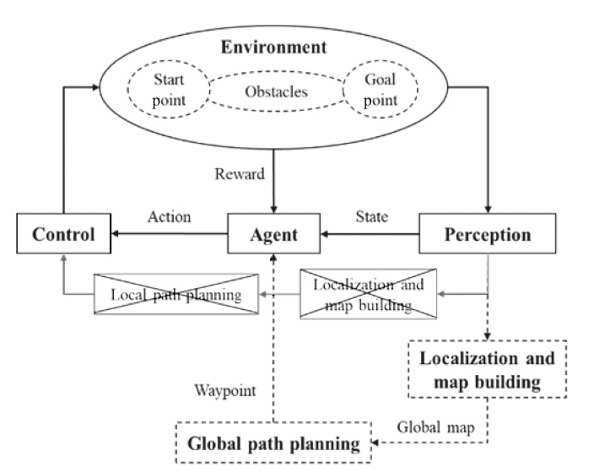
> *Caption: End-to-End DRL Navigation Framework. This architecture illustrates the replacement of the classical, rigid pipeline with a learned policy. By bypassing traditional modules such as explicit localization and local planning, the agent interacts directly with the environment to maximize cumulative rewards based on raw sensory input. Adapted from Zhu et al. [17]*
---

#### Hybrid Architectures
Hybrid approaches, as discussed by Zhu and Zhang [17], often integrate DRL into the traditional navigation framework to mitigate the errors that accumulate in classical pipelines. Instead of replacing the entire system, DRL is used to enhance specific modules or work alongside hand-coded logic to improve reactivity and robustness. 

The division of labor in these systems typically follows two patterns:

**Hierarchical Integration:** A global path planning module (traditional) generates waypoints or intermediate goals, while a DRL agent handles local obstacle avoidance to reach those waypoints.  

**Unified Control:** DRL policies can be combined with classic Proportional-Integral-Derivative (PID) controllers to create a "Hybrid-RL" framework. In these setups, the system may switch between different control sub-policies depending on the complexity of the scenario.  

A novel direction proposed by Ogunsina et al. [4] involves combining RL with adaptive planning algorithms. This framework leverages the adaptability of RL to learn from experience while utilizing the structured decision-making of adaptive planning to handle real-time changes in dynamic or unstructured environments. While RL provides the flexibility to adapt to new situations, adaptive planning allows the system to adjust its plan "on the fly," providing a layer of reliability that pure RL may lack.  

This architectural synergy is particularly effective for overcoming the unpredictability of dynamic obstacles, like pedestrians or other vehicles,where the system must continuously interpret sensory data and predict future trajectories to ensure safe, real-time navigation.

---

### 9.7.6 Case Studies

---

#### 9.7.6.1 UAV Navigation in Urban Environments: DDPG with Transfer Learning

When we move from 2D ground robots to 3D UAVs, the complexity doesn't just increase,it explodes. We are no longer dealing with simple $(x, y)$ coordinates; we are dealing with high-dimensional state spaces where classical grid-based RL (like DQN) falls apart due to the "curse of dimensionality". Bouhamed et al. [14] address this by leveraging Deep Deterministic Policy Gradient (DDPG), an actor-critic framework designed specifically for the continuous action spaces that real-world flight demands.

##### The Problem
In many autonomous systems, we simplify movement into discrete steps: "move left," "move right," or "climb." However, for a UAV, this leads to jittery trajectories and inefficient energy use. Classical path-planning solutions like Mixed-Integer Linear Programming (MILP) or Evolutionary Algorithms often struggle with real-time adaptation because they are computationally heavy and usually rely on a centralized controller.

To achieve true autonomy, the drone needs to make decentralized, local decisions. It needs a framework that understands the world isn't a grid, but a continuous field of possibilities.
##### The Approach
Instead of forcing the drone to follow a rigid grid, the researchers gave it total freedom to move in any direction using a "spherical" coordinate system. This means that at every step, the drone’s brain chooses three simple things: how far to fly, which way to tilt, and which way to turn.  To make the learning process smoother, they designed a clever reward system. If the drone gets closer to the goal, it earns points; if it hits a building, it loses points based on the "crash depth",basically, how hard it hit the wall. This gradual feedback is much more helpful than a simple "yes/no" penalty because it tells the drone exactly how much it needs to adjust its path to stay safe.
##### Architecture
The architecture uses a model called DDPG, which acts like a two-part team:

**The Actor (The Pilot):** This part looks at where the drone is and decides the best move to make.

**The Critic (The Instructor):** This part watches the Pilot's move and gives it a score, helping it learn from its successes and mistakes.

To keep the drone from getting overwhelmed, they added a "memory bank" (a replay buffer) so it could revisit past experiences and a "slow-learning" trick (target networks) to make sure the training stayed stable and didn't crash before the drone did.

A Two-Step Education
The most practical part of their method was a shortcut called **Transfer Learning**. Rather than dropping a "baby" drone into a complex city, they trained it in two stages:

**Preschool:** First, the drone practiced in an empty, obstacle-free space just to learn the basics of reaching a target.

**The Real World:** Once it mastered the basics, they moved that "learned brain" into a city with buildings. Because it already knew how to fly toward a goal, it could spend all its energy learning how to dodge obstacles.

This "start simple" strategy allowed the drone to adapt to crowded urban environments much faster than if it had started from scratch.

---
> **Figure 9.13:** 
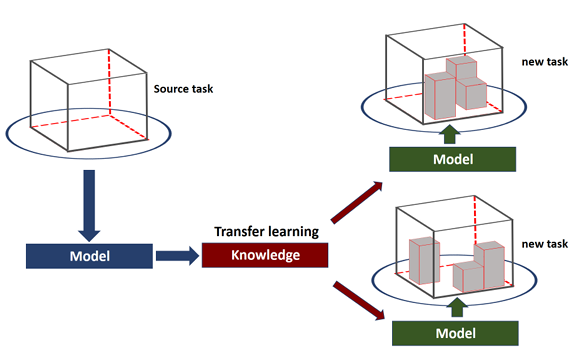
> *Caption: Illustration of the transfer-learning technique. Adapted from Bouhamed et al. [14]*
---


##### Results
The results confirmed the efficiency of this staged approach. While the UAV reached a 100% success rate in open space, it maintained a solid ~83% success rate in complex urban environments. Interestingly, the agent learned to "exploit altitude",choosing to fly over shorter buildings rather than detouring around them, a strategy that naturally emerged from the reward function.  

##### Limitations
The authors noted a lack of "pinpoint accuracy" at the final destination,a common side effect of the infinite action space in DDPG where the agent might oscillate slightly around the target instead of coming to a dead stop.

#### 9.7.6.2 Unmanned Surface Vehicle Navigation: ANOA with Dueling Deep Q-Networks

Wu et al. [15] created the ANOA (Autonomous Navigation and Obstacle Avoidance) algorithm, a real-time navigation system for unmanned surface vehicles (USVs) powered by a dueling deep Q-network.
##### The Problem
Navigating a boat is inherently different and often more difficult than operating ground or aerial vehicles because marine environments are highly dynamic and unpredictable. Traditional path planning methods,like graph search or swarm intelligence,are too slow for real-time obstacle avoidance and frequently get stuck in suboptimal routes.

On the other hand, standard AI approaches like basic DQNs struggle because they tend to overestimate the value of actions when presented with too many choices, leading the boat to make poor decisions. The challenge was to create a stable, real-time navigation system that actually respects the physical movement limitations of a boat.

##### The Approach
To solve the overestimation issue, ANOA uses a "dueling" network. Instead of trying to calculate one massive score for every possible move all at once, the network splits the problem into two simpler questions: How safe is my current location? and What is the specific benefit of taking this action right now?. 

Combining these two streams creates a much more stable learning process.  The system acts as the "eyes" of the boat by looking at a simplified grid map that tracks the USV's position, the obstacles, and the final destination. Rather than testing this in the real world immediately, the team trained the AI in a 3D simulation using Unity. Crucially, they tied the AI to a realistic mathematical model of boat physics,accounting for forward thrust, sideways drift, and turning momentum,so the AI learned how to steer a physical vessel rather than just moving a digital dot.

---
> **Figure 9.14:** 
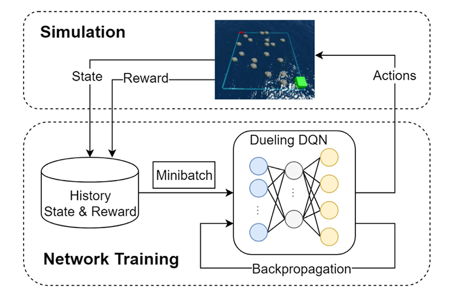
> *Caption: The main components and data flow of the ANOA algorithm. Adapted from Wu et al. [15]*
---

##### Results
ANOA outperformed older AI models like standard DQN and Deep Sarsa. It learned faster and more stably, mastering static obstacle courses in about 2,000 episodes (vs. ~3,000 for DQN and Deep Sarsa) and dynamic environments with moving obstacles in just 1,000 episodes. It also maintained lower peak loss values (0.01 vs. 0.03 for DQN and 0.068 for Deep Sarsa) and more stable Q-value estimates. The researchers tested it against Recast, a standard industry navigation tool. While Recast often failed when multiple obstacles moved at the same time and required rapid route changes, ANOA surpassed Recast’s success rate after about 70 million training steps, continued improving with further training, and maintained reliable real-time performance in dynamic environments.
##### Limitations and Future Work
The simulation platform does not model wind velocity, wave dynamics, or ocean currents, all of which would meaningfully affect USV behaviour in real marine environments [15]. The grid-based discrete action space limits the smoothness and precision of trajectories compared to continuous control formulations. The ANOA approach has not been validated on a physical USV platform, and the gap between the simplified simulation and real marine physics remains an open challenge. Future directions include real sea deployment, integration of wind and current disturbance models, and extension to multi-USV collaborative navigation.


#### 9.7.6.3 Map-Less MAV Navigation: DQN with Sensor Fusion and Zero-Shot Transfer

Doukhi and Lee [16] demonstrate a complete learning system that allows a micro-aerial vehicle (MAV) to navigate and avoid obstacles autonomously. Impressively, they achieved zero-shot transfer, meaning a policy trained entirely in a simulator was deployed in the real world without any extra fine-tuning or real-world data collection.

##### The Problem
Traditionally, MAVs rely on resource-heavy 3D mapping and complex trajectory planning to navigate. While Deep Reinforcement Learning (DRL) can skip the map, taking a policy from a simulation directly to a real drone is highly risky; tiny errors in 3D space usually lead to catastrophic crashes. Furthermore, MAVs need to see both small, close objects (best seen by depth cameras) and large, distant structures (best seen by LiDAR).

##### The Approach
To solve this, the researchers divided the navigation problem into two main modules:  Collision Awareness Module (CAM): This handles sensor fusion by taking data from a 2D LiDAR (limited to a 90° field of view to reduce processing time) and a forward-facing RGB-D depth camera. Both sensor feeds are resized and converted into simple 90x90 binary images. By stacking two consecutive frames from both sensors, the system creates a single 4-channel observation tensor that captures both spatial structure and motion.  Collision-Free Control Policy Module (CFCPM): This feeds the fused observation tensor into a Deep Q-Network (DQN). The network uses two convolutional layers and max-pooling to process the data, ultimately outputting one of three simple discrete actions: move forward, turn left, or turn right.

The training relies on a straightforward, LiDAR-based reward system. The agent gets a positive reward for safely moving forward, a small penalty for turning when the path is clear, and a massive penalty if an obstacle breaches a 2-meter safety radius, which ends the training episode.  The secret to their successful zero-shot transfer is the binarization of the sensor data. By converting depth and LiDAR readings into simple black-and-white visual maps during training, the simulated data looks almost identical to real-world data. This closes the "sim-to-real gap" without needing hyper-realistic graphics or complex domain randomization.

##### The Architecture
The MAV was trained in a Gazebo simulator over 2,000 episodes (taking about 168 hours), learning to navigate both indoor corridors and outdoor forests.  In the real world, the drone processes the full pipeline in real-time using an onboard NVIDIA Jetson TX2. It operates using a smart toggle system: it uses standard waypoint navigation when the path is clear, but automatically switches to the DQN obstacle-avoidance mode the moment an object enters its 2-meter safety zone. 

##### Results
**Indoor generalisation:** In real-world tests, the MAV successfully navigated straight and L-shaped corridors from start to finish without hitting the walls.  
**Outdoor missions:** During a fully autonomous forest mission, the drone reached a target 35 meters away, avoiding randomly placed trees and a moving pedestrian. It completed the 115-second mission without a single collision.

##### Limitations and Future Work
While highly effective, the discrete action space (left, right, forward) limits the smoothness of the drone's flight. The MAV also operates at a fixed altitude throughout the flight, restricting the system to 2D planar obstacle avoidance rather than true 3D maneuvering. Additionally, the 2-meter safety threshold is quite conservative, which artificially limits the drone's forward speed. Finally, while binarizing the images enables zero-shot transfer, it throws away precise metric distance data that a more advanced model could exploit. Future work will need to integrate 3D altitude control and optimize for faster, longer-range navigation.

#### 9.7.6.4 Real-World Social Navigation: Incremental Residual RL

Nagahisa et al. [10] proposed Incremental Residual Reinforcement Learning (IRRL) to solve a classic robotics headache: how to let a robot learn in the real world when its "onboard brain" (edge devices like a Jetson) has strictly limited memory and processing power.

##### The Problem
Social navigation is notoriously difficult because human behavior is implicit and context-dependent. A robot trained perfectly in a simulation often fails in the real world where pedestrians might be uncooperative or distracted. While "online learning" (learning on the fly) seems like the obvious fix, standard Reinforcement Learning (RL) usually requires a massive replay buffer,essentially a giant library of past experiences,that quickly exhausts a mobile robot’s memory.

##### The IRRL Framework
IRRL handles these constraints by combining two specialized strategies:Incremental Learning: The robot updates its model using only the most recent interaction and then moves on. This deletes the need for a massive replay buffer, making it feasible for low-power hardware. 

Residual RL: Instead of letting the AI control the robot from scratch, they give it a "base policy" (using the Social Force Model). This base policy handles the basic physics of movement, while the AI only learns the residual,the small, corrective "tweaks" needed to handle complex human behavior.
##### Architecture
The system uses an actor-critic setup powered by Graph Attention Networks (GATv2).

Crowd Modeling: This allows the robot to "pay attention" to different pedestrians based on how much of a threat they pose to its path, regardless of how many people are around.

Stability: To prevent the AI from "collapsing" or overreacting to a single bad experience, the team used stabilization techniques like penultimate normalization and TD error scaling rather than relying on heavy computational buffers.

---
> **Figure 9.15:** 
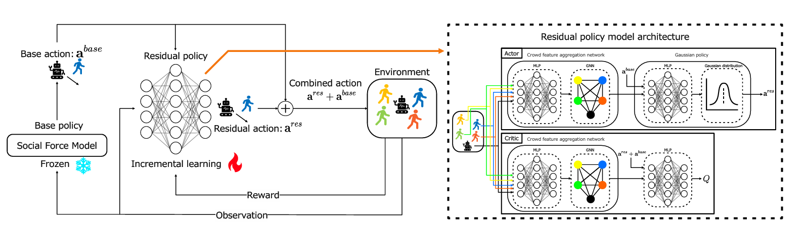
> *Caption: The full IRRL framework. Left: the frozen Social Force Model gives a base action while the residual policy network learns a corrective action through online updates. Right: the actor-critic setup uses an MLP and GNN crowd feature network to capture robot-pedestrian interactions. Adapted from Nagahisa et al. [10]*
---

##### Results
The researchers tested the system on a Mecanum-wheeled robot powered by an NVIDIA Jetson AGX Orin.  

Simulation: Achieved a 98.8% success rate, proving the robot could learn effectively even without a replay buffer.  
Real-World (Initial): A policy trained only in simulation failed 60% of the time when facing real, uncooperative humans.  
Real-World (Online): After just 100 episodes of learning on the job, the success rate climbed to 60%, and collisions dropped significantly.  

The "Personality" Change:
The most notable result was how the robot's behavior evolved. It started with an aggressive "crossing" strategy but eventually learned that when humans are uncooperative, socially compliant waiting is actually the most efficient way to reach its goal safely.
##### Limitations and Future Work
While IRRL is a major step for on-device learning, it currently has some training wheels:

* The tests were limited to simple scenarios with two pedestrians.

* The system still relies on "hybrid" training (mixing virtual and real agents) to get enough data.

The authors view this as a proof of feasibility, with future work focused on denser crowds and "lifelong learning" where the robot never stops adapting.

---

#### 9.7.6.5 Forest Trail Navigation: Semantic Segmentation RL

Tibermacine et al. [12] developed a modular hybrid system to help robots navigate dense, "unstructured" forests. Instead of relying on GPS or pre-made maps, which often fail under heavy tree cover, this framework combines high-level visual understanding with adaptive decision-making.
##### The Problem
Forests are a nightmare for traditional robot navigation for several reasons:

**Perceptual Chaos:** Dense trees create constant shadows and lighting shifts that confuse standard sensors.

**Unreliable Localization:** GPS signals are blocked by the canopy, making it impossible for the robot to know exactly where it is on a map.

**Irregular Geometry:** Unlike a paved road, forest trails have ambiguous edges, fallen logs, and varying textures that make simple rule-based steering fail.

##### The Approach
The system breaks navigation down into three distinct steps to ensure the robot stays on track:  

**Perception (Mask R-CNN):** The robot looks at an RGB image and creates a pixel-level "mask" to identify exactly which parts of the image are the trail.  

**Decision (Soft Actor-Critic):** An RL agent (SAC) takes the trail data and decides the best speed and steering angle. It uses "entropy regularization," which essentially encourages the robot to keep exploring and learning rather than getting stuck in a repetitive, suboptimal loop.  

**Control (Pure Pursuit):** A geometric controller smooths out the SAC agent’s choices to ensure the robot's physical movement is stable and doesn't jerk around.


##### Architecture
The framework was trained using a ResNet-50 backbone for feature extraction and tested across three simulated forest environments:

Map A: Narrow, winding trails with heavy vegetation.

Map B: Rugged terrain with elevation changes and fallen obstacles.

Map C: Ambiguous junctions and "fake" trail branches.

The reward function used to train the agent was a mix of five factors: staying on the trail, moving forward, reaching the goal, avoiding collisions, and minimizing lateral deviation.
> **Figure 9.16:** 
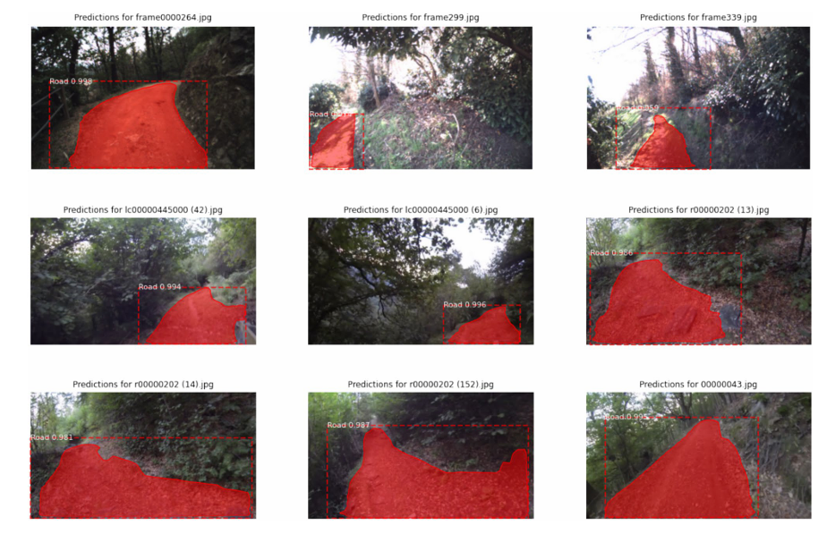
> *Caption:  Examples of trail detection results. Adapted from Tibermacine et al. [12]*

##### Results
In 90 different trials, the system showed it could handle the complexity of the woods better than traditional methods:

Success Rate: It reached the goal 86.7% of the time across all maps.

Precision: The robot stayed within 0.31 meters of the trail centerline on average.

Safety: It averaged only 0.2 collisions per episode, lower than vision-only or LiDAR-only baselines.

Comparison: While LiDAR is great for sensing 3D shapes (Map B), this vision-based system was much better at "understanding" which path to take in semantically confusing areas like trail forks (Map C).

The researchers proved that the "hybrid" nature of the system is what makes it work:

* Without SAC, the robot couldn't adapt to ambiguous trails (success fell to 71.1%).

* Without Mask R-CNN, simple color-based trail finding failed due to shadows (success fell to 63.4%).

* Without the Pure Pursuit controller, the robot's motion became erratic and unstable.

##### Limitations and Future Work
The system isn't perfect yet. It can still be blinded by extreme sunlight or "dappled" shadows that weren't common in its training data. It also lacks a "memory",if the trail is blocked for several frames, the robot can get confused because it doesn't remember where the path was a few seconds ago. Future versions may include recurrent neural networks (RNNs) to give the robot a sense of time and better multispectral sensors to handle tricky lighting.

#### 9.7.6.6 Underwater Navigation: Digital Twin-Validated PPO

Mari et al. [13] conducted a comparative study on deep reinforcement learning (RL) for autonomous underwater navigation, utilizing the BlueROV2 platform. The study centers on using Digital Twin (DT) technology,a high-fidelity virtual replica of a physical environment,to validate RL policies safely before they are deployed in high-risk harbor settings

##### The Problem
Underwater navigation is notoriously difficult because standard tools like GPS do not work submerged, visibility is often poor, and unpredictable water currents affect movement.

Traditional algorithms, like the Dynamic Window Approach (DWA), are deterministic and reactive. While efficient, they often fail in "cluttered" zones because they lack the foresight to navigate around complex obstacles. In these scenarios, the robot often gets trapped in local minima,effectively becoming "stuck" because it cannot find a mathematically clear path to the goal despite one existing.
##### The Approach
To solve this, researchers used Proximal Policy Optimization (PPO), an RL algorithm known for its stability in handling complex, continuous movements.

A standout feature of this research was the creation of a 3D Digital Twin of the Pointe Rouge harbor in Marseille. This model was built using photogrammetry (processing over 26,000 photos taken by divers) to ensure the virtual harbor matched the real one with millimeter-level accuracy. This allowed for "hardware-in-the-loop" testing, where the RL agent’s decisions were tested against virtual obstacles that mirrored the real-world site.
##### Architecture
The RL agent doesn't "see" like a human; it processes an 84-dimensional observation vector that combines three types of data:

Target Info: The normalized distance and relative angle to the destination.

Virtual Occupancy Grid: A sonar-like 360-degree map that tells the agent if a specific direction contains an obstacle.

Boundary Rays: "Virtual rays" cast in multiple directions to ensure the vehicle stays within the designated workspace boundaries

The PPO algorithm was selected for its stability and effectiveness in continuous action spaces, allowing for precise control of the ROV's thrusters.

##### Results
- **Comparative Success:** In highly cluttered harbor scenarios, the RL policy achieved a 55% success rate and 17% collision, whereas the classical DWA baseline achieved only 8% and 76% respectively, due to local minima traps.
- **Transferability:** The study confirmed that policies validated through the Digital Twin exhibited high reliability when transitioned to physical hardware, with minimal behavioral drift.

While PPO was far better at reaching the goal and avoiding crashes, it had a higher "exit rate" because it often chose wide, sweeping maneuvers to stay safe, which occasionally pushed it outside the mapped boundary.

Real-world sea trials confirmed a successful Sim-to-Real transfer. The BlueROV2 followed paths in the actual harbor that closely mirrored those predicted by the simulation, with only minor deviations caused by acoustic noise and water currents.

##### Limitations and Future Work
A big limitation is that the virtual occupancy grid currently omits sonar multi-path artifacts (echoes that occur in narrow underwater channels). This may result in the agent being overconfident in environments with significant acoustic noise.

So for future improvements, adding realistic "sonar noise" to the training, as the current model assumes perfect sonar data. Moving from 2D movement to full 3D maneuvers (allowing the robot to change depth to avoid obstacles). Integrating visual relocalization, using the massive database of harbor photos to help the robot "recognize" exactly where it is based on what its camera sees.

---

#### 9.7.6.7 Summary Table: Navigation Case Studies

| Paper / Case Study      | Application Domain              | Architecture                          | RL Algorithm                          | Sim-to-Real Solution                                | Key Contribution / Outcome                                                                                                             |
|-------------------------|---------------------------------|---------------------------------------|---------------------------------------|-----------------------------------------------------|----------------------------------------------------------------------------------------------------------------------------------------|
| Bouhamed et al. [14]    | UAV urban navigation            | End-to-end                            | DDPG (continuous action)              | Transfer learning between scenarios (simulation only) | 100% obstacle-free success, 84% / 82% with static/dynamic obstacles; demonstrates continuous control for aerial navigation             |
| Wu et al. [15]          | Marine surface vehicle          | End-to-end                            | Dueling DQN                           | Integrated realistic USV control model in simulation | Faster convergence than DQN/Deep Sarsa; surpassed Recast baseline in dynamic environments with real-time obstacle avoidance            |
| Doukhi & Lee [16]       | Micro-aerial vehicle            | End-to-end                            | DQN                                   | Zero-shot transfer via sensor binarization (LiDAR + depth) | 10km+ sim corridor flights, 115s outdoor forest mission with dynamic obstacles; no sim-to-real fine-tuning required                    |
| Nagahisa et al. [10]    | Social navigation (pedestrians) | Hybrid (residual on Social Force Model) | Incremental Actor-Critic with GAT     | Direct real-world online learning on edge device     | 98.8% simulation success; 40%→60% real-world success after 100 online episodes; learns socially compliant waiting behavior             |
| Tibermacine et al. [12] | Forest trail following          | Hybrid (Mask R-CNN + SAC + Pure Pursuit) | SAC (entropy-regularized)             | None (simulation only)                               | 86.7% success across varied terrain; 0.31m lateral deviation, 0.2 collisions/episode; outperforms vision-only and LiDAR-only baselines |
| Mari et al. [13]        | Underwater ROV harbor navigation | End-to-end                            | PPO                                   | Digital Twin validation (hardware-in-the-loop)       | 55% success in cluttered harbor vs 8% for classical DWA; validated policies transfer to physical ROV with minimal drift                |


The diversity in this table is the story. Six different platforms , ground, surface, aerial, underwater. Six different architectural philosophies , some end-to-end, some hybrid, each splitting the problem differently depending on where the uncertainty actually lives. Six different sim-to-real strategies, from binarizing sensors to training directly on hardware to building Digital Twins that mirror the deployment environment down to the obstacle geometry.

This isn't an accident. RL navigation isn't a monolithic solved problem you download from a repository. It's a toolkit. The sensor fusion that works for a MAV avoiding trees wouldn't make sense for a USV dodging reefs. The residual learning approach that lets a social robot train safely around real pedestrians wouldn't help a forest trail-follower operating solo in the wilderness. The right solution depends entirely on your sensors, your platform dynamics, your deployment constraints, and whether you can afford to fail during learning.

What's encouraging is the pace. The oldest paper in this table is from 2020. The newest from 2026. In six years we went from "can we get a policy to work in simulation" to "zero-shot outdoor flight missions with dynamic obstacles" and "real-world online learning on edge devices without replay buffers." The solutions are getting faster, smaller, more robust, and more deployable. New algorithms, new sim-to-real techniques, new hardware , the landscape is moving quickly. There's still a long way to go before you see fully autonomous RL-based delivery robots navigating crowded malls at scale, but the progress is real, and it's accelerating.

---

### 9.7.7 Limitations and Open Problems in RL-Based Navigation

The case studies above show genuine progress. Policies that navigate crowded rooms, fly through forests, dodge obstacles underwater , things that would have been research fantasies a decade ago are now documented, reproducible results. But before we get too optimistic, it's worth being clear about what's still broken.

**Learning is expensive.** Most of these systems required hundreds of thousands to millions of episodes to learn a competent policy. Even in simulation, that's a significant computational cost , days or weeks of GPU time. And simulation isn't the end of it. The sim-to-real gap means you almost always need some real-world experience to close the final performance delta. For social navigation, this is a real problem: you can't collect data from human pedestrians arbitrarily fast, and every training episode involves a real person who didn't sign up to be part of your dataset [10]. We need better reward functions, smarter state representations, curriculum learning strategies , anything that cuts the sample requirements without sacrificing final performance.

**Exploration is dangerous.** An RL policy that's still learning is, by definition, going to make mistakes. In navigation, mistakes mean collisions. Collisions with obstacles damage the robot. Collisions with people hurt the people. The challenge of safe exploration , how to learn without taking actions that could cause harm , is especially acute in social settings, where a near-miss doesn't just break hardware, it breaks trust [10]. The safe RL techniques from Section 9.6.3.4 help, but integrating them into real systems running on constrained hardware with limited compute and no room for conservative slowdowns is still an open problem.

**Social conventions aren't universal.** A policy trained on North American pedestrian behavior learns to pass on the right, maintain arm's-length personal space, and yield to people walking faster. Deploy that same policy in a culture with different conventions and it behaves inappropriately , not because the algorithm failed, but because the conventions it learned don't generalize [10]. A truly robust social navigation system would need to infer the local norms from context and adapt accordingly. That's a form of meta-learning , learning to learn new social rules , that current architectures aren't designed for.

**You can't ask the network why.** Neural network policies are black boxes. You can't inspect one and figure out why it chose to turn left at that particular moment in that particular corridor. This makes failure analysis hard. It makes debugging hard. And for navigation systems that operate in public spaces , delivery robots, hospital transport, airport guidance , it creates legal and ethical problems. If the robot does something unexpected and someone gets hurt, "the neural network made that decision and we don't know why" is not an acceptable answer. Interpretability isn't just a nice-to-have for public-facing robotics; it's a deployment requirement that the field hasn't solved yet.

**Policies don't remember.** Current RL navigation systems operate with short observation windows , the last few seconds of sensor data, maybe a local occupancy grid. They have no long-term memory. A robot that operates in the same building for a year doesn't learn that the third-floor corridor is crowded every day at noon, or that the person in the red jacket always cuts corners unpredictably. It can't incorporate that knowledge into its strategy because it has nowhere to store it. Extending RL to leverage long-horizon context , through explicit memory networks, world models, or continual learning architectures , is a research direction with a lot of promise but not many concrete solutions yet [10].

---


## 9.8 RL Applications in Robotic Manipulation

---

### 9.8.1 What Is Robotic Manipulation?

Robotic manipulation is about getting a robot to physically interact with objects in its environment, whether that means picking them up, sliding them across a surface, pressing them into a socket, or rotating them in the palm of a hand. It sounds straightforward, but it sits among the hardest problems in robotics.

The difficulty comes from contact. Once a robot's finger touches an object, the physics get messy: friction, deformation, slipping, and sticking all happen at the same time, and none of it is easy to describe with a clean mathematical model. This is precisely the point where classical model-based control starts to break down, and where reinforcement learning has proven most useful [19].

The following sections cover four manipulation task types, explain what makes each one hard, and go through what researchers have actually managed to achieve.

---

### 9.8.2 Task 1 : Grasping Unknown Objects

#### Why Is Grasping Hard?

Grasping is the first thing most people think of when they imagine a robot interacting with the world, and it is also one of the tasks that took the longest to get right. A classical grasp planner needs to know the exact shape, weight, and surface friction of whatever it is picking up. It can be carefully tuned to work on a specific object, and it will fall apart the moment you swap that object for something it has not seen before.

Real environments do not cooperate this way. Objects come in endless varieties, and most of the properties a planner would need are not known ahead of time. RL sidesteps the modeling problem entirely: instead of writing rules, you let the robot try, fail, and accumulate experience until it figures out what works.

#### Levine et al. (2016/2018) [23]

This work is probably the most widely cited demonstration that large-scale robotic learning is feasible. Google set up a cluster of 14 robotic arms that ran autonomously for two months, collecting over 800,000 grasp attempts with no human labeling whatsoever.

The setup was deliberately simple. The robot saw an RGB image of its workspace, chose a gripper motion in task space (x, y, z, rotation), and received a reward of 1 for a successful grasp and 0 for a failure. A convolutional neural network learned to predict success from the image alone, without needing to know anything about the camera's calibration.


> **Figure 9.17:**
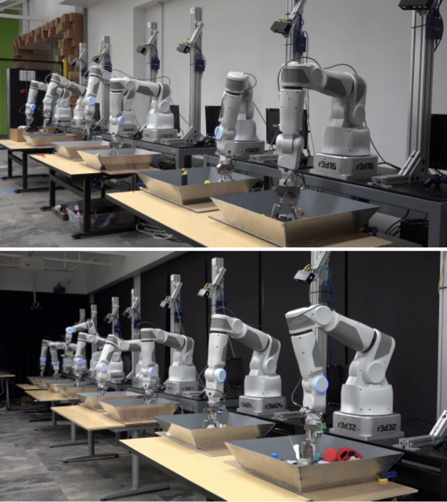
> *Caption: Large-scale data collection with 14 robotic arms running autonomously. Each robot had slightly different camera angles and hardware wear, which forced the policy to learn generalizable grasping strategies rather than overfitting to any one setup. Adapted from Levine et al. [23]*


What made the scale of this experiment so important was the variety it introduced. To test how well the learned policy generalized, the second set of experiments used approximately 1,100 different objects spanning an enormous range of shapes, weights, textures, and materials. Figures 9.18 and 9.19 give a sense of what the robot actually had to deal with.

Figure 9.18 shows softer and more irregular objects: a sponge ring, a foam brick, a pipe fitting, and a Lego brick. Each pair of photos shows the gripper approaching and then completing the grasp. These objects are challenging because their surfaces deform under contact and their geometry does not lend itself to any fixed grasp strategy.

> **Figure 9.18:**
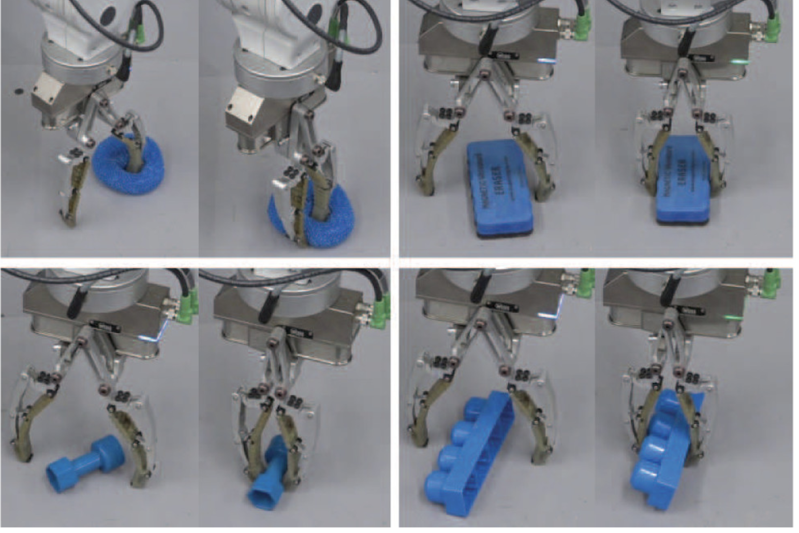
> *Caption: The three-fingered gripper grasping soft and irregular objects. Sponge and foam objects deform under the fingers, making fixed grasp strategies unreliable. The policy learned to handle these entirely from visual feedback and binary success rewards. Adapted from Levine et al. [23]*

Figure 9.19 shows the harder cases: transparent glasses frames, a screwdriver with a long thin handle, a clamp with complex geometry, and a chain. These objects combine low-friction surfaces, unusual aspect ratios, and in the case of the transparent frames, essentially no visual contrast against the background. These are precisely the kinds of objects that break classical grasp planners.

> **Figure 9.19:**
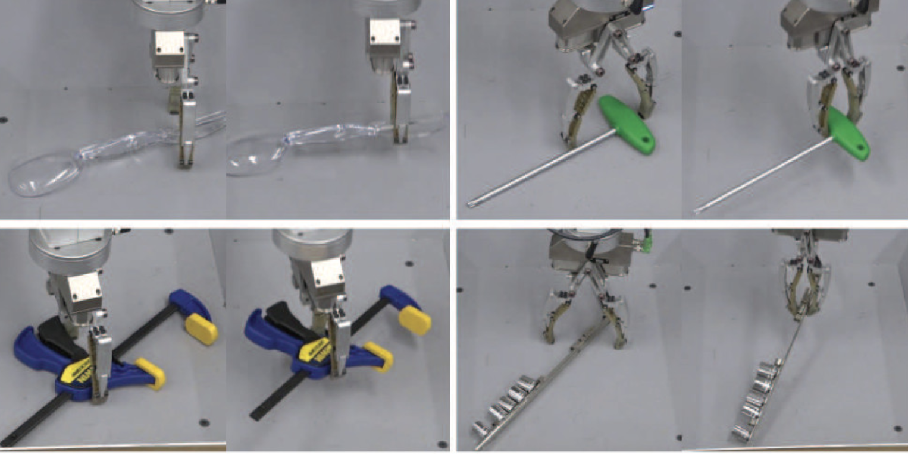
> *Caption: Grasp attempts on geometrically challenging objects. Transparent items, long thin handles, and complex-shaped tools represent the difficult end of the generalization test. Adapted from Levine et al. [23]*

The results are summarized in the table below, comparing four approaches:

- **Random baseline:** The robot picks a grasp position at random, with no learning or planning. This sets the floor for what any method needs to beat.
- **Hand-designed baseline:** A classical perception pipeline that uses depth images to detect graspable objects and plan a grasp geometrically. This represents the traditional engineering approach.
- **Open-loop learned baseline:** Uses the same neural network trained on the same large dataset, but commits to a fixed grasp plan at the start and does not adjust during execution. It cannot react to anything that changes after the motion begins.
- **Closed-loop method (theirs):** The full proposed approach, where the robot continuously watches its own hand via the camera and corrects its motion in real time throughout the grasp. This is the key contribution of the paper.

| Method | With Replacement (failure rate) | Without Replacement , first 10 | first 20 | first 30 |
|--------|--------------------------------|-------------------------------|----------|----------|
| Random | 69% | 67.5% | 70.0% | 72.5% |
| Hand-designed | 35% | 32.5% | 35.0% | 50.8% |
| Open-loop | 43% | 27.5% | 38.7% | 33.7% |
| **Our method** | **20%** | **10.0%** | **17.5%** | **17.5%** |

The closed-loop method achieved a failure rate of only 20% in the with-replacement condition, compared to 35% for the hand-designed baseline and 43% for the open-loop variant. In the without-replacement condition, where the bin is gradually emptied leaving only the hardest objects, the hand-designed baseline degraded significantly, reaching 50.8% failure on the first 30 grasps. This happened because the depth camera, positioned roughly a meter away, could not resolve small flat objects once the bin was nearly empty. The closed-loop method held at 17.5% under the same conditions.

The open-loop baseline is worth noting separately. It used the same large dataset, which was more than an order of magnitude larger than prior work at the time, yet still performed worse than the closed-loop method. The reason is that it could not react to perturbations, object movement, or variability in gripper shape and actuation. The continuous visual feedback in the closed-loop variant is what made the difference.

The paper also described a qualitative finding that lines up with what is shown in Figures 9.18 and 9.19. The policy learned different strategies for soft and hard objects without anyone telling it to. For hard objects it placed the fingers on either side. For soft objects it embedded one finger into the center of the object, since soft materials can be pinched rather than gripped around the outside. This kind of strategy differentiation emerged purely from the reward signal across 800,000 attempts.
#### Kalashnikov et al. (2018) : QT-Opt [24]

A later extension of this work, QT-Opt, applied a SAC-style off-policy training pipeline to 580,000 real-world grasp attempts and reached 96% success on objects not seen during training. That number represents a significant jump over classical model-based planners on the same benchmark, and it set the state of the art for vision-based robotic grasping at the time.

---

### 9.8.3 Task 2 : Object Pushing and Rearrangement

#### Why Is Pushing Hard?

Pushing is a good example of a task that seems simpler than grasping but turns out to be surprisingly tricky. The contact point between the finger and the object shifts as the object moves, friction behaves nonlinearly depending on speed and surface properties, and small errors in the initial push direction can snowball into large position errors. Analytical models can handle pushing for simple convex shapes with known friction values, but they fall apart quickly when the objects change.

RL handles this by learning the input-output relationship directly from interaction, without ever needing a friction model.

#### Results on Standard Benchmarks [22]

Pushing is a good example of a task that seems simpler than grasping but turns out to be surprisingly tricky. Unlike grasping, the robot never fully controls the object. It makes contact with one side, applies a force, and the object moves in a direction that depends on friction, surface properties, object shape, and the exact contact point, none of which are easy to know precisely.

The contact point between the finger and the object shifts continuously as the object moves. Friction behaves nonlinearly depending on speed and surface properties, and small errors in the initial push direction can snowball into large position errors by the time the object reaches the target. Analytical models can handle pushing for simple convex shapes with known friction values, but they fall apart quickly when the objects or surfaces change.

RL learns the input-output relationship directly from interaction. The agent does not need to know why a push goes where it goes, it just learns from thousands of attempts which motions reliably move objects toward a goal.

#### The FetchPush Environment

One of the standard benchmarks for pushing is the FetchPush-v1 environment from OpenAI Gym, shown in Figure 9.20. A robot arm must push a small block from its starting position to a target location marked on the table. The robot cannot grasp the block, it can only make contact and push. The target position changes every episode, so the robot must learn a general pushing strategy rather than memorizing a fixed path.

> **Figure 9.20:**
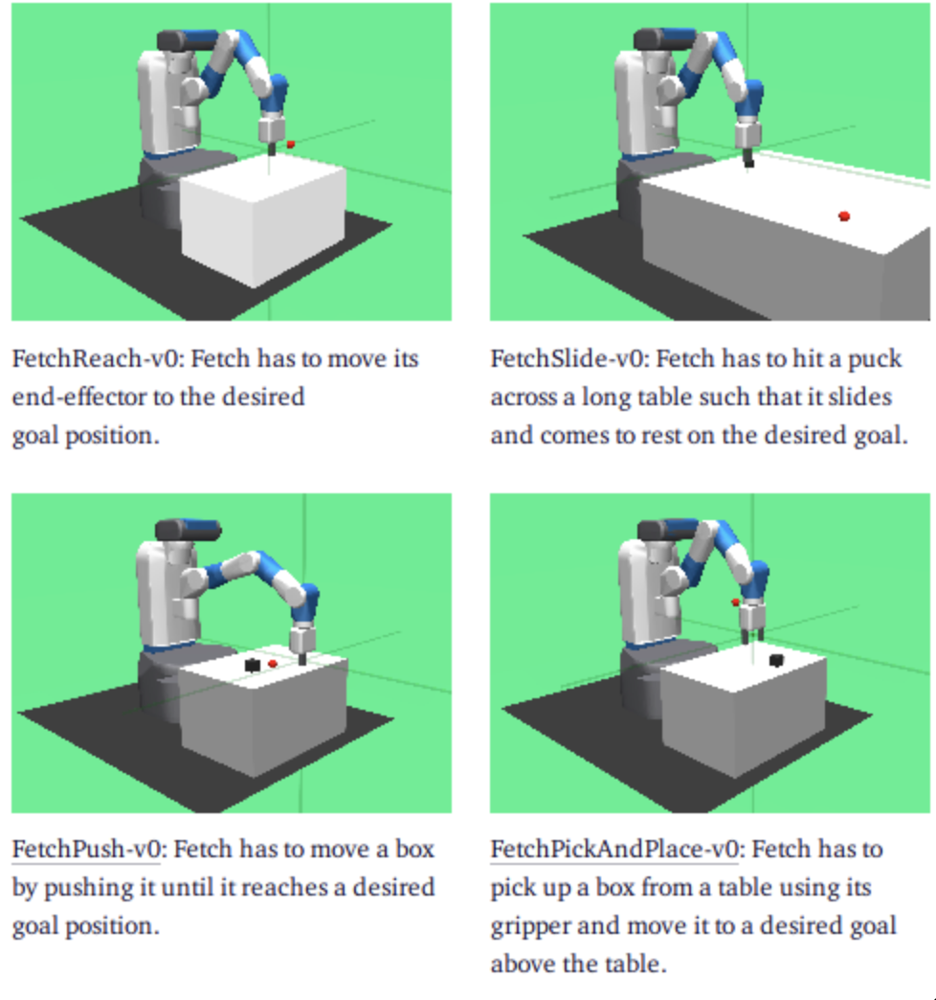
> *Caption: The FetchPush-v1 MuJoCo environment. A robot arm must push the block to the target location using only contact forces, with no grasping allowed. The target position varies each episode. Adapted from Haarnoja et al. [22]*

The state space includes the position and velocity of both the end-effector and the block, plus the relative position between the block and the goal. The action is a continuous 3D displacement of the end-effector. The reward is shaped to give the agent feedback on progress: a distance penalty that decreases as the block gets closer to the goal, a progress bonus each step the block moves in the right direction, and a success bonus when it arrives within 5cm of the target.

```python
def compute_reward(object_pos, goal_pos, prev_object_pos):
    dist_to_goal  = np.linalg.norm(object_pos - goal_pos)
    progress      = np.linalg.norm(prev_object_pos - goal_pos) - dist_to_goal
    success_bonus = 10.0 if dist_to_goal < 0.05 else 0.0
    return progress + success_bonus - 0.01
```

#### Results [22]

SAC handles this task well because the entropy term encourages the agent to explore many different pushing trajectories before committing to one strategy. This matters for pushing because the optimal approach angle and speed depend heavily on the block's starting position relative to the goal, and a deterministic policy tends to get stuck in suboptimal habits. On FetchPush-v1, SAC reaches near-maximum reward in under 1 million steps, while DDPG plateaus significantly lower due to its limited exploration of the continuous pushing space [22].

---


---

### 9.8.4 Task 3 : Contact-Rich Insertion (Peg-in-Hole)

#### Why Is Insertion Hard?

Peg-in-hole insertion requires the robot to align a peg with a hole to millimeter accuracy, then guide it in while managing the forces that arise when the peg makes contact with the edge. Even small misalignments cause jamming, and applying more force once jammed usually makes things worse rather than better.

Classical solutions to this problem need precise geometric models of both parts, carefully tuned force controllers, and significant re-engineering whenever the parts change. RL takes a different route: it learns from the force readings at the wrist what is happening at the contact point, and it figures out the right corrective motions through experience rather than through a model.

Figure 9.21 shows a typical hardware setup for this task. The robot is a 6-DOF UR3e arm, a compact industrial manipulator commonly used in precision assembly research. Mounted between the arm and the gripper is a force/torque sensor, which measures the full 6D wrench at the wrist in real time. This sensor is what makes RL viable for insertion tasks: without it, the robot has no way to feel when it is jammed against the edge or when it has found the hole. The end-effector is a parallel gripper holding a cuboid peg, positioned just above the task board with the matching hole. The coordinate frame shown in the image illustrates the three axes the robot must control simultaneously during the insertion motion.

> **Figure 9.21:**
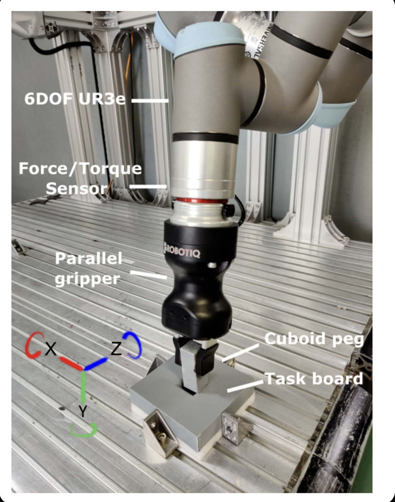
> *Caption: Hardware setup for the peg-in-hole task. A 6-DOF UR3e arm equipped with a force/torque sensor and a parallel gripper must insert a cuboid peg into the matching hole on the task board. The force/torque sensor provides the contact feedback the RL policy uses to detect misalignment and correct in real time. Adapted from Singh et al. [19]*

#### Findings from Singh et al. (2021) [19]

Singh et al. discuss peg-in-hole as a representative contact-rich manipulation task in their survey. The state space combines joint angles with a 6D force/torque vector from the wrist sensor, and the action is a 6D end-effector velocity. SAC is preferred here because its stochastic policy naturally handles the uncertainty in alignment: rather than committing to a fixed path, it can spread probability over several possible corrections and adapt as the contact forces change.

The reward structure is worth paying attention to. A naive reward that only penalizes distance to goal will train the robot to jam the peg in with whatever force is necessary, which looks fine in simulation and damages hardware in the real world. Adding a force penalty term changes the behavior completely:

$$r = -\text{distance\_to\_goal} - \lambda \|\mathbf{F}\|$$

With this penalty, the robot learns the kind of gentle, compliance-aware insertion that a skilled technician would use. After training, peak contact forces during insertion fall by roughly 60% compared to the untrained policy, and the force profile shows a brief controlled peak at entry followed by smooth convergence rather than the erratic spikes seen before training.

---

### 9.8.5 Task 4 : Dexterous In-Hand Manipulation (OpenAI Dactyl)

#### Why Is In-Hand Manipulation Hard?

In-hand manipulation, meaning rotating or repositioning an object while holding it in a multi-fingered hand, sits at the top of the difficulty ladder for robotic manipulation. A Shadow Dexterous Hand has 24 degrees of freedom. Contact can occur at hundreds of points at any given moment, and losing grip at any one of them can cause the object to fall. The rolling and sliding that happens between fingertips and object surface is extremely sensitive to tiny parameter variations, and there is no known analytical model that captures all of it accurately enough to be useful for control.

#### Andrychowicz et al. (2020) : OpenAI Dactyl [25]

OpenAI's Dactyl project is one of the more impressive things that has come out of deep RL research in recent years. The goal was to train a policy that could reorient a wooden block held in the palm of the Shadow Hand to match a target orientation shown to the system. Training happened entirely in MuJoCo simulation, using the same distributed RL infrastructure that ran OpenAI Five. No human demonstrations were used at any point.

Three things made the transfer to the real hand work. First, the team used Automatic Domain Randomization: rather than trying to match the simulation to the real world exactly, they randomized every physical parameter they could think of, friction, mass, joint damping, object appearance, across every training episode. The idea is that if the real world is just one more sample in a wide enough distribution, the policy will not be surprised by it. Second, the policy used an LSTM so it could adapt online to whatever physical conditions it encountered, without being told explicitly what those conditions were. Third, pose estimation came from three RGB cameras rather than motion-capture markers, which meant no special instrumentation was needed on the real hardware.

```
State:    24 joint angles + object pose (position + quaternion) = 60D
Action:   Relative joint angles (discretized to 11 bins for safety)
Reward:   rotation_progress + 5 x (goal_achieved) - 20 x (object_dropped)
Training: roughly 100 years of simulated experience
```

> **Figure 9.22:**
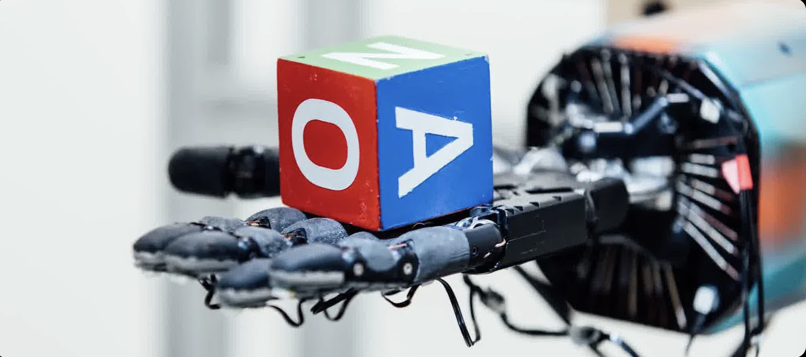
> *Caption: The Shadow Dexterous Hand from OpenAI's Dactyl project holding a colored wooden block. The hand has 24 degrees of freedom and must learn to reorient the block to match target orientations purely through finger contact, with no grasping or external support. The policy controlling it was trained entirely in simulation and transferred to this physical hand. Adapted from Andrychowicz et al. [25]*

Policies trained with domain randomization achieved over 20 consecutive successful rotations before dropping the object, far more than the versions trained without it. The vision-based system performed nearly as well as one given ground-truth pose information, which validated the quality of the learned estimator.

One of the more surprising results was that human-like manipulation strategies appeared in the learned policy without anyone teaching them. The robot developed tip pinch grips, tripod configurations, power grasps, and finger gaiting, behaviors drawn from established hand taxonomy literature, purely as a result of trying to maximize reward over billions of simulated steps.

The same hand was later used to solve a Rubik's cube [26], requiring roughly 13,000 years of simulated experience. The trained policy held up under deliberate perturbations: rubber gloves placed over the fingers, individual fingers bound together, and an external object prodding the hand during the solve.

---


### 9.8.6 Algorithm Comparison: Benchmarking on Dexterous Manipulation

#### Berscheid et al. (2024) : Which Algorithm Actually Works? [27]

Most papers in the manipulation literature pick one algorithm and show that it works on one task. What they do not tell you is whether that algorithm would still win if you swapped it for something else, or whether the task was simply easy enough that anything would have worked. Berscheid et al. set out to answer that question directly by running DDPG, SAC, and TD3 side by side under identical conditions.

#### The Problem

Practitioners building robotic manipulation systems face a choice that the literature does not answer clearly: given a specific task, which RL algorithm should you use? DDPG is older and simpler. SAC has better theoretical properties around exploration. TD3 was designed to fix the overestimation problems that DDPG suffers from. All three are actor-critic methods for continuous action spaces, and all three have been used in manipulation research. But they are almost never compared on the same hardware doing the same tasks, which makes it impossible to draw any practical conclusion from the existing literature.

The question the paper asks is simple: does the choice of algorithm actually matter, and if so, under what conditions?

#### The Approach

The authors used a three-fingered robotic gripper and defined three tasks that form a difficulty ladder. The first task was pure reaching: move the end-effector to a target position with no object contact required. The second was grasping: pick up objects of varying shape from a table. The third was fine insertion: place a grasped object into a tight-fitting socket, requiring precision at the millimeter scale.

All three algorithms ran on the same hardware with the same reward functions, the same training budget, and the same evaluation protocol. Each algorithm was run across multiple seeds to measure variance, not just average performance. The state space included joint positions, end-effector pose, and object position. Actions were continuous end-effector velocity commands.

The reward was shaped differently per task. Reaching used a pure distance penalty. Grasping added a binary success bonus. Insertion added a force penalty on top of distance, discouraging the robot from jamming the object into the socket rather than guiding it in gently.

#### Results

| Task | Contact Level | TD3 | SAC | DDPG |
|------|--------------|-----|-----|------|
| Reaching | Low | >90% | ~85% | ~70% |
| Grasping | Moderate | >90% | ~83% | ~60% |
| Fine insertion | High | >90% | ~80% | ~45% |

The results were clear. On the reaching task, all three algorithms learned successfully, though DDPG showed noticeably more variance across runs. On grasping, the gap between DDPG and the other two opened up significantly. On fine insertion, DDPG's failure rate climbed to around 45% while TD3 and SAC both held above 80%. TD3 was the most consistent performer across all three tasks, exceeding 90% success rate at convergence in every case.

> **Figure 9.23:**
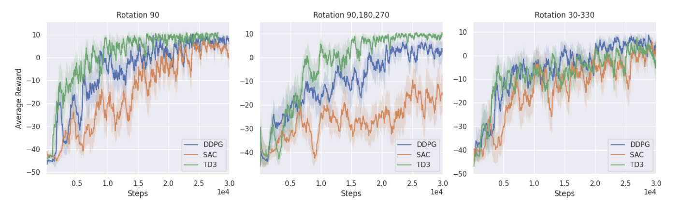
> *Caption: Reward curves for DDPG, SAC, and TD3 on three dexterous gripper tasks. TD3 achieves the highest asymptotic reward; DDPG shows high variance, especially on fine contact tasks. Adapted from Berscheid et al. [27]*

> **Figure 9.24:**
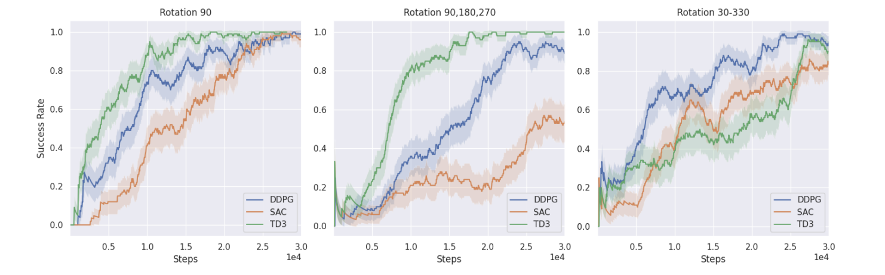
> *Caption: Success rate over training iterations. TD3 consistently exceeds 90% at convergence, while DDPG failure rates are significantly higher on precision tasks. Adapted from Berscheid et al. [27]*

#### Why Does DDPG Fall Behind?

The authors attribute DDPG's poor performance on contact-rich tasks primarily to its exploration mechanism. DDPG relies on Ornstein-Uhlenbeck noise added to the action, which is a fixed perturbation scheme that does not adapt based on what the agent has or has not explored. For simple reaching, this is fine. For fine insertion, where the agent needs to discover very specific force-compliant behaviors, fixed noise is not enough. SAC and TD3 both have mechanisms that produce more systematic exploration: SAC through its entropy bonus, TD3 through its clipped double-Q and delayed policy updates that prevent premature convergence.

#### Limitations

The paper acknowledges that the success rate numbers are specific to this gripper and these task definitions. Different hardware or tighter tolerances on the insertion task would likely shift the numbers. The study also does not include more recent algorithms such as SAC with automatic entropy tuning variants or distributional critics, which may perform differently. Still, as a controlled comparison it fills a genuine gap in the literature.

---

### 9.8.7 Broader Perspective: Deep RL in Robotics

#### Morales et al. (2021) : Mapping the Field [28]

#### The Problem

By 2021, deep reinforcement learning had produced a large number of impressive results in robotics, but the field had grown in many directions at once. Different papers used different benchmarks, different hardware, different algorithm families, and different evaluation metrics, making it very hard to understand the overall landscape or to know which direction was most promising. Morales et al. wrote this survey to map the field systematically: what has been tried, what has worked, how the approaches relate to each other, and where the open problems are.

#### The Approach

The survey covers both deep learning and deep reinforcement learning applied to robotics, organized around two dimensions. The first is the type of learning technique: value function methods, policy gradient methods, and actor-critic methods. The second is the robotics application domain: navigation, manipulation, tracking, motion planning, and multi-robot systems. For each combination, the authors identify the representative papers, describe the techniques used, and assess what the results actually showed.

For manipulation specifically, they trace the progression from early learning-based grasping systems through to large-scale vision-based approaches like QT-Opt [24], identifying the key ingredients that made each step forward possible.

#### Key Findings on Manipulation

The survey identifies combining force/torque sensing with visual feedback through an actor-critic architecture as the most consistently effective approach for contact-rich manipulation tasks. No single algorithm dominates across all task types, but the actor-critic family (SAC, DDPG, TD3) outperforms pure value function or pure policy gradient methods in manipulation because it handles continuous actions without the high variance that plagues pure policy gradient approaches.

The authors organize DRL methods into three families and their trade-offs:

| Approach | Main Algorithms | Characteristic |
|----------|----------------|----------------|
| Value function | DQN variants | Sample efficient, discrete actions only |
| Policy gradient | PPO-based | Stable convergence, less sample efficient |
| Actor-critic | SAC, DDPG, TD3 | Best balance for manipulation |

A recurring finding across papers in the survey is that model-free approaches dominate in practice, not because model-based methods are theoretically inferior, but because learning an accurate dynamics model is itself a hard problem that introduces a second source of error on top of the policy learning. When the model is wrong, the policy trained on it will be wrong too.

#### Open Challenges Identified

The survey is particularly useful for its honest assessment of what the field has not solved. Sample inefficiency is the dominant bottleneck: state-of-the-art algorithms still need millions of interactions for tasks that take a human minutes to learn. Generalization after training on a limited object set remains brittle. Safety during training is a real concern, since a robot exploring a manipulation task can apply dangerous forces. Long-horizon tasks involving many sequential steps are beyond the reach of standard RL without hierarchical structures. And the simulation-to-real gap, while partially addressed by domain randomization, remains an active research problem.

#### Limitations

As a survey paper, Morales et al. do not contribute new experimental results. The coverage is necessarily selective , a field this large cannot be fully covered in one paper. Some of the specific performance numbers cited from individual papers are difficult to compare across papers because evaluation protocols vary widely. The authors acknowledge this and call for standardized benchmarks as a priority for the field.

---

### 9.8.8 Comprehensive Survey: RL Across Robotic Platforms

#### Singh, Kumar & Singh (2021) : The Full Landscape [19]

#### The Problem

Most RL robotics papers focus on one platform type, usually a robotic arm or a ground vehicle, and one task category. This creates a fragmented picture of the field where it is hard to see what techniques transfer across domains and what is specific to one type of robot. Singh et al. set out to produce the most comprehensive survey of RL in robotics to date, covering land-based, air-based, and underwater systems together in a single unified review.

The question the paper addresses is: across all these different platforms and applications, what learning mechanisms have researchers developed, what problems have they solved, and what patterns emerge when you look at the whole field at once?

#### The Approach

The survey is organized into three platform categories. Land-based robots cover ground vehicles, robotic arms, humanoids, and mobile manipulators across tasks including navigation, object picking, manufacturing, human-robot interaction, and control. Air-based robots cover UAVs across tasks including transportation, navigation, flock control, and disaster management. Underwater robots cover autonomous underwater vehicles across tracking, navigation, and target search tasks.

For each application, the survey identifies the specific RL algorithm used, the hardware platform, the task objective, and the key result. The authors also review the theoretical foundations of each algorithm class in detail, covering critic-only methods, actor-only methods, actor-critic methods, deep RL, multi-agent RL, human-centered RL, and neuro-evolution.

#### Key Findings on Manipulation

For manipulation tasks specifically, the survey traces a clear progression. Early work in the 2000s used simple fuzzy-logic combined with Q-learning on 2-DOF manipulators for basic tasks like surface smoothing and control. By the 2010s, deep RL had scaled this to 7-DOF arms learning grasping, reaching, and lifting simultaneously. By 2020, the same family of algorithms running on distributed infrastructure was controlling 24-DOF dexterous hands.

The survey reviews representative manipulation results including a hybridized algorithm combining RL with cooperative co-evolution for object picking, interactive RL for table-cleaning tasks, reactive-control-plus-RL for slip-free grasping on the Openbionics ADA hand, and the ABB Yumi 7-DOF arm learning multiple manipulation skills through DeepRL.

The theoretical comparison the paper draws between algorithm classes is one of the most useful contributions for practitioners:

| Method | Action Space | Convergence | Gradient Variance |
|--------|-------------|-------------|-------------------|
| Critic-only (Q-learning, SARSA) | Discrete only | Weak | Low |
| Actor-only (Policy Gradient) | Continuous | Strong | High |
| Actor-Critic (DDPG, SAC, TD3) | Continuous | Strong | Low |

Critic-only methods require discretizing the action space, which destroys the precision needed for fine contact tasks. Pure policy gradient methods suffer from high variance in gradient estimates, which makes convergence slow and unreliable. Actor-critic methods combine the advantages of both, and this is why they appear in virtually every manipulation paper in the survey.


#### Results Across Platforms

Looking across all three platform types, the survey identifies several patterns. First, actor-critic methods dominate across all platforms, not just manipulation. Second, hybrid approaches that combine RL with classical controllers (fuzzy logic, model predictive control, impedance control) consistently outperform pure RL on tasks that require stability guarantees or physical safety constraints. Third, multi-agent RL shows promise for coordination tasks but adds significant complexity and is still maturing. Fourth, human-centered RL, where human feedback guides the learning process, significantly reduces the number of trials needed, which is critical for real-hardware deployment.

#### Limitations

The survey acknowledges that comparing results across papers is difficult because experimental conditions vary widely. Hardware differs, reward functions differ, and evaluation metrics differ. The authors do not attempt to rank algorithms by absolute performance across the board, which is the right call given the lack of standardized benchmarks. The survey also predates several important results that appeared in 2022 and beyond, including advances in language-conditioned manipulation and diffusion-based policies.

---
### 9.8.9 Reward Design Across Manipulation Tasks

The reward function is the single design decision that most determines whether RL succeeds or fails on a given manipulation task. A reward that is too sparse means the agent never accidentally succeeds, so it never learns anything. A reward that is too easy to game means the agent finds an unintended solution that looks good numerically but fails in practice.

| Strategy | Formula | Application |
|---------|---------|-------------|
| Distance reward | $-\|s - g\|_2$ | Reaching, pushing |
| Binary success | $+R$ if task complete | Grasping |
| Force penalty | $-\lambda \|\mathbf{F}\|$ | Peg insertion, delicate assembly |
| Smoothness penalty | $-\lambda \|\dot{a}\|^2$ | Real hardware |
| Progress reward | $d_{t-1} - d_t$ | Pushing, sliding |
| Entropy bonus | $+\alpha \mathcal{H}(\pi)$ | SAC built-in |

---

### 9.8.10 Open Challenges in Manipulation

Despite the results above, several problems in robotic manipulation remain genuinely unsolved [19][28].

Sample inefficiency is the most persistent one. Even SAC needs millions of interactions for tasks a human picks up in a few tries. Closing that gap through model-based RL, meta-learning, or imitation learning is an active area of research.

Safety during training is a practical concern that often goes unmentioned. A robot that is exploring a contact-rich task will occasionally apply excessive force or make unexpected contact with things it should not. Safe RL methods that constrain exploration to stay within defined operating limits are one direction, though they introduce their own complexity.

Generalization after training on a limited object set remains brittle. A policy that works on the 50 objects in the training set may fail on the 51st if it has a different weight distribution or surface texture than anything seen before.

Long-horizon tasks, such as assembling a multi-part mechanism, require sequences of many steps, and standard RL algorithms struggle to propagate reward signals reliably across such long chains. Hierarchical RL approaches, where a high-level planner breaks the task into subtasks handled by low-level controllers, are promising but not yet mature.

---


## References
[1] J. Tobin, R. Fong, A. Ray, J. Schneider, W. Zaremba, and P. Abbeel, "Domain Randomization for Transferring Deep Neural Networks from Simulation to the Real World," in *Proc. IEEE/RSJ Int. Conf. Intelligent Robots and Systems (IROS)*, Vancouver, BC, Canada, 2017, pp. 23–30.

[2] X. B. Peng, M. Andrychowicz, W. Zaremba, and P. Abbeel, "Sim-to-Real Transfer of Robotic Control with Dynamics Randomization," in *Proc. IEEE Int. Conf. Robotics and Automation (ICRA)*, Brisbane, Australia, 2018, pp. 3803–3810.

[3] L. Brunke, M. Greeff, A. W. Hall, Z. Yuan, S. Zhou, J. Panerati, and A. P. Schoellig, "Safe Learning in Robotics: From Learning-Based Control to Safe Reinforcement Learning," *Annual Review of Control, Robotics, and Autonomous Systems*, 2021. arXiv:2108.06266.

[4] M. Ogunsina, C. P. Efunniyi, O. S. Osundare, S. O. Folorunsho, and L. A. Akwawa, "Reinforcement Learning in Autonomous Navigation: Overcoming Challenges in Dynamic and Unstructured Environments," *Engineering Science & Technology Journal*, vol. 5, no. 9, pp. 2724–2736, Sept. 2024.

[5] Y. J. Ma, W. Liang, H. Wang, S. Wang, Y. Zhu, L. Fan, O. Bastani, and D. Jayaraman, "DrEureka: Language Model Guided Sim-to-Real Transfer," arXiv:2406.01967, Jun. 2024.

[6] F. Berkenkamp, M. Turchetta, A. P. Schoellig, and A. Krause, "Safe Model-Based Reinforcement Learning with Stability Guarantees," in *Advances in Neural Information Processing Systems (NeurIPS)*, vol. 30, 2017, pp. 908–919.

[7] F. Muratore, F. Ramos, G. Turk, W. Yu, M. Gienger, and J. Peters, "Robot Learning from Randomized Simulations: A Review," *Frontiers in Robotics and AI*, 2022.

[8] A. Amini et al., "Learning Robust Control Policies for End-to-End Autonomous Driving from Data-Driven Simulation," *IEEE Robotics and Automation Letters*, vol. 5, no. 2, pp. 1143–1150, 2020.

[9] B. Schlereth-Groh et al., "Transferable RL for Real-World Navigation Using Semantic Segmentation and Bird's-Eye View Abstraction," *AAAI-26*, 2026.

[10] H. Nagahisa, K. Matsumoto, Y. Tomita, Y. Hyodo, and R. Kurazume, "Incremental Residual Reinforcement Learning Toward Real-World Learning for Social Navigation," arXiv:2604.07945, Apr. 2026.

[11] C. Chen, Y. Liu, S. Kreiss, and A. Alahi, "Crowd-Robot Interaction: Crowd-Aware Robot Navigation with Attention-Based Deep Reinforcement Learning," in *Proc. IEEE ICRA*, Montreal, Canada, 2019, pp. 6015–6022.

[12] Tibermacine, Ahmed, et al. "Autonomous navigation in unstructured outdoor environments using semantic segmentation guided reinforcement learning: A. Tibermacine et al." Scientific Reports 16.1 (2026): 2633.

[13] Mari, Z.; Nawaf, M.M.; Drap, P. Deep Reinforcement Learning for Autonomous Underwater Navigation: A Comparative Study with DWA and Digital Twin Validation. Sensors 2026, 26, 2179.

[14] O. Bouhamed, H. Ghazzai, H. Besbes, and Y. Massoud, "Autonomous UAV Navigation: A DDPG-based Deep Reinforcement Learning Approach," in Proc. IEEE International Symposium on Circuits and Systems (ISCAS), 2020.

[15] X. Wu, H. Chen, C. Chen, M. Zhong, S. Xie, Y. Guo, and H. Fujita, "The Autonomous Navigation and Obstacle Avoidance for USVs with ANOA Deep Reinforcement Learning Method," Knowledge-Based Systems, vol. 196, p. 105201, 2020.

[16] O. Doukhi and D. J. Lee, "Deep Reinforcement Learning for Autonomous Map-Less Navigation of a Flying Robot," IEEE Access, vol. 10, pp. 82964–82976, 2022.

[17] Zhu, Kai, and Tao Zhang. "Deep reinforcement learning based mobile robot navigation: A review." Tsinghua Science and Technology 26.5 (2021): 674-691.

[18] Sutton, R. S., & Barto, A. G. (2018). *Reinforcement Learning: An Introduction* (2nd ed.). MIT Press.

[19] Singh, B., Kumar, R., & Singh, V. P. (2021). Reinforcement learning in robotic applications: A comprehensive survey. *Artificial Intelligence Review, 55*, 945–990.

[20] Silver, D., Lever, G., Heess, N., Degris, T., Wierstra, D., & Riedmiller, M. (2014). Deterministic policy gradient algorithms. *Proceedings of ICML*.

[21] Lillicrap, T. P., Hunt, J. J., Pritzel, A., et al. (2016). Continuous control with deep reinforcement learning. *arXiv:1509.02971*.

[22] Haarnoja, T., Zhou, A., Abbeel, P., & Levine, S. (2018). Soft Actor-Critic: Off-policy maximum entropy deep reinforcement learning with a stochastic actor. *arXiv:1801.01290*.

[23] Levine, S., Pastor, P., Krizhevsky, A., Ibarz, J., & Quillen, D. (2018). Learning hand-eye coordination for robotic grasping with deep learning and large-scale data collection. *The International Journal of Robotics Research, 37*(4–5), 421–436.

[24] Kalashnikov, D., Irpan, A., Pastor, P., et al. (2018). QT-Opt: Scalable deep reinforcement learning for vision-based robotic manipulation. *arXiv:1806.10293*.

[25] Andrychowicz, O. M., Baker, B., Chociej, M., et al. (2020). Learning dexterous in-hand manipulation. *The International Journal of Robotics Research, 39*(1), 3–20.

[26] OpenAI, Akkaya, I., Andrychowicz, M., et al. (2019). Solving the Rubik's cube with a robot hand. *arXiv:1910.07113*.

[27] Berscheid, L., Friedrich, C., & Kröger, T. (2024). Benchmarking reinforcement learning methods for dexterous robotic manipulation with a three-fingered gripper. *arXiv:2408.14747*.

[28] Morales, E. F., Murrieta-Cid, R., Becerra, I., & Esquivel-Basaldua, M. A. (2021). A survey on deep learning and deep reinforcement learning in robotics. *Intelligent Service Robotics, 14*, 773–805.


To cite this, please use the following bibtex:

```bibtex
@misc{Eskandar_2026_ReinforcementLearning,
  author       = {Manuella Eskandar and Mostafa Ahmed},
  title        = {Reinforcement Learning: A Gentle Introduction, Chapter 9},
  year         = {2026},
  publisher    = {GitHub},
  howpublished = {\url{https://github.com/amrmsab/reinforcement_learning_book}},
  note         = {Accessed: April 30, 2026}
}
